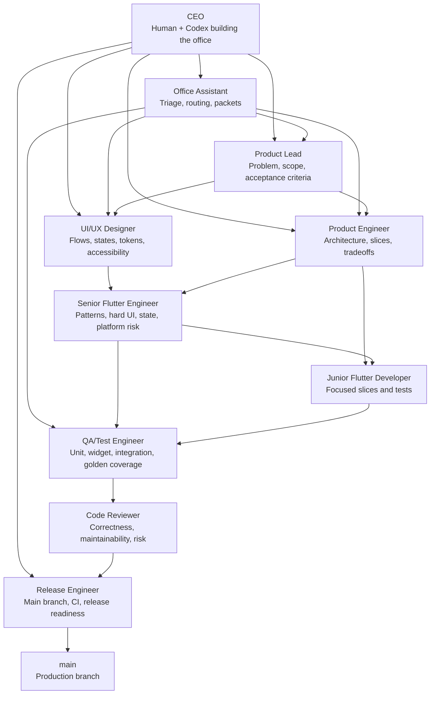
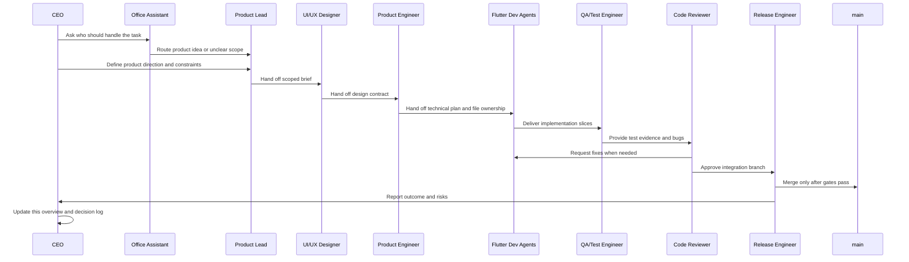
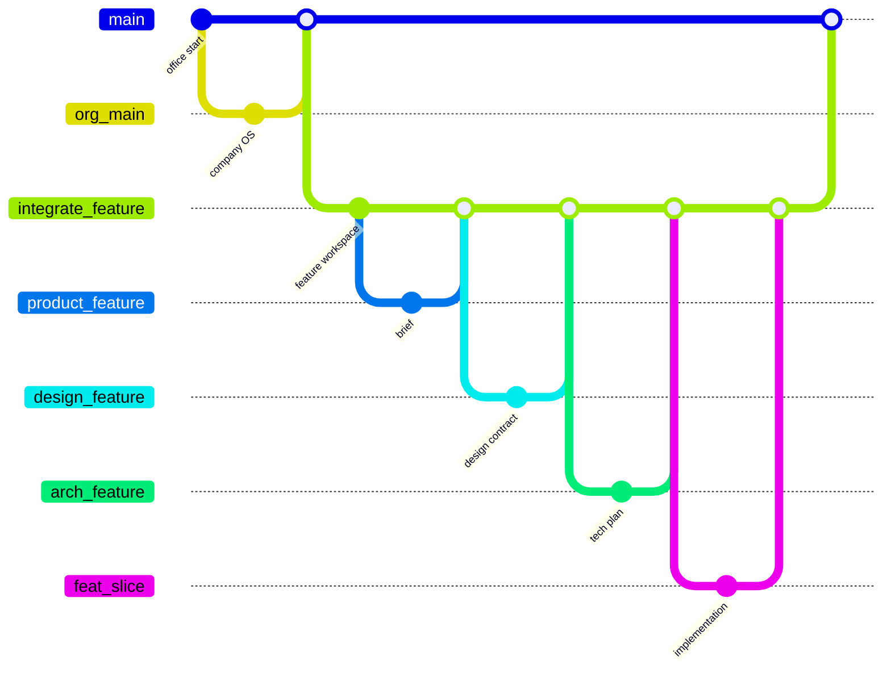

# CEO Overview

The CEO role is us: the people currently building this AI Flutter office. The
CEO does not replace the specialist agents. The CEO keeps the company coherent.

This file is the living executive record for the project. Whenever we change the
team, workflow, rules, tooling, or product direction, the CEO updates this file
so future agents understand not only what exists, but why it exists.

## CEO Mission

Build the best Flutter AI dev team in the world: an office of specialist AI
agents that can take a raw product idea and turn it into production-ready code on
`main` with product clarity, design quality, engineering discipline, and visible
decision history.

## CEO Responsibilities

- Define the office vision.
- Maintain the team structure.
- Record major decisions and why they were made.
- Keep the workflow honest and Flutter-specific.
- Make sure design, product, engineering, QA, review, and release work connect.
- Protect `main` as production code.
- Decide when the team needs a new role, workflow, tool, or quality gate.
- Keep this `CEO_OVERVIEW.md` file up to date.

## Current Office Structure



## Production Flow

The CEO owns the shape of this system. The agents own their specialist work.



## Branch Strategy

`org/main` is the company operating system. `main` is production code for the
current product. The integration branch is the office workbench. Specialist
branches keep parallel work reviewable.



Branch naming:

- `org/main`: canonical company operating system.
- `org/<initiative>`: durable changes to roles, workflow, tooling, templates, or
  governance.
- `office/<initiative>`: CEO-owned office structure, workflow, and governance
  changes when a full org branch is unnecessary.
- `integrate/<feature-slug>`: shared integration branch for one feature.
- `product/<feature-slug>`: product brief and acceptance criteria.
- `design/<feature-slug>`: UX, design contract, tokens, and UI expectations.
- `arch/<feature-slug>`: technical plan and architecture decisions.
- `feat/<feature-slug>/<slice>`: implementation branches.
- `test/<feature-slug>`: tests and QA evidence.
- `fix/<feature-slug>/<issue>`: review and QA fixes.

## Flutter-Native Differentiation

The office is not only a generic software team. It is designed for Flutter.

Flutter-specific expectations:

- Every meaningful screen has a route contract.
- Every user-facing feature has loading, empty, error, disabled, ready, and
  success state expectations.
- Design maps to Flutter artifacts: `ThemeData`, tokens, component states,
  responsive rules, semantics, and golden-test expectations.
- Developers use small composable widgets and keep business rules outside widget
  composition.
- QA uses unit, widget, integration, and golden tests where they fit.
- Reviewers check for Flutter failure modes: layout overflow, broad rebuilds,
  async context issues, missing semantics, brittle tests, and hidden state.

## Tooling Strategy

The CEO approved these layers:

- `AGENTS.md`: durable office-wide agent rules.
- `docs/ai-office/`: operating model, roles, workflow, quality gates, Flutter
  specialization, MCP, skills, and package decisions.
- `.agents/skills/`: official Flutter and Dart agent skills installed in this
  workspace.
- `.fvmrc`: repo-local Flutter SDK pin.
- `.cursor/mcp.json` and `.gemini/settings.json`: project-local MCP configs for
  clients that support checked-in MCP settings.
- `skills-lock.json`: reproducible record of installed skills.

Current local tool status:

- Global Dart exists locally as `3.4.1`.
- Global `flutter` is not currently on PATH.
- This repo is pinned with `.fvmrc` to FVM `stable`.
- `fvm flutter --version` resolves to Flutter `3.38.8` with Dart `3.10.7`.
- `fvm dart mcp-server --help` works.
- The official Dart/Flutter MCP server requires Dart `3.9+`, so this repo should
  use FVM-based commands for Flutter and MCP work.

CEO decision: use FVM as the office cockpit for Flutter tooling. Plain global
`dart` and `flutter` are not authoritative for this repo.

Workspace decision: the repository root is the office. Product Flutter apps live
under `work/<app-slug>/`.

## Decision Log

### 2026-05-18: Start The AI Flutter Office

Decision: initialize this workspace as a `main` branch git repo and create the
first office operating docs.

Why: the project started empty, so defining the operating model before app code
prevents messy collaboration patterns from becoming default.

Created:

- `AGENTS.md`
- `docs/ai-office/README.md`
- `docs/ai-office/roles.md`
- `docs/ai-office/workflow.md`
- `docs/ai-office/quality-gates.md`
- `.github/PULL_REQUEST_TEMPLATE.md`
- Flutter-friendly `.gitignore`
- feature templates under `docs/ai-office/templates/`

### 2026-05-18: Use Integration Branches Instead Of Direct Agent-To-Main Work

Decision: agents work through role branches into `integrate/<feature-slug>`, then
Release Engineer opens the final PR to `main`.

Why: direct-to-main work makes coordination harder and lets partial product,
design, or implementation decisions leak into production. Integration branches
let multiple agents collaborate without lowering the production bar.

### 2026-05-18: Make Designer Agents Git-Native

Decision: designer agents use branches too, but their outputs are design
contracts, route/screen-state expectations, tokens, component specs,
accessibility notes, and golden/screenshot expectations.

Why: design agents should not produce vague advice outside the repo. Their work
needs to be versioned, reviewable, and directly usable by Flutter developers.

### 2026-05-18: Make The Office Flutter-Specific

Decision: add Flutter-specific rules, templates, and quality gates.

Why: a Flutter team needs to care about widget trees, layout constraints, route
contracts, state ownership, semantics, golden tests, platform behavior, and
runtime inspection. Generic software workflow is not enough.

Created:

- `docs/ai-office/flutter-specialization.md`
- `docs/ai-office/mcp-and-skills.md`
- `docs/ai-office/package-decisions.md`
- `docs/ai-office/templates/flutter-screen-contract.md`
- `.cursor/mcp.json`
- `.gemini/settings.json`

### 2026-05-18: Install Official Flutter And Dart Skills

Decision: install the official Flutter and Dart agent skills into `.agents/skills`
and keep `skills-lock.json`.

Why: official skills give agents task-specific playbooks for Flutter and Dart
work instead of relying only on general model memory.

Installed:

- 10 official Flutter skills.
- 9 official Dart skills.

Risk note: the installer marked `flutter-use-http-package` as high risk. It stays
available, but networking dependencies require a package decision record.

### 2026-05-18: Add CEO Role

Decision: add CEO as the role owned by us while building and directing the
office.

Why: the office needs an explicit meta-role responsible for vision, structure,
decision history, and documentation. Without that role, the team may execute
tasks but lose the reason behind the system.

Created:

- `CEO_OVERVIEW.md`

### 2026-05-18: Fire Up Flutter Through FVM

Decision: add a repo-local `.fvmrc` pinned to `stable`, update MCP configs to
launch `fvm dart mcp-server --force-roots-fallback`, and treat FVM as the
authoritative Flutter command path for this office.

Why: the global Dart SDK is too old for the official Dart/Flutter MCP server and
plain `flutter` is not on PATH. FVM already has a cached stable Flutter SDK with
Dart `3.10.7`, which satisfies the MCP requirement.

Verification:

- `fvm doctor` now detects this repo as `ai-dev-team-flutter`.
- `fvm flutter --version --no-version-check` reports Flutter `3.38.8` and Dart
  `3.10.7`.
- `fvm dart mcp-server --help` works.

Guardrail: a parent `D:\.fvmrc` exists and remains pinned to `3.32.8`. This repo
must keep its own `.fvmrc` so the office does not inherit the parent drive
setting.

### 2026-05-18: Create Visitor-Facing README

Decision: add `README.md` as the front door for the project, with an Office
Entrance section and a round table diagram of the full AI Flutter team,
including the CEO.

Why: the office now has enough structure that visitors need a compelling entry
point before they dive into internal operating docs. The README explains the
project, team, Flutter-native workflow, FVM/MCP setup, quality gates, and next
CEO move.

Created:

- `README.md`

### 2026-05-18: Define Async Agent Runtime

Decision: define a service-agnostic async runtime where each role can run in a
separate AI session, branch, or tool, using Markdown packets and outbox handoffs
as the communication protocol.

Why: running all roles inside one chat causes context bloat and hides important
state in transcripts. The repo should be the office memory. This makes the team
compatible with Codex, Gemini CLI, Cursor, Claude Code, terminal agents, and
humans.

Created:

- `docs/ai-office/async-agent-runtime.md`
- `docs/ai-office/templates/agent-session-packet.md`
- `docs/ai-office/templates/agent-outbox.md`

Updated:

- `README.md`
- `AGENTS.md`
- `docs/features/README.md`
- `docs/ai-office/README.md`

### 2026-05-18: Define Organization Branch Model

Decision: add `org/main` as the stable company operating system branch and
`org/<initiative>` as the branch family for durable company-structure changes.

Why: the office should not be rewritten for every product. Product `main` should
hold production app code, while `org/main` holds reusable roles, workflows,
templates, FVM/MCP setup, skills, and CEO memory. New products can start from
`org/main` and periodically sync improvements.

Created:

- `docs/ai-office/org-branch-model.md`

Updated:

- `README.md`
- `AGENTS.md`
- `docs/ai-office/README.md`
- `docs/ai-office/workflow.md`
- `docs/ai-office/async-agent-runtime.md`

### 2026-05-18: Add Office Assistant Role

Decision: add Office Assistant as the front-desk role for task triage, routing,
packet creation, status coordination, and escalation.

Why: users may know the task but not the right specialist role. The Office
Assistant lets the office start from natural requests without forcing the user to
choose Product Lead, Designer, Engineer, QA, Review, or Release manually.

Created:

- `docs/ai-office/task-triage.md`

Updated:

- `README.md`
- `AGENTS.md`
- `CEO_OVERVIEW.md`
- `docs/ai-office/README.md`
- `docs/ai-office/roles.md`
- `docs/ai-office/async-agent-runtime.md`
- `docs/ai-office/templates/agent-session-packet.md`

### 2026-05-18: Add User Activation Contract

Decision: define a user-facing activation contract where the user can simply say
`Office Assistant: <task>` in any compatible AI coding tool.

Why: users should not have to remember branches, role order, packet paths, or
workflow documents. The Office Assistant should read the repo, inspect branch
state, choose the right role sequence, and prepare the branch or packet plan.

Created:

- `docs/ai-office/user-activation.md`

Updated:

- `README.md`
- `AGENTS.md`
- `docs/ai-office/README.md`
- `docs/ai-office/task-triage.md`

### 2026-05-18: Add Assistant Progress Monitoring

Decision: extend the Office Assistant role so users can ask for status or
progress without knowing branch names, async folders, outbox paths, or handoff
files.

Why: a real office needs a front desk that can answer "where are we?" The user
should be able to ask the Assistant for progress, and the Assistant should read
git state plus feature status files before summarizing.

Updated:

- `README.md`
- `AGENTS.md`
- `docs/ai-office/task-triage.md`
- `docs/ai-office/user-activation.md`
- `docs/ai-office/roles.md`

### 2026-05-18: Make Assistant Status Read-Only

Decision: status and progress requests to the Office Assistant are read-only.

Why: during testing, the Assistant started doing code work when asked only for
status. Monitoring should report state and recommend next actions, not mutate
the project.

Rule: for `Office Assistant: status` or similar progress checks, do not edit
files, create branches, run generators, apply fixes, commit, or merge unless the
user explicitly asks for action after the report.

Updated:

- `AGENTS.md`
- `docs/ai-office/task-triage.md`
- `docs/ai-office/user-activation.md`
- `docs/ai-office/roles.md`

### 2026-05-19: Add Work Directory Layout

Decision: keep the repository root as the AI office and put Flutter app
scaffolds under `work/<app-slug>/`.

Why: Flutter creates many platform folders such as `android/`, `ios/`, `web/`,
`macos/`, `linux/`, and `windows/`. Initializing those at the root makes the
office hard to scan and causes generated artifacts to appear beside org docs.

Rule: new Flutter projects must be created under `work/<app-slug>/`, with
`--project-name <dart_package_name>` when the folder slug is not a valid Dart
package name. Office docs, roles, templates, skills, MCP config, and CEO memory
stay at the root.

Created:

- `work/README.md`

Updated:

- `README.md`
- `AGENTS.md`
- `docs/ai-office/org-branch-model.md`
- `docs/ai-office/workflow.md`
- `docs/ai-office/flutter-specialization.md`
- `docs/ai-office/quality-gates.md`
- `docs/ai-office/mcp-and-skills.md`
- `docs/ai-office/async-agent-runtime.md`

### 2026-05-19: Move Minimal Timer App Into Work

Decision: migrate the first product app from root-level Flutter scaffold files
into `work/minimal-timer-app/`.

Why: the first app proved the root-clutter problem in practice. The office root
should remain readable as the company operating system, while generated
platform folders and app-local tooling files belong inside the app workspace.

Moved:

- `lib/`, `test/`, `android/`, `ios/`, `web/`, `linux/`, `macos/`, `windows/`
- `pubspec.yaml`, `pubspec.lock`, `analysis_options.yaml`, `.metadata`
- app-local ignored artifacts such as `.dart_tool/`, `build/`, `.idea/`, and
  the app `.iml` file when the OS allowed moving them

Updated:

- `README.md`
- `docs/features/minimal-timer-app/handoff.md`
- `docs/features/minimal-timer-app/tech-plan.md`
- `docs/features/minimal-timer-app/test-plan.md`

### 2026-05-19: Add Role Activation Banners

Decision: every role must announce a visible activation banner before doing
task work in chat.

Why: users should not need to infer which specialist is speaking or what scope
the agent is taking. A clear banner keeps fresh sessions understandable across
Codex, Gemini CLI, Cursor, Claude Code, and other tools.

Rule: the first visible line from an activated role must follow:

```text
<Role> Activated: I am your <plain-language role> and responsible for <primary responsibility>.
```

Created:

- `docs/ai-office/role-activation.md`

Updated:

- `AGENTS.md`
- `README.md`
- `docs/ai-office/README.md`
- `docs/ai-office/roles.md`
- `docs/ai-office/user-activation.md`
- `docs/ai-office/task-triage.md`
- `docs/ai-office/async-agent-runtime.md`
- `docs/ai-office/templates/agent-session-packet.md`

### 2026-05-19: Adopt Packet-First Office Assistant

Decision: make the Office Assistant the default mode for unstructured prompts
and keep it as a packet generator, not an executor.

Why: users should not need to know which role owns a task, but the Assistant
should also not accidentally perform specialist work. The Assistant now routes,
plans, and produces ready-to-paste role packets. Specialist roles do the actual
product, design, code, QA, review, and release work.

Rule: if a user prompt does not start with a specific role name and colon, the
Office Assistant activates. It reads the repo, determines the role sequence,
and outputs packets. Every packet must include the target role's activation
banner as the first visible line.

Accepted from external Opus review:

- no-prefix Office Assistant default
- ready-to-paste packet output
- Office Assistant does not modify project files
- slimmer packets with explicit file ownership and handoff targets

Amended by CEO decision:

- keep activation banners inside generated packets
- keep `CEO_OVERVIEW.md` updated for office/workflow changes
- use ASCII arrows in review notes to avoid encoding issues

Updated:

- `AGENTS.md`
- `README.md`
- `docs/ai-office/roles.md`
- `docs/ai-office/task-triage.md`
- `docs/ai-office/user-activation.md`
- `docs/ai-office/role-activation.md`
- `docs/ai-office/async-agent-runtime.md`
- `docs/ai-office/templates/agent-session-packet.md`
- `OPUS_REVIEW.md`

### 2026-05-19: Harden Status, Activation, And Commits

Decision: make status checks branch-aware and lightweight, require role
activation before tool use, and standardize commit messages with Conventional
Commits.

Why: the first real app tests showed four protocol gaps:

- status answers could become stale when feature work lived on another branch
- status-only prompts could waste context by reading app and platform code
- roles could call tools before the user saw which role was active
- commit subjects were not predictable enough for a multi-agent repo

Rules:

- The activation banner must be the first visible line before tools, commands,
  file reads, planning, or edits.
- `docs/features/status-index.md` is the first source for project status.
- Status mode should use branch-native git reads such as `git show <branch>:...`
  instead of switching branches or crawling source by default.
- Status mode does not read app source, generated platform folders, lockfiles,
  or build output unless the user asks for code inspection.
- Every commit follows `docs/ai-office/commit-guidelines.md`.

Created:

- `docs/ai-office/status-protocol.md`
- `docs/ai-office/commit-guidelines.md`
- `docs/features/status-index.md`

Updated:

- `AGENTS.md`
- `README.md`
- `docs/ai-office/README.md`
- `docs/ai-office/roles.md`
- `docs/ai-office/role-activation.md`
- `docs/ai-office/task-triage.md`
- `docs/ai-office/user-activation.md`
- `docs/ai-office/async-agent-runtime.md`
- `docs/ai-office/templates/agent-session-packet.md`
- `docs/ai-office/templates/handoff.md`
- `docs/features/README.md`

### 2026-05-19: Improve README Office Entrance

Decision: replace the crowded README round-table Mermaid chart with a simpler
SVG office map, and add a repo-native Office Assistant activation screenshot to
show the intended user experience.

Why: visitors should understand the office quickly. The README should show that
the workflow is simple at the front door: ask a normal question, see the active
role announced, then get branch-aware evidence.

Created:

- `docs/assets/readme/office-round-table.svg`
- `docs/assets/readme/office-assistant-activation.svg`

Updated:

- `README.md`

### 2026-05-18: Materialize Office Baseline

Decision: create the first repository commit as the AI Flutter office operating
system baseline, then create `org/main` from that same commit.

Why: `main` can now become the production branch for the first product, while
`org/main` preserves the reusable company structure for future products and org
changes.

Result:

- `main`: current product production branch.
- `org/main`: reusable company operating system branch.

## Current Open CEO Items

- Review and merge `integrate/minimal-timer-app` into `main` when the release
  gate is green.
- Decide whether timer completion needs sound, haptics, or notifications.

## CEO Rule

When the office changes, update this file in the same branch as the change. If a
future agent cannot understand the team, workflow, or decision history from this
file, the CEO has not finished the job.
