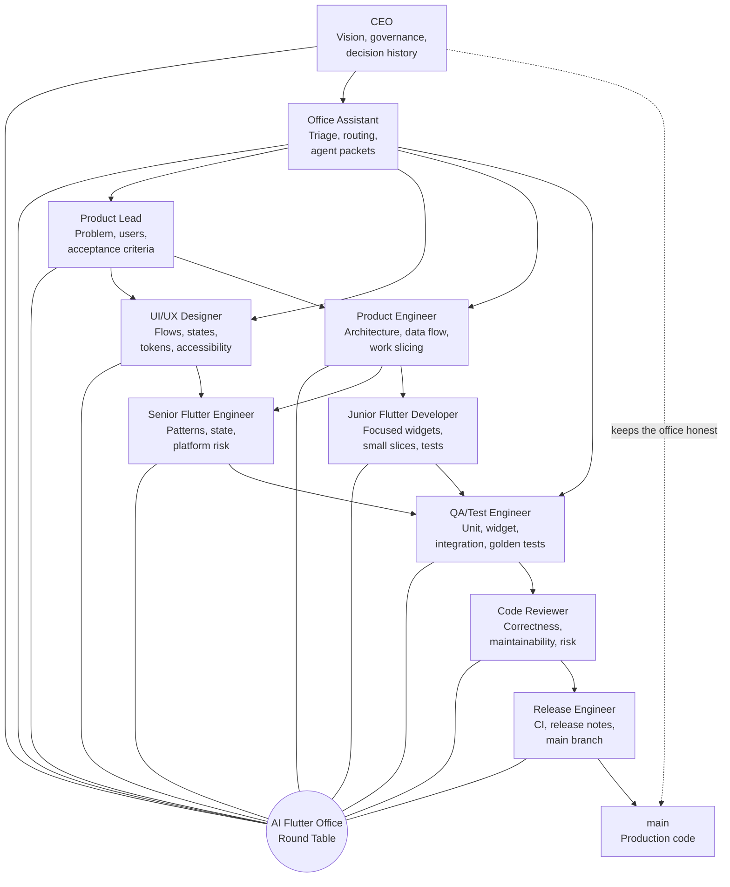
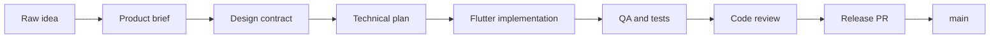

# AI Dev Team Flutter

An experimental Flutter studio where AI agents work like a real product team.

This repo is not just a Flutter app. It is an office: a structured collaboration
system for taking a rough idea, shaping it through product and design, building
it with Flutter specialists, testing it, reviewing it, and merging only
production-ready work into `main`.

The ambition is simple and slightly dangerous in the best engineering way:
build the best Flutter AI dev team in the world.

## What This Project Is

Most AI coding workflows treat the assistant like one very busy developer. This
project treats AI as a team.

Each role has a job:

- The CEO keeps the office coherent.
- The Office Assistant routes unclear tasks to the right specialist.
- The Product Lead clarifies what is worth building.
- The UI/UX Designer makes the experience implementable.
- The Product Engineer turns intent into architecture.
- Flutter developers build focused slices.
- QA proves behavior.
- Code Review protects quality.
- Release Engineering protects `main`.

The result should feel less like random code generation and more like walking
into a serious Flutter studio where every agent knows where to sit, what to own,
and when to hand off.

## Office Entrance

Welcome to the round table. Every feature starts here.



The CEO role is us while we build and steer the office. CEO-level decisions live
in `CEO_OVERVIEW.md`.

## The Production Path

The office does not let every agent write straight to `main`.



Work happens through an integration branch:

```text
main
  integrate/<feature-slug>
    product/<feature-slug>
    design/<feature-slug>
    arch/<feature-slug>
    feat/<feature-slug>/<slice>
    test/<feature-slug>
    fix/<feature-slug>/<issue>
```

`main` is production. `integrate/<feature-slug>` is the office workbench.

The office itself has a longer-lived home:

```text
org/main
```

`org/main` is the company operating system: roles, workflows, templates, skills,
MCP config, FVM setup, and CEO memory. Product `main` is where the current app
becomes production code. New products can start from `org/main` without
reinventing the office.

## Why It Is Flutter-Native

This office is tuned for Flutter, not generic app development.

Flutter work must account for:

- Widget tree clarity.
- Route contracts.
- Loading, empty, error, disabled, ready, and success states.
- Responsive layout across phone, tablet, desktop, keyboard, and text scaling.
- `ThemeData`, tokens, reusable widgets, and semantics.
- Unit, widget, integration, and golden tests.
- Flutter-specific review risks such as layout overflow, hidden state ownership,
  broad rebuilds, async context bugs, and brittle tests.

The docs under `docs/ai-office/` describe how each agent handles those concerns.

## Tooling

This repo uses FVM as the Flutter cockpit.

```powershell
fvm flutter --version --no-version-check
fvm dart --version
fvm dart mcp-server --help
```

Current verified local setup:

- FVM is installed.
- This repo is pinned with `.fvmrc` to `stable`.
- FVM resolves Flutter `3.38.8`.
- FVM resolves Dart `3.10.7`.
- `fvm dart mcp-server --help` works.

Project-local MCP configs are included for tools that support them:

- `.cursor/mcp.json`
- `.gemini/settings.json`

They launch:

```powershell
fvm dart mcp-server --force-roots-fallback
```

Official Flutter and Dart agent skills are installed in `.agents/skills`, with
their hashes recorded in `skills-lock.json`.

## How To Fire Up The Office

If you know the task but do not know the role, start here:

```text
Office Assistant: <task>
```

That is enough. You do not need to name branches, workflows, packet files, or
specialist roles. The Office Assistant reads the repo, picks the role sequence,
chooses the branch plan, and prepares the handoff path.

Start with a CEO kickoff:

```text
CEO kickoff: I want to build <idea>.
Run the AI office workflow.
Create the feature folder, product brief, design contract, tech plan, and branch
plan before implementation.
```

Then create the feature integration branch:

```powershell
git checkout -b integrate/<feature-slug>
```

The first feature folder should live here:

```text
docs/features/<feature-slug>/
  brief.md
  ux.md
  design-contract.md
  tech-plan.md
  handoff.md
  test-plan.md
  release-notes.md
```

For parallel role sessions, create async packets:

```text
docs/features/<feature-slug>/async/
  runbook.md
  status.md
  ownership.md
  decisions.md
  packets/<role>.md
  outbox/<role>.md
```

Each role can then run in a separate AI session or service. The packet is the
input. The outbox file is the handoff. The branch is the workspace. This avoids
one giant context-heavy chat while keeping the office coordinated.

## Quality Gates

Once the Flutter app scaffold exists, the default gates are:

```powershell
fvm flutter pub get
fvm dart format --set-exit-if-changed .
fvm flutter analyze
fvm flutter test
```

As the app matures, release candidates should also earn platform checks:

```powershell
fvm flutter build web
fvm flutter build apk --debug
```

## Map Of The Office

Start here if you are visiting:

- `CEO_OVERVIEW.md`: executive map, decisions, team structure, open items.
- `AGENTS.md`: rules every agent follows.
- `docs/ai-office/org-branch-model.md`: how the company structure stays stable
  across products.
- `docs/ai-office/roles.md`: each role and its definition of done.
- `docs/ai-office/task-triage.md`: which role to call when the task is unclear.
- `docs/ai-office/user-activation.md`: what to type in a brand-new AI session.
- `docs/ai-office/workflow.md`: branch and handoff model.
- `docs/ai-office/async-agent-runtime.md`: parallel multi-session execution.
- `docs/ai-office/flutter-specialization.md`: what makes this Flutter-specific.
- `docs/ai-office/mcp-and-skills.md`: MCP and official skills setup.
- `docs/features/README.md`: where feature work lives.

## Current Status

The office is built. The Flutter app itself has not been scaffolded yet.

Next CEO move:

1. Choose the first product idea.
2. Run it through the office workflow.
3. Create the Flutter app scaffold with FVM.
4. Ship the first production-ready slice to `main`.
