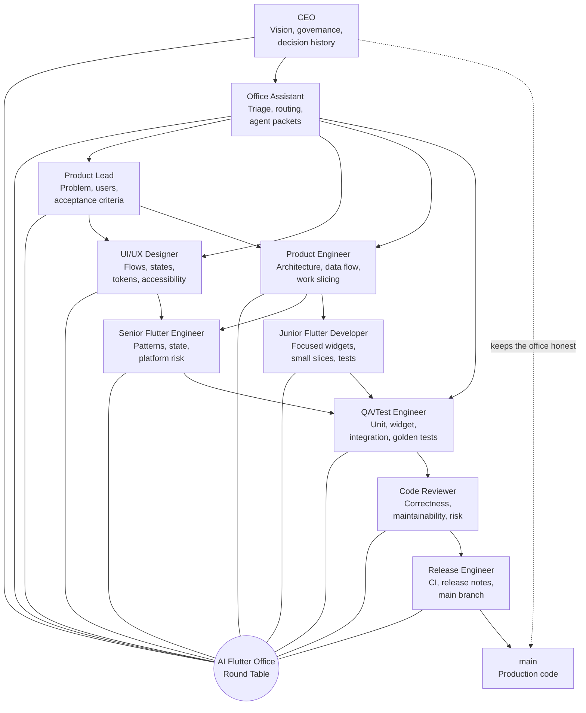
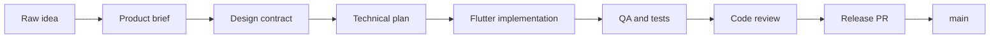

# AI Dev Team Flutter

An experimental Flutter studio where AI agents work like a real product team.

This repo is not just a Flutter app. It is an office: a structured collaboration
system for taking a rough idea, shaping it through product and design, building
it with Flutter specialists, testing it, reviewing it, and merging only
production-ready work into `main`.

The ambition is simple and slightly dangerous in the best engineering way:
build the best Flutter AI dev team in the world.

## What This Project Is

Most AI coding workflows treat the assistant like one very busy developer. This
project treats AI as a team.

Each role has a job:

- The CEO keeps the office coherent.
- The Office Assistant turns unstructured tasks into role packets.
- The Product Lead clarifies what is worth building.
- The UI/UX Designer makes the experience implementable.
- The Product Engineer turns intent into architecture.
- Flutter developers build focused slices.
- QA proves behavior.
- Code Review protects quality.
- Release Engineering protects `main`.

The result should feel less like random code generation and more like walking
into a serious Flutter studio where every agent knows where to sit, what to own,
and when to hand off.

## Office Entrance

Welcome to the round table. Every feature starts here.



The CEO role is us while we build and steer the office. CEO-level decisions live
in `CEO_OVERVIEW.md`.

## The Production Path

The office does not let every agent write straight to `main`.



Work happens through an integration branch:

```text
main
  integrate/<feature-slug>
    product/<feature-slug>
    design/<feature-slug>
    arch/<feature-slug>
    feat/<feature-slug>/<slice>
    test/<feature-slug>
    fix/<feature-slug>/<issue>
```

`main` is production. `integrate/<feature-slug>` is the office workbench.

The office itself has a longer-lived home:

```text
org/main
```

`org/main` is the company operating system: roles, workflows, templates, skills,
MCP config, FVM setup, and CEO memory. Product `main` is where the current app
becomes production code. New products can start from `org/main` without
reinventing the office.

## Workspace Layout

The repository root is the office. Product apps live under `work/`.

```text
.
  AGENTS.md
  CEO_OVERVIEW.md
  docs/
  work/
    <app-slug>/
      lib/
      test/
      android/
      ios/
      web/
```

This keeps generated Flutter platform folders from taking over the office lobby.

Create new Flutter apps like this:

```powershell
fvm flutter create --project-name <dart_package_name> work/<app-slug>
```

Run app commands from the app workspace:

```powershell
Push-Location work/<app-slug>
fvm flutter pub get
fvm flutter analyze
fvm flutter test
Pop-Location
```

## Why It Is Flutter-Native

This office is tuned for Flutter, not generic app development.

Flutter work must account for:

- Widget tree clarity.
- Route contracts.
- Loading, empty, error, disabled, ready, and success states.
- Responsive layout across phone, tablet, desktop, keyboard, and text scaling.
- `ThemeData`, tokens, reusable widgets, and semantics.
- Unit, widget, integration, and golden tests.
- Flutter-specific review risks such as layout overflow, hidden state ownership,
  broad rebuilds, async context bugs, and brittle tests.

The docs under `docs/ai-office/` describe how each agent handles those concerns.

## Tooling

This repo uses FVM as the Flutter cockpit.

```powershell
fvm flutter --version --no-version-check
fvm dart --version
fvm dart mcp-server --help
```

Current verified local setup:

- FVM is installed.
- This repo is pinned with `.fvmrc` to `stable`.
- FVM resolves Flutter `3.38.8`.
- FVM resolves Dart `3.10.7`.
- `fvm dart mcp-server --help` works.

Project-local MCP configs are included for tools that support them:

- `.cursor/mcp.json`
- `.gemini/settings.json`

They launch:

```powershell
fvm dart mcp-server --force-roots-fallback
```

Official Flutter and Dart agent skills are installed in `.agents/skills`, with
their hashes recorded in `skills-lock.json`.

## How To Fire Up The Office

Just describe your task. No prefix needed:

```text
I want to build a habit tracker app.
```

```text
add onboarding to the timer app
```

```text
fix the timer overflow bug where it shows 61 minutes
```

Any unstructured prompt activates the Office Assistant, which reads the codebase,
determines the role sequence, and outputs **ready-to-paste agent packets**.

You copy-paste each packet into a separate agent session (Codex, Cursor, Gemini
CLI, Claude Code, or any AI tool) and the agent works within its defined scope.

To skip the Office Assistant and invoke a specific role directly:

```text
Senior Flutter Engineer: implement the auth screen
```

Ask for progress at any time:

```text
status
```

```text
give me progress on onboarding
```

Status mode is read-only. The Assistant reports what is happening and recommends
the next action without changing code or files.

### What A Packet Looks Like

The Office Assistant outputs prompts like this for each agent:

```text
Senior Flutter Engineer Activated: I am your senior Flutter engineer and responsible for complex implementation, shared patterns, state, navigation, and platform risk.

You are the Senior Flutter Engineer for this project.
Read AGENTS.md for team rules.

Mission: build the onboarding screen shell and route registration.
Branch: feat/onboarding/senior-navigation
You own: work/minimal-timer-app/lib/features/onboarding/
Do NOT edit: work/minimal-timer-app/lib/shared/widgets/
Other agents: Junior Flutter Developer is working on shared widgets.
When done: commit and write summary to
  docs/features/onboarding/async/outbox/senior-flutter-engineer.md
```

Each role runs in a separate session on its own branch with disjoint file
ownership. The integration branch is where everything comes together.

## Quality Gates

Once the Flutter app scaffold exists, the default gates are:

```powershell
Push-Location work/<app-slug>
fvm flutter pub get
fvm dart format --set-exit-if-changed .
fvm flutter analyze
fvm flutter test
Pop-Location
```

As the app matures, release candidates should also earn platform checks:

```powershell
Push-Location work/<app-slug>
fvm flutter build web
fvm flutter build apk --debug
Pop-Location
```

## Map Of The Office

Start here if you are visiting:

- `CEO_OVERVIEW.md`: executive map, decisions, team structure, open items.
- `AGENTS.md`: rules every agent follows.
- `docs/ai-office/org-branch-model.md`: how the company structure stays stable
  across products.
- `docs/ai-office/roles.md`: each role and its definition of done.
- `docs/ai-office/role-activation.md`: visible chat banners for activated
  roles.
- `docs/ai-office/task-triage.md`: which role to call when the task is unclear.
- `docs/ai-office/user-activation.md`: what to type in a brand-new AI session.
- `docs/ai-office/workflow.md`: branch and handoff model.
- `docs/ai-office/async-agent-runtime.md`: parallel multi-session execution.
- `docs/ai-office/flutter-specialization.md`: what makes this Flutter-specific.
- `docs/ai-office/mcp-and-skills.md`: MCP and official skills setup.
- `docs/features/README.md`: where feature work lives.
- `work/README.md`: where product app scaffolds live.

## Current Status

The office is built. The Flutter app scaffold now exists, and the first product
slice is a minimal countdown timer tracked under:

```text
docs/features/minimal-timer-app/
work/minimal-timer-app/
```

Next CEO move:

1. Review the timer feature branch.
2. Decide whether timer completion needs sound, haptics, or notifications.
3. Ship the first production-ready slice to `main`.
