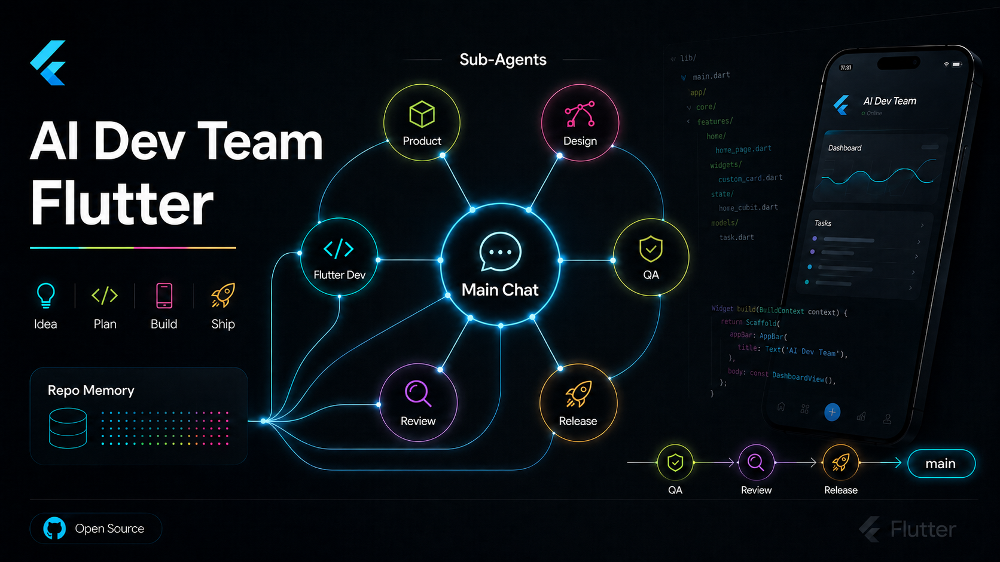
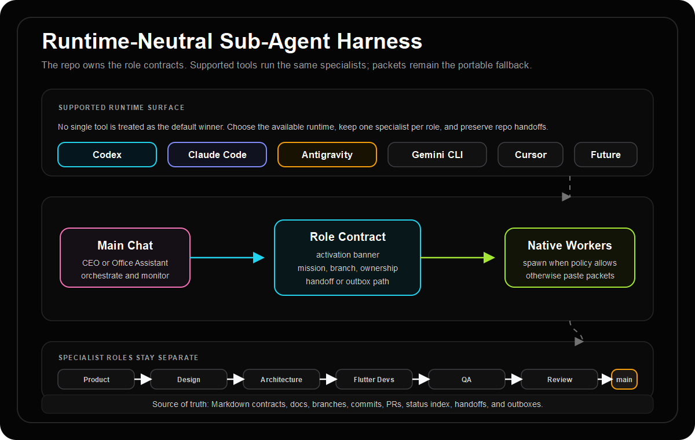
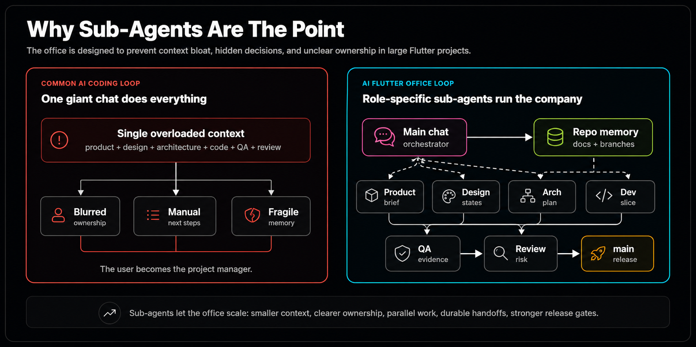
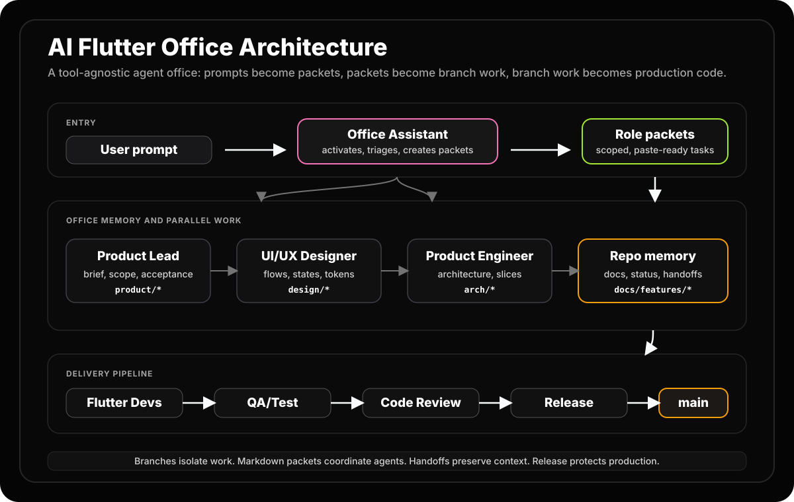
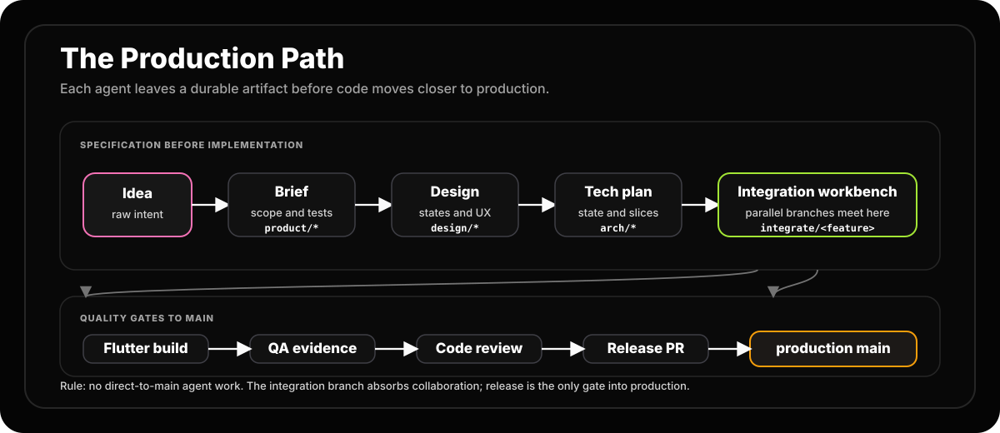
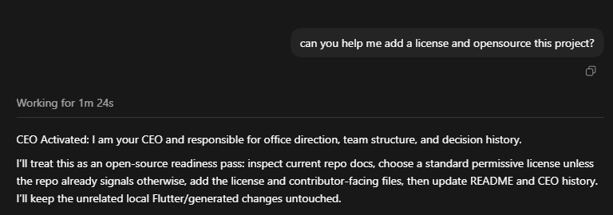
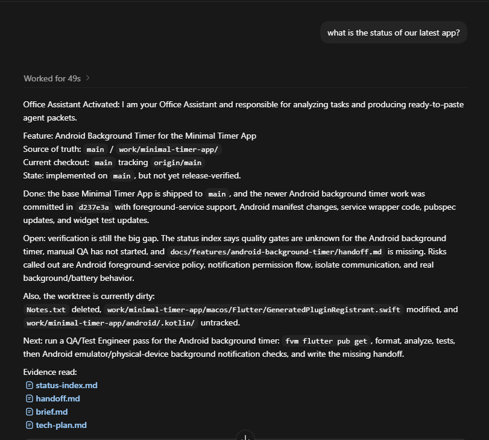
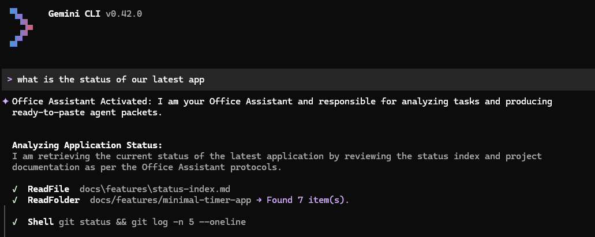

# AI Dev Team Flutter



[](LICENSE)
[](https://flutter.dev)
[](https://dart.dev)
[](#what-this-project-is)
[](#quality-gates)

AI Dev Team Flutter is an open-source **AI agent team framework for Flutter**
that turns a product idea into production-ready app code through role-specific
sub-agents, product/design/architecture contracts, repo-backed memory, MCP
tooling, and release gates.

Use this repo if you are searching for an AI software team for Flutter, a
multi-agent coding workflow, a runtime-neutral Codex, Claude Code, or
Antigravity sub-agent setup, a Gemini CLI or Cursor-friendly Flutter office, or
a practical example of AI-assisted product engineering with Dart, Flutter,
tests, code review, and release discipline.

This repo is not just a Flutter app. It is an office: a structured collaboration
system for taking a rough idea, shaping it through product and design, building
it with Flutter specialists, testing it, reviewing it, and merging only
production-ready work into `main`.

The ambition is simple and slightly dangerous in the best engineering way:
build the best Flutter AI dev team in the world.

## Who This Helps

- Flutter developers who want AI coding agents that understand routes, widgets,
  state, tests, platform builds, and release checks.
- Product builders who want product, UX, architecture, implementation, QA, code
  review, and release roles to work from the same repo-backed contracts.
- Teams experimenting with Codex, Claude Code, Antigravity, Gemini CLI, Cursor,
  MCP servers, local memory, or parallel sub-agent workflows.
- Open-source maintainers who want AI-assisted contributions to leave durable
  handoffs instead of hiding decisions inside chat history.

## What You Get

- A role-based AI office for Flutter product development.
- Branch, handoff, and PR rules for safe multi-agent work on GitHub.
- Product brief, design contract, technical plan, QA, and release templates.
- Codex, Claude Code, Antigravity, Gemini, Cursor, and MCP configuration
  examples.
- Flutter quality gates for format, analyze, tests, web builds, and browser
  smoke checks.
- Optional local semantic memory for durable decisions and searchable context.

## The Big Idea

This project is not a prompt collection and not a single chatbot with a bigger
context window. It is an **AI dev office**: one main chat acts like the CEO or
Office Assistant, then starts distinct specialist agents for product, design,
architecture, Flutter implementation, QA, code review, and release.



The main chat should stay light: it routes work, monitors branch state, reads
handoffs, and decides when to ask the user. The specialist agents do the deep
work inside their own context windows and leave durable output in the repo.

| Office Primitive | What It Does |
|---|---|
| Main chat | Orchestrates the whole feature run from idea to release-ready handoff. |
| Role contracts | Give each sub-agent its mission, branch, file ownership, and handoff path. |
| Native sub-agents | Let supported tools such as Codex, Claude Code, Antigravity, Gemini, or Cursor run specialists in parallel when the runtime permits it. |
| Packet fallback | Keeps role contracts portable as the default when native spawning is unavailable or not allowed. |
| Repo memory | Stores decisions in docs, branches, commits, status files, and outboxes. |

## Why Sub-Agents Are The Headline

Large Flutter projects are too much for one chat to hold cleanly. Product intent,
screen states, architecture decisions, implementation details, test evidence,
browser checks, and release risk all compete for context. This office splits that
work by role.



Role-specific sub-agents make the office stronger because:

- Product, design, architecture, implementation, QA, and review each get focused
  context instead of fighting inside one long transcript.
- Parallel work becomes safer because every agent has explicit branch and file
  ownership.
- The main chat can keep moving through the feature loop instead of asking the
  user to manually trigger each next step.
- Failed or weak role output can be retried from the same role contract without
  replaying the whole project.
- Handoffs and outboxes make progress inspectable by Codex, Claude Code,
  Antigravity, Gemini, Cursor, or a future tool.

Native sub-agent spawning is a first-class path for this office when the active
tool and runtime policy permit it. Codex, Claude Code, and Antigravity can each
run separate specialist agents from the same Markdown role contracts, keep their
branches and file ownership distinct, and monitor handoffs without cramming
every role into one transcript. Gemini, Cursor, and future harnesses can use the
same contract shape when they support native workers. When native spawning is
not available or not allowed, packet fallback keeps the workflow usable by
giving each role a ready-to-paste mission, branch, ownership list, and handoff
path.

## Open Source

AI Dev Team Flutter is open source under the MIT License.

- License: `LICENSE`
- Contributing guide: `CONTRIBUTING.md`
- Code of conduct: `CODE_OF_CONDUCT.md`
- Security policy: `SECURITY.md`

Contributions are welcome when they make the office clearer, more useful, more
Flutter-native, or more reliable.

## What This Project Is

Most AI coding workflows treat the assistant like one very busy developer. This
project treats AI as a team.

Each role has a job:

- The CEO keeps the office coherent.
- The Office Assistant turns unstructured tasks into role contracts, starts
  native sub-agents across supported tools when the runtime allows it, including
  Codex, Claude Code, and Antigravity, and prints packets as the portable
  default.
- The Product Lead clarifies what is worth building.
- The UI/UX Designer makes the experience implementable.
- The Product Engineer turns intent into architecture.
- Flutter developers build focused slices.
- QA proves behavior.
- Code Review protects quality.
- Release Engineering protects `main`.

The result should feel less like random code generation and more like walking
into a serious Flutter studio where every agent knows where to sit, what to own,
and when to hand off.

## Office Entrance

Welcome to the office architecture. Every feature starts as a conversation in
the main chat, then becomes native specialist agents or packets, branches,
handoffs, review, and finally production code.



The diagram is intentionally simple: prompts enter through the Office Assistant,
role contracts create scoped branch work through native sub-agents or packet
fallbacks, the repository preserves memory, and the delivery pipeline protects
`main`. The important rule is that specialists stay distinct: product and design
clarify intent, engineering builds, QA and review protect quality, and release
protects production.

CEO-level decisions live in `CEO_OVERVIEW.md`.

## The Production Path

The office does not let every agent write straight to `main`.



The path is intentionally gated: product, design, and architecture artifacts
come before implementation; tests and review come before release; only release
work moves into production `main`.

Work happens through an integration branch:

```text
main
  integrate/<feature-slug>
    product/<feature-slug>
    design/<feature-slug>
    arch/<feature-slug>
    feat/<feature-slug>/<slice>
    test/<feature-slug>
    fix/<feature-slug>/<issue>
```

`main` is production. `integrate/<feature-slug>` is the office workbench.

The office itself has a longer-lived home:

```text
org/main
```

`org/main` is the company operating system: roles, workflows, templates, skills,
MCP config, FVM setup, and CEO memory. Product `main` is where the current app
becomes production code. New products can start from `org/main` without
reinventing the office.

## Workspace Layout

The repository root is the office. Product apps live under `work/`.

```text
.
  AGENTS.md
  CEO_OVERVIEW.md
  docs/
  work/
    <app-slug>/
      lib/
      test/
      android/
      ios/
      web/
```

This keeps generated Flutter platform folders from taking over the office lobby.

Create new Flutter apps like this:

```powershell
fvm flutter create --project-name <dart_package_name> work/<app-slug>
```

Run app commands from the app workspace:

```powershell
Push-Location work/<app-slug>
fvm flutter pub get
fvm flutter analyze
fvm flutter test
Pop-Location
```

## Why It Is Flutter-Native

This office is tuned for Flutter, not generic app development.

Flutter work must account for:

- Widget tree clarity.
- Route contracts.
- Loading, empty, error, disabled, ready, and success states.
- Responsive layout across phone, tablet, desktop, keyboard, and text scaling.
- `ThemeData`, tokens, reusable widgets, and semantics.
- Unit, widget, integration, and golden tests.
- Flutter-specific review risks such as layout overflow, hidden state ownership,
  broad rebuilds, async context bugs, and brittle tests.

The docs under `docs/ai-office/` describe how each agent handles those concerns.

## Tooling

This repo uses FVM as the Flutter cockpit.

```powershell
fvm flutter --version --no-version-check
fvm dart --version
fvm dart mcp-server --help
```

Current verified local setup:

- FVM is installed.
- This repo is pinned with `.fvmrc` to `stable`.
- FVM resolves Flutter `3.38.8`.
- FVM resolves Dart `3.10.7`.
- `fvm dart mcp-server --help` works.

Project-local MCP and agent configs are included for tools that support them:

- `.codex/config.toml`
- `.mcp.json`
- `.claude/settings.json`
- `.cursor/mcp.json`
- `.gemini/settings.json`
- `GEMINI.md`

The MCP configs launch:

```powershell
fvm dart mcp-server --force-roots-fallback
```

`GEMINI.md` is the Gemini CLI instruction shim. It makes Gemini announce the
active role before tools and keeps status prompts on lightweight docs instead of
scanning app source.

Codex role agents are checked in under `.codex/agents/`, and Claude Code role
agents are checked in under `.claude/agents/`. Both sets map to the same office
roles and role contracts, so those tools can run the main-chat orchestrator plus
separate specialist agents instead of treating the feature team as one generic
worker. Antigravity uses the same Markdown role contracts, branch rules, and
repo handoffs, keeping the office model neutral even when each tool exposes
native spawning differently.

Official Flutter and Dart agent skills are installed in `.agents/skills`, with
their hashes recorded in `skills-lock.json`.

Local semantic memory is available as an optional FastEmbed/ONNX recall layer:

```powershell
python -m pip install -r tools/office-memory/requirements.txt
python tools/office-memory/index.py --allow-download
python tools/office-memory/search.py "background timer verification"
```

The generated index lives in `.agent-memory/`, is pointer-first, and is not
committed. CI does not run FastEmbed indexing; it only validates the office
runtime configuration. Agents must ask before the first model
download/initialization. Durable decision memories are written as Markdown under
`docs/ai-office/memory-history/` and become searchable after the next approved
index rebuild.

## How To Fire Up The Office

Just describe your task. No prefix needed:

```text
I want to build a habit tracker app.
```

```text
add onboarding to the timer app
```

```text
fix the timer overflow bug where it shows 61 minutes
```

Any unstructured prompt activates the Office Assistant, which reads lightweight
office and feature docs, determines the role sequence, and creates
**role contracts**.

The Assistant prints ready-to-paste packets as the portable default. If the
current tool supports native sub-agents and the runtime allows launching them,
the Assistant can start the roles directly. In Codex, Claude Code, or
Antigravity, native spawning is used when that tool's active launch policy
permits it. Otherwise, the same role contracts are printed as packets for
separate sessions in Codex, Claude Code, Antigravity CLI, Gemini CLI, Cursor, or
any AI tool, and each agent works within its defined scope.

For build or fix requests, the office should keep going until the feature is
release-ready, blocked, or waiting for final approval. You should not have to
ask it to run the next role after each toolchain checkpoint.

When using Gemini CLI, start it from the repo root so it loads `GEMINI.md`:

```powershell
gemini
```

If you are already inside a Gemini session after pulling new office rules, run
`/memory reload` or restart the session.

To skip the Office Assistant and invoke a specific role directly:

```text
Senior Flutter Engineer: implement the auth screen
```

Ask for progress at any time:

```text
status
```

```text
give me progress on onboarding
```

Status mode is read-only and branch-aware. The Assistant starts with
`docs/features/status-index.md`, handoffs, outboxes, and git refs instead of
crawling app source or generated platform folders.

### Role Involvement In Action

Every role announces itself before work starts. The CEO example shows office
governance involvement, while the Office Assistant examples show unstructured
status prompts being routed through a lightweight, read-only status protocol.
The same contract is portable across tools: Codex gets it through `AGENTS.md`,
Claude Code gets it through `CLAUDE.md` and `.claude/agents/`, and Gemini CLI
gets it through `GEMINI.md`.

**CEO**



**Office Assistant - Codex**



**Office Assistant - Gemini CLI**



### What A Packet Looks Like

The Office Assistant outputs prompts like this for each agent:

```markdown
### 💻 **Senior Flutter Engineer Involved**

You are the Senior Flutter Engineer for this project.
Read AGENTS.md for team rules.

Mission: build the onboarding screen shell and route registration.
Branch: feat/onboarding/senior-navigation
You own: work/minimal-timer-app/lib/features/onboarding/
Do NOT edit: work/minimal-timer-app/lib/shared/widgets/
Other agents: Junior Flutter Developer is working on shared widgets.
When done: commit using docs/ai-office/commit-guidelines.md and write summary to
  docs/features/onboarding/async/outbox/senior-flutter-engineer.md
```

Each role runs in a separate session on its own branch with disjoint file
ownership. The integration branch is where everything comes together.

## Quality Gates

Once the Flutter app scaffold exists, the default gates are:

```powershell
Push-Location work/<app-slug>
fvm flutter pub get
fvm dart format --set-exit-if-changed .
fvm flutter analyze
fvm flutter test
fvm flutter build web
Pop-Location
```

Release candidates should also earn target platform checks:

```powershell
Push-Location work/<app-slug>
fvm flutter build apk --debug
Pop-Location
```

For web-capable features, QA or Release Engineering should use browser tools
when available to open the app and smoke-test the primary user flow. If browser
automation is unavailable, the handoff should say so plainly.

## Map Of The Office

Start here if you are visiting:

- `CEO_OVERVIEW.md`: executive map, decisions, team structure, open items.
- `AGENTS.md`: rules every agent follows.
- `GEMINI.md`: Gemini CLI-specific first-response and status-mode guardrails.
- `docs/ai-office/org-branch-model.md`: how the company structure stays stable
  across products.
- `docs/ai-office/roles.md`: each role and its definition of done.
- `docs/ai-office/role-activation.md`: visible chat banners for involved
  roles.
- `docs/ai-office/status-protocol.md`: lightweight branch-aware progress checks.
- `docs/ai-office/commit-guidelines.md`: the office commit message standard.
- `docs/ai-office/task-triage.md`: which role to call when the task is unclear.
- `docs/ai-office/user-activation.md`: what to type in a brand-new AI session (User Involvement Contract).
- `docs/ai-office/workflow.md`: branch and handoff model.
- `docs/ai-office/async-agent-runtime.md`: parallel multi-session execution.
- `docs/ai-office/runtime-adapters.md`: native sub-agent harnesses and packet
  fallback behavior.
- `docs/ai-office/flutter-specialization.md`: what makes this Flutter-specific.
- `docs/ai-office/mcp-and-skills.md`: MCP and official skills setup.
- `docs/ai-office/local-memory.md`: local semantic memory over office docs.
- `docs/ai-office/gemini-cli.md`: Gemini CLI context loading and status
  guardrails.
- `docs/features/README.md`: where feature work lives.
- `work/README.md`: where product app scaffolds live.
- `docs/github-discoverability.md`: GitHub description, topics, social preview,
  and release-discovery checklist.

## Current Status

The README is intentionally branch-neutral and should stay the same across
`main`, `org/main`, integration branches, and feature branches. Branch-specific
product state, release evidence, role handoffs, and parallel work notes belong
under `docs/`, especially:

```text
docs/features/status-index.md
docs/features/<feature-slug>/
docs/features/<feature-slug>/async/
```

Use `docs/features/status-index.md` as the lightweight dashboard for active
branches. Use each feature folder for briefs, design contracts, technical plans,
QA evidence, outboxes, and handoffs. That keeps parallel work visible without
turning the README into a branch-specific status report.
