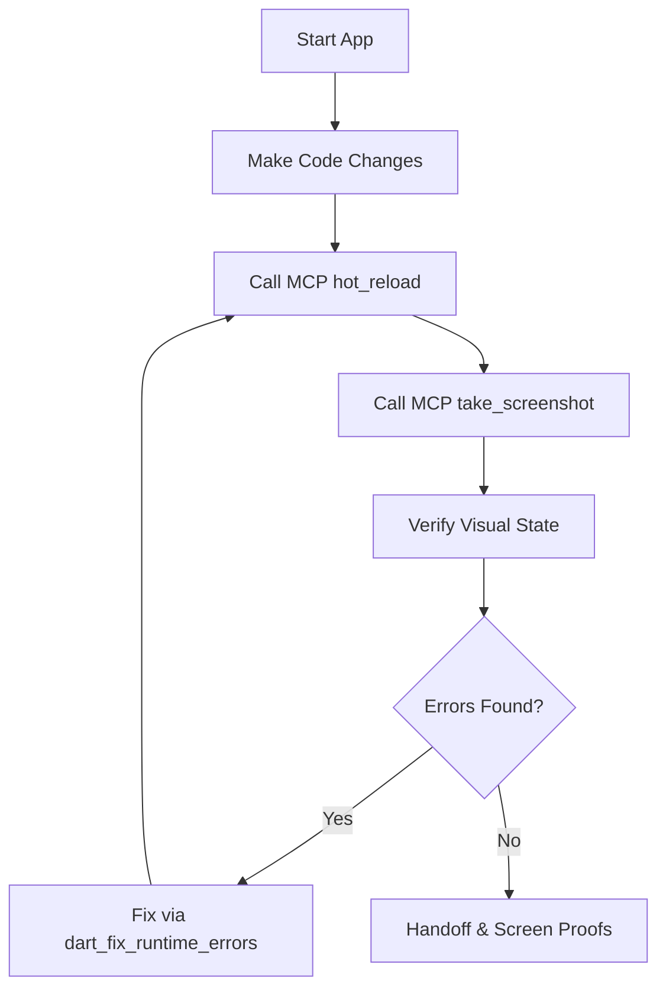

# Agentic Hot Reload Protocol

This protocol defines the live development loop for Flutter agents. Rather than blind code-build-check cycles, agents should run the app locally and interact with it using MCP tools.

## When to Use

Use this protocol for:
- Visual UI changes and screen styling.
- Debugging layout issues (e.g., overflows, alignment).
- Verifying state transitions (e.g., loading -> success -> error).
- Checking responsive layouts across different viewport dimensions.

## The Workflow Loop



1. **Start the App**: Launch the application targeting a web browser or virtual device.
2. **Make Code Changes**: Edit UI files in `lib/`.
3. **Hot Reload**: Execute `hot_reload` via MCP tool to apply code changes instantly.
4. **Take Screenshot**: Use `take_screenshot` via MCP tool to capture the UI.
5. **Verify**: Check the visual output against design specifications.
6. **Fix Errors**: If runtime errors or layout exceptions occur, use `get_runtime_errors` and the `dart-fix-runtime-errors` skill to repair the code.
7. **Repeat**: Continue the loop until the feature meets the design contract.

## Start Command

Run the application locally from the workspace root (or feature sandbox) with the DTD URI logging enabled:

```powershell
fvm flutter run -d chrome --print-dtd
```

> [!NOTE]
> The `--print-dtd` flag allows the Dart Tooling Daemon to expose connection details. The MCP server will automatically discover DTD and bind to your running app for inspection.

## Available MCP Tools

The official Dart and Flutter MCP server exposes:
- `hot_reload`: Applies changes immediately to the running app.
- `take_screenshot`: Captures current emulator/browser state.
- `get_runtime_errors`: Retrieves the active stack trace of recent layout/runtime exceptions.
- `widget_tree_inspection`: Examines widget constraints, keys, and hierarchies.
- `resolve_symbol`: Performs deep lookup of Dart/Flutter API symbol documentations.
- `dart_fix_runtime_errors` (Skill): Analyzes errors and writes a patch automatically.

## Quality Gates Integration

Screenshots captured during hot reload sessions serve as valid UI verification evidence:
- Save all screenshots to: `docs/features/<feature-slug>/assets/`.
- Reference and embed screenshots in `handoff.md` and the final PR.
- UI/UX Designers and Code Reviewers will check these assets to verify states before approval.

## Role Guidance

- **Senior Flutter Engineer / Junior Flutter Developer**: Must prefer this loop for visual development. Blind editing is a violation of the Quality Gate when visual outputs can be tested interactively.
- **QA / Test Engineer**: Use `take_screenshot` to document bug reports and compile test evidence.

## References

- **Dart MCP Server Source**: [dart-lang/ai](https://github.com/dart-lang/ai)
- **Official Documentation**: [docs.flutter.dev/ai/mcp-server](https://docs.flutter.dev/ai/mcp-server)
