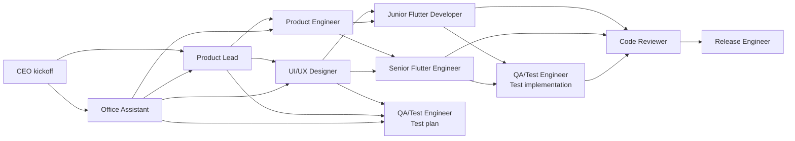

# Async Agent Runtime

The office should not depend on one giant chat session. Roles should be able to
run in separate sessions, separate tools, or separate AI services without losing
coordination.

The best default is simple:

> Use a native agent harness when the current tool has one. Use the repository
> as shared memory, branches as workspaces, and Markdown packets as the fallback
> cross-agent protocol.

This keeps the workflow compatible with Codex, Antigravity, Gemini CLI, Cursor,
Claude Code, plain terminal agents, and future tools.

## Core Principle

No role should require hidden chat history.

Every role session should be able to start from:

- `README.md`
- `CEO_OVERVIEW.md`
- `AGENTS.md`
- The relevant files in `docs/ai-office/`
- `docs/features/status-index.md` for project status
- The current feature folder under `docs/features/<feature-slug>/`
- The relevant app workspace under `work/<app-slug>/`, when code exists
- Its own agent session packet

If an agent needs context that is not in those files, the CEO or orchestrator
should write it down before delegating the task.

## Service-Agnostic Contract

Use only primitives every AI coding service understands:

- Git branches.
- Markdown files.
- Shell commands.
- Code files.
- PRs or patch diffs.
- Handoff notes.

MCP, installed skills, and tool-specific features are useful accelerators, but
they must be optional. The protocol should still work if an agent only has a
terminal, a text editor, and git.

## Native Harness First, Packet Fallback

Newer AI coding tools can spin up multiple sub-agents from one main chat. The
office should use that capability when it exists, because it reduces manual
copy-paste and lets the main chat coordinate work without becoming the only
context container.

The execution order is:

1. The main chat activates as CEO, Office Assistant, or the requested role.
2. It creates a role contract for each specialist.
3. If native sub-agents are available, it starts those agents with the role
   contracts. **CRITICAL**: Launch each specialist role as a distinct, separate sub-agent. Never collapse or blend multiple roles into a single "Feature Team Sub-agent" or generalist sub-agent.
4. If native sub-agents are not available, it prints ready-to-paste packets.
5. Every role writes back through branches, commits, handoffs, outboxes, and
   status files.

The role contract is the portable unit. A native harness receives it as the
sub-agent prompt. A human receives it as a packet to paste into another tool.

Native sub-agents do not replace the repo protocol:

- The main chat must still show which roles are being activated.
- Each sub-agent must still announce its activation banner before task work.
- Each sub-agent must still use the assigned branch and file ownership.
- Each sub-agent must still write an outbox or handoff when done.
- Status-only prompts remain read-only, even if the runtime can spawn agents.
- **Strict Independence**: Sub-agents must never edit overlapping files or cross into other roles' scopes without a documented handoff.

Use packets when:

- The current AI service cannot spawn sub-agents.
- The user wants to run roles in different tools.
- The role needs a separate account, model, IDE, emulator, or device.
- The task is sensitive and the user wants to review every prompt before launch.
- The native harness cannot guarantee disjoint file ownership.
- The tool runtime is prone to blending multiple roles into a single generic sub-agent (collapsing UX designer, Product Engineer, and Junior dev into a generic 'Feature Team Sub-agent' is strictly forbidden).

## Autonomous Feature Run

A feature execution prompt means the office should keep moving until the feature
is release-ready, blocked, or waiting for final approval. Toolchain completions
are checkpoints, not conversation endings.

The main chat should:

1. Start the required role agents in dependency order.
2. Wait for handoffs or tool results.
3. Read the outbox/status files.
4. Start the next role or follow-up fix agent when the path is clear.
5. Run the final release gate, including build and browser checks when
   available.
6. Notify the user with the final state and any remaining decisions.

The main chat should interrupt the user only for:

- Product ambiguity that blocks a useful brief.
- Permission, credential, network, emulator, or device access.
- Destructive git/file operations.
- Merge conflicts or overlapping ownership that cannot be resolved safely.
- Failed quality gates where the next fix is unclear or out of scope.
- Final release or merge approval.

Otherwise, role progress should be written to `docs/features/<feature-slug>/`,
`async/outbox/`, commits, and `docs/features/status-index.md`.

## Async Feature Workspace

Each feature should include an async run folder:

```text
docs/features/<feature-slug>/
  brief.md
  design-contract.md
  tech-plan.md
  test-plan.md
  handoff.md
  async/
    runbook.md
    status.md
    ownership.md
    decisions.md
    packets/
      office-assistant.md
      product-lead.md
      ui-ux-designer.md
      product-engineer.md
      senior-flutter-engineer.md
      junior-flutter-developer.md
      qa-test-engineer.md
      code-reviewer.md
      release-engineer.md
    outbox/
      office-assistant.md
      product-lead.md
      ui-ux-designer.md
      product-engineer.md
      senior-flutter-engineer.md
      junior-flutter-developer.md
      qa-test-engineer.md
      code-reviewer.md
      release-engineer.md
```

`packets/` are the prompts or task contracts given to each role. They may be
used directly by a native sub-agent harness or pasted manually into a separate
agent session.

`outbox/` is where each role writes the result of the session.

`status.md`, `ownership.md`, and `decisions.md` are the coordination layer.
`docs/features/status-index.md` is the cross-feature dashboard that lets the
Office Assistant answer progress questions without reading the whole app.

## Agent Session Packet

The Office Assistant generates a role contract for each role session. When the
runtime supports native sub-agents, the contract is used as the sub-agent prompt.
When it does not, the same contract is printed as a ready-to-paste packet. Each
contract answers five questions:

1. **Who are you?** (activation banner)
2. **What is your job?** (mission)
3. **What branch?** (prevents commit collisions)
4. **What files are yours and what is off-limits?** (prevents edit collisions)
5. **Who else is working and what do you leave behind?** (enables handoffs)

Example packet:

```text
Senior Flutter Engineer Activated: I am your senior Flutter engineer and responsible for complex implementation, shared patterns, state, navigation, and platform risk.

You are the Senior Flutter Engineer for this project.
Read AGENTS.md for team rules.

Mission: build the onboarding screen shell and route registration.
Branch: feat/onboarding/senior-navigation
You own: work/minimal-timer-app/lib/features/onboarding/
Do NOT edit: work/minimal-timer-app/lib/shared/widgets/
Other agents: Junior Flutter Developer is working on shared widgets.
When done: commit using docs/ai-office/commit-guidelines.md and write summary to
  docs/features/onboarding/async/outbox/senior-flutter-engineer.md
```

Packets should be under 200 words when practical. The activation banner remains
required even in short packets and native sub-agent prompts. The agent reads the
codebase itself. The packet sets boundaries and intent.

Packets should also tell the role to use `docs/ai-office/commit-guidelines.md`
for any commit it creates.

See `templates/agent-session-packet.md` for the full template.

## Handoff Packet

Every role ends by writing an outbox handoff:

```text
Role:
Branch:
Summary:
Changed files:
Decisions made:
Tests or checks:
Open questions:
Blockers:
Recommended next agents:
```

The next agent reads the previous outbox files instead of reading the entire
previous chat.

When a role changes feature state, it should also update
`docs/features/status-index.md` on the branch where the work lives.

## Parallelization Model

Not every role can run at once. The office should parallelize where dependencies
are clear.



Good parallel work:

- UI/UX Designer and Product Engineer can often work in parallel after the brief.
- QA/Test Engineer can write the test plan while developers implement.
- Senior and Junior Flutter developers can work in parallel when file ownership
  is disjoint.
- Code Reviewer can review docs, architecture, and test plans before all code is
  finished.

Bad parallel work:

- Two agents editing the same file without an owner.
- Developers implementing before product acceptance criteria exist.
- QA writing brittle tests before state names and user flows are stable.
- Release Engineer merging before review and test evidence exists.

## Branch Strategy For Async Sessions

Each role session should use its own branch:

```text
org/main
org/<initiative>
office/<initiative>
integrate/<feature-slug>
product/<feature-slug>
design/<feature-slug>
arch/<feature-slug>
feat/<feature-slug>/<slice>
test/<feature-slug>
fix/<feature-slug>/<issue>
```

For truly parallel coding, split by ownership:

```text
feat/mvp-dashboard/senior-shell
feat/mvp-dashboard/junior-agent-card
feat/mvp-dashboard/junior-status-panel
test/mvp-dashboard/widget-tests
```

Each branch should merge into `integrate/<feature-slug>`, not directly into
`main`.

Exception: company-structure changes should merge into `org/main`, then sync
into product `main` through an explicit org sync branch.

## Context Budgeting

Use small curated context instead of dumping the whole repo into every session.

### Small Packet

Use for narrow changes:

- `AGENTS.md`
- Role packet
- One feature file
- Relevant source files

### Medium Packet

Use for product, design, architecture, and normal implementation:

- `README.md`
- `CEO_OVERVIEW.md`
- `AGENTS.md`
- Relevant `docs/ai-office/` files
- Feature folder
- Relevant source files
- Relevant `work/<app-slug>/` files

### Large Packet

Use only for cross-cutting review, release, or architecture changes:

- Medium packet
- Current branch diff
- Related package decisions
- Test evidence
- Prior outbox handoffs

The CEO should prefer many medium-quality focused sessions over one giant
everything session.

## Async Runbook

Recommended flow:

1. CEO creates `integrate/<feature-slug>`.
2. CEO or Office Assistant creates the feature folder and role contracts.
3. If the current tool supports native sub-agents, start the Product Lead
   sub-agent. Otherwise print the Product Lead packet.
4. UI/UX Designer and Product Engineer run as native sub-agents or separate
   packet sessions.
5. CEO or Product Engineer updates `ownership.md`.
6. Flutter developers run in parallel on disjoint branches.
7. QA/Test Engineer runs test planning early and test implementation after code.
8. Code Reviewer reads diffs, outbox files, and test evidence.
9. Release Engineer runs the final release gate: format, analyze, tests, Flutter
   build, and browser smoke when supported.
10. Release Engineer prepares the final PR or merge approval request.
11. CEO updates `CEO_OVERVIEW.md` if the office changed.

## Compatibility Notes

### Codex

Use native sub-agents when the user has asked to run parallel or delegated role
work. Give each sub-agent one role contract, explicit file ownership, and a
handoff path. If native sub-agents are not available, use a fresh chat per role
with the packet. If MCP is available, use
`fvm dart mcp-server --force-roots-fallback`.

### Antigravity

Use Antigravity 2.0, Antigravity CLI, or the Antigravity SDK as a runtime
adapter, not as the office source of truth. The main chat may start dynamic
sub-agents or managed agents from the same role contracts used elsewhere.
Antigravity-specific artifacts are useful, but the durable record must still be
commits, branch diffs, outboxes, and feature status files.

### Claude Code

When Claude Code plugins or sub-agent harnesses are available, start one
sub-agent per role contract. Keep plugin-specific state optional. If the runtime
cannot create a sub-agent, print the packet and let the user paste it into a new
Claude Code session.

### Gemini CLI

Use the same role contracts, packet files, and branch names. The root
`GEMINI.md` file is the Gemini-specific instruction shim; it requires activation
banners before tool use and keeps status prompts on lightweight docs.

The `.gemini/settings.json` MCP config points at FVM for this repo. MCP gives
Gemini tools, while `GEMINI.md` gives Gemini the office behavior.

After pulling office-rule changes inside an existing Gemini session, run:

```text
/memory reload
```

Use `/memory list` or `/memory show` to verify that the root `GEMINI.md` is
loaded.

### Cursor

Use the packet as the agent prompt and keep the branch ownership map visible.
The `.cursor/mcp.json` MCP config points at FVM for this repo.

### Any Other AI Service

If the service has a native agent harness, start one sub-agent per role contract.
If it does not, paste the packet, attach or reference the relevant files, and
require the agent to write its outbox handoff. If the service cannot write files
directly, copy the handoff into the repo afterward.

## Rule Of Thumb

If a role's output would help the next role, put it in the repo. If it only
exists in a chat transcript, the office cannot reliably build on it.
