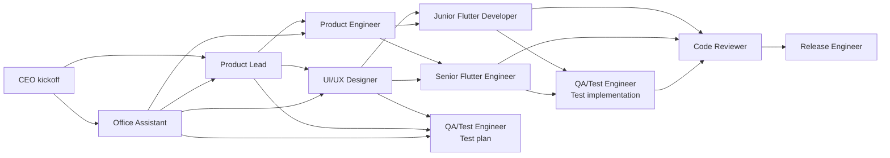

# Async Agent Runtime

The office should not depend on one giant chat session. Roles should be able to
run in separate sessions, separate tools, or separate AI services without losing
coordination.

The best default is simple:

> Use the repository as the shared memory, branches as workspaces, and Markdown
> packets as the cross-agent protocol.

This keeps the workflow compatible with Codex, Gemini CLI, Cursor, Claude Code,
plain terminal agents, and future tools.

## Core Principle

No role should require hidden chat history.

Every role session should be able to start from:

- `README.md`
- `CEO_OVERVIEW.md`
- `AGENTS.md`
- The relevant files in `docs/ai-office/`
- `docs/features/status-index.md` for project status
- The current feature folder under `docs/features/<feature-slug>/`
- The relevant app workspace under `work/<app-slug>/`, when code exists
- Its own agent session packet

If an agent needs context that is not in those files, the CEO or orchestrator
should write it down before delegating the task.

## Service-Agnostic Contract

Use only primitives every AI coding service understands:

- Git branches.
- Markdown files.
- Shell commands.
- Code files.
- PRs or patch diffs.
- Handoff notes.

MCP, installed skills, and tool-specific features are useful accelerators, but
they must be optional. The protocol should still work if an agent only has a
terminal, a text editor, and git.

## Async Feature Workspace

Each feature should include an async run folder:

```text
docs/features/<feature-slug>/
  brief.md
  design-contract.md
  tech-plan.md
  test-plan.md
  handoff.md
  async/
    runbook.md
    status.md
    ownership.md
    decisions.md
      packets/
      office-assistant.md
      product-lead.md
      ui-ux-designer.md
      product-engineer.md
      senior-flutter-engineer.md
      junior-flutter-developer.md
      qa-test-engineer.md
      code-reviewer.md
      release-engineer.md
      outbox/
      office-assistant.md
      product-lead.md
      ui-ux-designer.md
      product-engineer.md
      senior-flutter-engineer.md
      junior-flutter-developer.md
      qa-test-engineer.md
      code-reviewer.md
      release-engineer.md
```

`packets/` are the prompts or task contracts given to each role.

`outbox/` is where each role writes the result of the session.

`status.md`, `ownership.md`, and `decisions.md` are the coordination layer.
`docs/features/status-index.md` is the cross-feature dashboard that lets the
Office Assistant answer progress questions without reading the whole app.

## Agent Session Packet

The Office Assistant generates a ready-to-paste packet for each role session.
Each packet answers five questions:

1. **Who are you?** (activation banner)
2. **What is your job?** (mission)
3. **What branch?** (prevents commit collisions)
4. **What files are yours and what is off-limits?** (prevents edit collisions)
5. **Who else is working and what do you leave behind?** (enables handoffs)

Example packet:

```text
Senior Flutter Engineer Activated: I am your senior Flutter engineer and responsible for complex implementation, shared patterns, state, navigation, and platform risk.

You are the Senior Flutter Engineer for this project.
Read AGENTS.md for team rules.

Mission: build the onboarding screen shell and route registration.
Branch: feat/onboarding/senior-navigation
You own: work/minimal-timer-app/lib/features/onboarding/
Do NOT edit: work/minimal-timer-app/lib/shared/widgets/
Other agents: Junior Flutter Developer is working on shared widgets.
When done: commit using docs/ai-office/commit-guidelines.md and write summary to
  docs/features/onboarding/async/outbox/senior-flutter-engineer.md
```

Packets should be under 200 words when practical. The activation banner remains
required even in short packets. The agent reads the codebase itself. The packet
sets boundaries and intent.

Packets should also tell the role to use `docs/ai-office/commit-guidelines.md`
for any commit it creates.

See `templates/agent-session-packet.md` for the full template.

## Handoff Packet

Every role ends by writing an outbox handoff:

```text
Role:
Branch:
Summary:
Changed files:
Decisions made:
Tests or checks:
Open questions:
Blockers:
Recommended next agents:
```

The next agent reads the previous outbox files instead of reading the entire
previous chat.

When a role changes feature state, it should also update
`docs/features/status-index.md` on the branch where the work lives.

## Parallelization Model

Not every role can run at once. The office should parallelize where dependencies
are clear.



Good parallel work:

- UI/UX Designer and Product Engineer can often work in parallel after the brief.
- QA/Test Engineer can write the test plan while developers implement.
- Senior and Junior Flutter developers can work in parallel when file ownership
  is disjoint.
- Code Reviewer can review docs, architecture, and test plans before all code is
  finished.

Bad parallel work:

- Two agents editing the same file without an owner.
- Developers implementing before product acceptance criteria exist.
- QA writing brittle tests before state names and user flows are stable.
- Release Engineer merging before review and test evidence exists.

## Branch Strategy For Async Sessions

Each role session should use its own branch:

```text
org/main
org/<initiative>
office/<initiative>
integrate/<feature-slug>
product/<feature-slug>
design/<feature-slug>
arch/<feature-slug>
feat/<feature-slug>/<slice>
test/<feature-slug>
fix/<feature-slug>/<issue>
```

For truly parallel coding, split by ownership:

```text
feat/mvp-dashboard/senior-shell
feat/mvp-dashboard/junior-agent-card
feat/mvp-dashboard/junior-status-panel
test/mvp-dashboard/widget-tests
```

Each branch should merge into `integrate/<feature-slug>`, not directly into
`main`.

Exception: company-structure changes should merge into `org/main`, then sync
into product `main` through an explicit org sync branch.

## Context Budgeting

Use small curated context instead of dumping the whole repo into every session.

### Small Packet

Use for narrow changes:

- `AGENTS.md`
- Role packet
- One feature file
- Relevant source files

### Medium Packet

Use for product, design, architecture, and normal implementation:

- `README.md`
- `CEO_OVERVIEW.md`
- `AGENTS.md`
- Relevant `docs/ai-office/` files
- Feature folder
- Relevant source files
- Relevant `work/<app-slug>/` files

### Large Packet

Use only for cross-cutting review, release, or architecture changes:

- Medium packet
- Current branch diff
- Related package decisions
- Test evidence
- Prior outbox handoffs

The CEO should prefer many medium-quality focused sessions over one giant
everything session.

## Async Runbook

Recommended flow:

1. CEO creates `integrate/<feature-slug>`.
2. CEO creates the feature folder and async packets.
3. Product Lead runs in its own session and writes outbox.
4. UI/UX Designer and Product Engineer run in separate sessions.
5. CEO or Product Engineer updates `ownership.md`.
6. Flutter developers run in parallel on disjoint branches.
7. QA/Test Engineer runs test planning early and test implementation after code.
8. Code Reviewer reads diffs, outbox files, and test evidence.
9. Release Engineer merges the integration branch to `main`.
10. CEO updates `CEO_OVERVIEW.md` if the office changed.

## Compatibility Notes

### Codex

Use a fresh chat or subtask per role. Give the role packet plus relevant files.
If MCP is available, use `fvm dart mcp-server --force-roots-fallback`.

### Gemini CLI

Use the same packet files and branch names. The `.gemini/settings.json` MCP config
points at FVM for this repo.

### Cursor

Use the packet as the agent prompt and keep the branch ownership map visible.
The `.cursor/mcp.json` MCP config points at FVM for this repo.

### Any Other AI Service

Paste the packet, attach or reference the relevant files, and require the agent
to write its outbox handoff. If the service cannot write files directly, copy the
handoff into the repo afterward.

## Rule Of Thumb

If a role's output would help the next role, put it in the repo. If it only
exists in a chat transcript, the office cannot reliably build on it.
