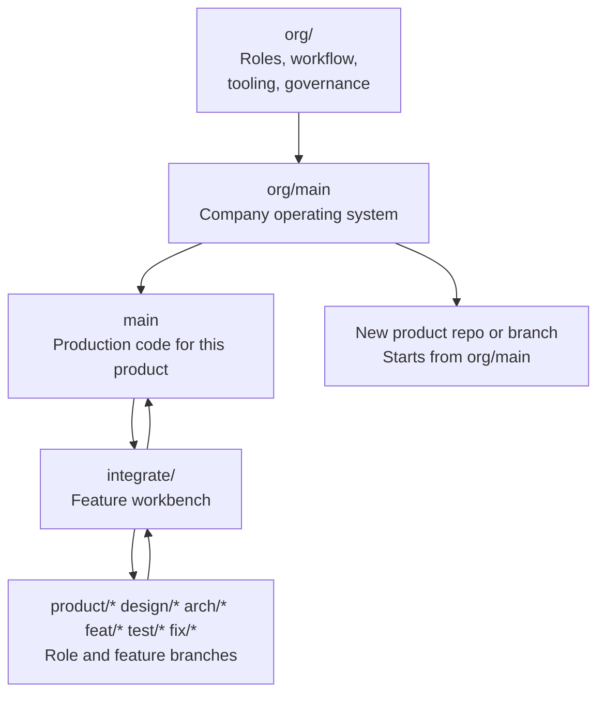

# Organization Branch Model

The AI office should outlive any single app idea.

Product code can change quickly. The company structure should change slowly and
intentionally. To make that possible, use a long-lived organization branch:

```text
org/main
```

`org/main` is the canonical company operating system. Product branches inherit
from it, but should not casually rewrite it.

## Branch Responsibilities



## What Belongs On `org/main`

Keep durable office structure here:

- `README.md`
- `CEO_OVERVIEW.md`
- `AGENTS.md`
- `.agents/`
- `.cursor/`
- `.gemini/`
- `.github/PULL_REQUEST_TEMPLATE.md`
- `docs/ai-office/`
- `docs/features/README.md`
- `skills-lock.json`
- `.fvmrc`
- `work/README.md`
- shared templates and scripts for starting features

These files describe the company, not one product feature.

## What Does Not Belong On `org/main`

Avoid product-specific implementation:

- `work/<app-slug>/lib/`
- `work/<app-slug>/test/`
- `work/<app-slug>/integration_test/`
- `work/<app-slug>/android/`
- `work/<app-slug>/ios/`
- `work/<app-slug>/web/`
- product-specific assets
- feature-specific app code

Product code belongs under `work/<app-slug>/` on product `main` and its feature
branches.

## How Organization Changes Work

Use `org/<initiative>` for company changes:

```text
org/add-security-reviewer
org/update-flutter-quality-gates
org/add-async-runtime
org/sync-official-skills
```

Flow:

1. Branch from `org/main`.
2. Change office docs, templates, configs, or skills.
3. Update `CEO_OVERVIEW.md`.
4. Review the org change.
5. Merge back to `org/main`.
6. Sync `org/main` into product `main` through an explicit org sync PR.

## How Product Work Uses The Office

Product work should branch from product `main`, not `org/main`:

```text
main
  integrate/<feature-slug>
    product/<feature-slug>
    design/<feature-slug>
    arch/<feature-slug>
    feat/<feature-slug>/<slice>
    test/<feature-slug>
    fix/<feature-slug>/<issue>
```

If a feature reveals that the office itself needs to change, do not bury that
inside the feature branch. Create a separate `org/<initiative>` branch.

## New Product Strategy

For a new product:

1. Start from `org/main`.
2. Create that product's `main`.
3. Keep the office files.
4. Add product code under `work/<app-slug>/` through normal feature branches.
5. Periodically sync new org improvements from `org/main`.

This lets every future product start with the same CEO memory, role structure,
async runtime, Flutter gates, FVM setup, MCP config, and official skills.

## Sync Strategy

Use explicit sync branches:

```text
org-sync/<date-or-version>
```

Example:

```powershell
git checkout main
git checkout -b org-sync/2026-05-18
git merge org/main
```

Resolve conflicts carefully. Product code should not rewrite office structure
unless the sync is intentionally changing the office.

## CEO Rule

If a change affects how the company works, it belongs on `org/main` first.

If a change affects what the product does, it belongs on product branches.

If a change affects both, split it into two branches:

- `org/<initiative>` for the office change.
- `integrate/<feature-slug>` for the product change.
