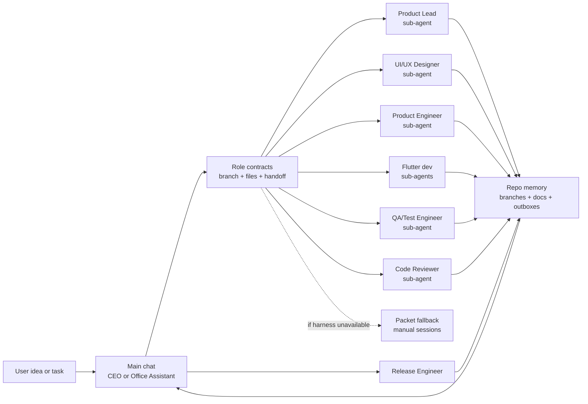

# Runtime Adapters

The AI office should be able to run on many agent platforms without rewriting
the company. Codex, Antigravity, Claude Code, Gemini, Cursor, and future tools
can all be useful runtimes. None of them should become the office itself.

## Boundary

The office core lives in repo files:

- `AGENTS.md`
- `CEO_OVERVIEW.md`
- `docs/ai-office/`
- `docs/features/<feature-slug>/`
- Branches, commits, diffs, handoffs, and outboxes

A runtime adapter is only the way a role gets executed.

## Execution Preference

Use this order:

1. **Native sub-agent harness**: if the current tool can start role-specific
   sub-agents, the main chat should launch them directly.
2. **Packet fallback**: if the tool cannot launch sub-agents, the main chat
   prints ready-to-paste packets.
3. **Manual handoff**: if the tool cannot edit files, the user or CEO copies the
   final handoff back into the repo.

The same role contract powers all three modes.

## Why Role Sub-Agents Matter

Large Flutter projects punish one giant chat context. Role sub-agents let the
office split context by responsibility instead of asking one model session to
remember product intent, design details, architecture, implementation, tests,
review, and release at the same time.

Advantages:

- Product, design, architecture, implementation, QA, and review can carry
  different context windows.
- Parallel roles can work on disjoint files without bloating the main chat.
- The main chat can stay focused on orchestration, blockers, and final quality.
- A failed sub-agent can be retried from its role contract without replaying the
  entire project history.
- Large projects can preserve clearer ownership because each role writes a
  handoff or outbox instead of burying decisions in chat.

## Antigravity 2.0 Fit

Antigravity 2.0 is the strongest fit for this architecture right now because it
is built around an agent harness: dynamic sub-agents, background or managed
agent work, CLI/SDK entry points, and Markdown-defined agent instructions map
cleanly onto this office's role-contract model.

Use Antigravity 2.0 when available for:

- Starting multiple specialist roles from one main chat.
- Running long QA, review, or verification jobs in the background.
- Keeping the main chat as the orchestrator while sub-agents own focused work.
- Turning the same Markdown role contracts into repeatable SDK or CLI workflows.

### CRITICAL ANTIGRAVITY 2.0 WARNING: SUB-AGENT COLLAPSING
- **DO NOT collapse multiple specialist roles** into a single generic sub-agent (e.g. UX designer, Product engineer, and Junior dev collapsed into a single `Feature Team Sub-agent`). Doing so violates the office design, leads to context bloat, and defeats the goal of parallel, disjoint workflows.
- **You MUST spawn separate, independent sub-agents** for each distinct specialist role required in your plan. If you need a UX designer and a Junior developer, use the sub-agent harness tool (`invoke_subagent`) to invoke them as separate sub-agents, passing their specific role contracts.
- **Limit/Parallelization Constraint**: If Antigravity limits the number of active sub-agents, run them sequentially in order of their workflow dependencies (e.g. UX Designer completes first and writes an outbox, then Product Engineer runs, then developers start) rather than blending them into one.

The office has not yet been fully tested across every other provider's harness.
The contract should still work across Codex, Claude Code plugins, Gemini, Cursor,
and future tools because it only depends on Markdown instructions, git branches,
repo files, shell commands, and handoff notes. Treat those integrations as
portable but still to be proven in real project runs.

## Adapter Contract

Every adapter must preserve these rules:

- Print the main role activation banner before orchestration work.
- Give each sub-agent its own role activation banner as the first line.
- Pass the mission, branch, file ownership, off-limits files, context paths, and
  handoff path to the role.
- Keep branch ownership disjoint whenever possible.
- Require outbox or handoff notes before review.
- Keep status-only prompts read-only.
- Treat provider-specific logs, dashboards, and artifacts as helpful but not
  authoritative.

The repo remains the source of truth.

## Supported Runtime Profiles

### Codex

Use native sub-agents when the user asks to run delegated or parallel role work.
Each sub-agent gets exactly one role contract and a narrow ownership scope.
Packets remain the fallback for tools or environments without sub-agent support.

### Antigravity 2.0, CLI, And SDK

Use Antigravity as a strong optional runtime for dynamic sub-agents, async
background work, managed agents, and SDK-driven workflows. Keep all role
definitions in repo Markdown. If Antigravity creates extra artifacts, summarize
the durable parts into outboxes, status files, and commits.

### Claude Code With Plugins

Use plugin or harness sub-agents when available. Keep plugin-specific state
disposable. The role contract and repo handoff are the durable interface.

### Gemini, Cursor, And Other Tools

If native sub-agents exist, use them. If not, paste the packets into separate
sessions. The workflow should still function with only Markdown, shell, editor,
and git.

## Main Chat Responsibilities

The main chat is the orchestrator, not the whole company.

It should:

- Decide which roles are needed.
- Create role contracts.
- Start native sub-agents when available.
- Print packet fallbacks when needed.
- Monitor outboxes, status files, and branch diffs.
- Escalate blockers to the CEO or user.

It should not:

- Hide important context in chat-only memory.
- Let sub-agents edit overlapping files without coordination.
- Treat a provider's dashboard as more authoritative than the repo.
- Let a status-only prompt turn into implementation.

## Packet Fallback Rule

Every native sub-agent launch should have an equivalent packet form. If the
runtime fails, the user should be able to continue by copying the packet into a
new session without changing the workflow.
