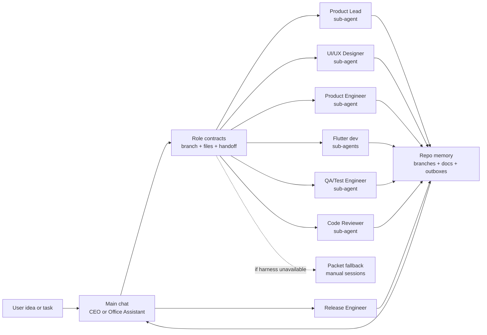

# Runtime Adapters

The AI office should be able to run on many agent platforms without rewriting
the company. Codex, Antigravity, Claude Code, Gemini, Cursor, and future tools
can all be useful runtimes. None of them should become the office itself.

## Boundary

The office core lives in repo files:

- `AGENTS.md`
- `CEO_OVERVIEW.md`
- `docs/ai-office/`
- `docs/features/<feature-slug>/`
- Branches, commits, diffs, handoffs, and outboxes

A runtime adapter is only the way a role gets executed.

## Execution Preference

Use this order:

1. **Packet fallback**: the main chat prints ready-to-paste packets as the
   portable default for every role contract.
2. **Native sub-agent harness**: if the current tool can start role-specific
   sub-agents and the active runtime policy permits it, the main chat may launch
   them directly. In Codex, `multi_agent_v1.spawn_agent` is allowed only when
   the user explicitly asks for sub-agents, delegation, or parallel agent work,
   or when runtime metadata otherwise permits native spawning.
3. **Manual handoff**: if the tool cannot edit files, the user or CEO copies the
   final handoff back into the repo.

The same role contract powers all three modes.

## Why Role Sub-Agents Matter

Large Flutter projects punish one giant chat context. Role sub-agents let the
office split context by responsibility instead of asking one model session to
remember product intent, design details, architecture, implementation, tests,
review, and release at the same time.

Advantages:

- Product, design, architecture, implementation, QA, and review can carry
  different context windows.
- Parallel roles can work on disjoint files without bloating the main chat.
- The main chat can stay focused on orchestration, blockers, and final quality.
- A failed sub-agent can be retried from its role contract without replaying the
  entire project history.
- Large projects can preserve clearer ownership because each role writes a
  handoff or outbox instead of burying decisions in chat.


```mermaid
flowchart LR
    User["User idea or task"]
    Main["Main chat\nCEO or Office Assistant"]
    Contract["Role contracts\nbranch + files + handoff"]
    Product["Product Lead\nsub-agent"]
    Design["UI/UX Designer\nsub-agent"]
    Arch["Product Engineer\nsub-agent"]
    Dev["Flutter dev\nsub-agents"]
    QA["QA/Test Engineer\nsub-agent"]
    Review["Code Reviewer\nsub-agent"]
    Release["Release Engineer"]
    Repo["Repo memory\nbranches + docs + outboxes"]
    Packet["Packet fallback\nmanual sessions"]

    User --> Main --> Contract
    Contract --> Product
    Contract --> Design
    Contract --> Arch
    Contract --> Dev
    Contract --> QA
    Contract --> Review
    Contract -. if harness unavailable .-> Packet
    Product --> Repo
    Design --> Repo
    Arch --> Repo
    Dev --> Repo
    QA --> Repo
    Review --> Repo
    Repo --> Main
    Main --> Release --> Repo
```

## Native Runtime Fit

Codex native sub-agents are the concrete operational path for Codex when
`multi_agent_v1.spawn_agent` is available and the current runtime policy permits
native spawning. The Office Assistant creates the same role contracts it would
print as packets, then launches one Codex sub-agent per specialist role with the
matching Codex `agent_type` only when that launch is allowed.

Antigravity remains a strong optional runtime because it is built around an
agent harness: dynamic sub-agents, background or managed agent work, CLI/SDK
entry points, and Markdown-defined agent instructions map cleanly onto this
office's role-contract model.

Use native harnesses such as Codex or Antigravity when available and allowed
for:

- Starting multiple specialist roles from one main chat.
- Running long QA, review, or verification jobs in the background.
- Keeping the main chat as the orchestrator while sub-agents own focused work.
- Turning the same Markdown role contracts into repeatable SDK or CLI workflows.

### Critical Native-Harness Guardrail: Sub-Agent Collapsing
- **DO NOT collapse multiple specialist roles** into a single generic sub-agent (e.g. UX designer, Product engineer, and Junior dev collapsed into a single `Feature Team Sub-agent`). Doing so violates the office design, leads to context bloat, and defeats the goal of parallel, disjoint workflows.
- **When spawning is permitted, you MUST spawn separate, independent sub-agents** for each distinct specialist role required in your plan. In Codex, call `multi_agent_v1.spawn_agent` once per role contract. In Antigravity, invoke each role as its own sub-agent.
- **Limit/Parallelization Constraint**: If the runtime limits the number of active sub-agents, run them sequentially in order of their workflow dependencies (e.g. UX Designer completes first and writes an outbox, then Product Engineer runs, then developers start) rather than blending them into one.

The office has Codex-native role definitions under `.codex/agents/` and can use
Codex sub-agents when `multi_agent_v1.spawn_agent` is exposed and allowed. The
same contract should still work across Claude Code plugins, Gemini, Cursor, and
future tools because it only depends on Markdown instructions, git branches,
repo files, shell commands, and handoff notes. Treat non-Codex integrations as
portable but still to be proven in real project runs.

## Adapter Contract

Every adapter must preserve these rules:

- Print the main role activation banner before orchestration work.
- Give each sub-agent its own role activation banner as the first line.
- Pass the mission, branch, file ownership, off-limits files, context paths, and
  handoff path to the role.
- Keep branch ownership disjoint whenever possible.
- Require outbox or handoff notes before review.
- Keep status-only prompts read-only.
- Treat provider-specific logs, dashboards, and artifacts as helpful but not
  authoritative.

The repo remains the source of truth.

## Supported Runtime Profiles

### Codex

Instruction file: `AGENTS.md` is read automatically by Codex at project root.

Native sub-agent tool: when the `multi_agent_v1` tools are available, the
Office Assistant starts specialist roles with `spawn_agent` only if the user
explicitly asked for sub-agents, delegation, or parallel agent work, or runtime
metadata otherwise permits native spawning. Otherwise it prints the same role
contracts as packets.

Operational rules:

- Spawn exactly one Codex sub-agent per specialist role contract.
- Do not call `spawn_agent` merely because the tool exists; Codex tool metadata
  currently requires an explicit user request for sub-agents, delegation, or
  parallel agent work unless a runtime policy says otherwise.
- Use the matching Codex role type as `agent_type` when available
  (`product-lead`, `ui-ux-designer`, `product-engineer`,
  `senior-flutter-engineer`, `junior-flutter-developer`,
  `qa-test-engineer`, `code-reviewer`, `release-engineer`, or `ceo`).
  These role types mirror `.codex/agents/` definitions; the TOML files are not
  passed to `spawn_agent`.
- Put the complete role contract in `message` or `items`; the first visible
  line must be the role activation banner.
- Keep branch, owned paths, files to avoid, context paths, and handoff path in
  the prompt. These boundaries are mandatory, even for native agents.
- Leave `fork_context` false unless the role truly needs prior hidden chat
  context. Prefer repo files, packets, and outboxes as shared memory.
- Do not use the generic `worker` or `default` type for a standard office role
  when a role-specific Codex agent type exists.
- If a concurrency limit prevents parallel spawning, run the same role contracts
  sequentially. Never combine roles to fit the limit.
- When a spawned agent finishes, inspect its changed paths and outbox before
  launching dependent roles.

MCP setup:

```powershell
codex mcp add dart -- fvm dart mcp-server --force-roots-fallback
```

This repo also checks in the project-scoped Codex MCP config at
`.codex/config.toml`:

```toml
[mcp_servers.dart]
command = "fvm"
args = ["dart", "mcp-server", "--force-roots-fallback"]
```

Sub-agent protocol: each office role runs as a separate Codex agent. The role
contract is passed as the agent prompt. Each agent has shell, git, and file
access according to its configured sandbox. The orchestrator monitors progress
via `wait_agent`, git refs, changed paths, and outbox files.

Use `wait_agent` for agent completion when the result is on the critical path,
and close completed agents when they are no longer needed. In interactive Codex
interfaces that expose threads, use `/agent` to switch between agent threads.

TOML-based agent configs live in `.codex/agents/` for persistent role
definitions. Each file defines `name`, `description`, `developer_instructions`,
and optional model/sandbox preferences so Codex can expose matching role types
for repeated launch. The `spawn_agent` call receives the role type name in
`agent_type`, not the TOML file itself. The office keeps one file per standard
role.

Model selection: use `codex --model <model-name>` to pick a role-specific
model. Heavier roles like architecture or review can use a stronger model while
narrow implementation tasks can use a faster one.

Config: `.codex/config.toml` supports `max_threads` and `max_depth` settings
to control parallelism and recursion depth.

Session logs are stored in `~/.codex/sessions/` as JSONL files. These are
useful for post-run auditing but are not the durable office record. The repo
remains the source of truth.

### Antigravity 2.0, CLI, And SDK

Use Antigravity as a strong optional runtime for dynamic sub-agents, async
background work, managed agents, and SDK-driven workflows. Keep all role
definitions in repo Markdown. If Antigravity creates extra artifacts, summarize
the durable parts into outboxes, status files, and commits.

### Claude Code

Instruction file: `CLAUDE.md` at the project root. Claude Code reads this
automatically for office behavior rules, activation banners, and status-mode
guardrails.

MCP config: `.claude/settings.json` for project-level MCP server definitions.

Standard sub-agents: define agents as `.claude/agents/*.md` files. Each file
contains a custom system prompt, tool allowlist, and model preference for one
role. Claude Code discovers these automatically.

This repo checks in project-level Claude agents for every standard office role
under `.claude/agents/`. Claude also reads the root `.mcp.json` for project MCP
servers and `.claude/settings.json` for Claude-specific settings.

Agent Teams (experimental): enable via the environment variable
`CLAUDE_CODE_EXPERIMENTAL_AGENT_TEAMS=1`. This activates a Team Lead plus
Teammates model with direct Mailbox communication between agents.

> **Warning**: Agent Teams can consume 3–7× the tokens of a single-agent
> session. Use for complex multi-role features, not simple tasks.

Agent View: press `\` in the Claude Code terminal to open a dashboard of
active and parallel agents.

Backgrounded agents: agents can continue execution without terminal streaming,
freeing the terminal for other work.

Adversarial Verification: use reviewer agents to audit worker output before
commits. The reviewer reads the diff and outbox, flags issues, and blocks the
merge until resolved.

Headless mode: run `claude --print -p "Product Lead: <task>"` for batch or CI
workflows. The output is printed to stdout without an interactive session.

The same role contracts used by other runtimes apply here. Keep plugin-specific
state disposable. The role contract and repo handoff are the durable interface.

### Local Semantic Memory

Codex memories and Claude project memories are useful personal recall layers, but
required team guidance must stay in checked-in docs. For repo-local semantic
recall, use `docs/ai-office/local-memory.md` and the scripts under
`tools/office-memory/`. They build a local FastEmbed/ONNX index over office docs
and return source paths for citation.

### Gemini CLI / Antigravity CLI, Cursor, And Other Tools

If native sub-agents exist and launch policy allows them, use them. If not,
paste the packets into separate sessions. The workflow should still function
with only Markdown, shell, editor, and git.

> **Note**: Gemini CLI standard tier reaches end-of-life on June 18, 2026. The
> successor is Antigravity CLI (`agy`). See
> `docs/ai-office/antigravity-migration.md` for the full migration plan.

Import existing Gemini configs into Antigravity CLI:

```powershell
agy plugin import gemini
```

Antigravity CLI is backward compatible: `GEMINI.md` and `.gemini/settings.json`
are still read. The new convention prefers the `.agents/` directory for skills
and agent definitions, but existing Gemini-era configs continue to work without
changes.

## Main Chat Responsibilities

The main chat is the orchestrator, not the whole company.

It should:

- Decide which roles are needed.
- Create role contracts.
- Start native sub-agents when available and allowed.
- Print packet fallbacks when needed.
- Monitor outboxes, status files, and branch diffs.
- Escalate blockers to the CEO or user.

It should not:

- Hide important context in chat-only memory.
- Let sub-agents edit overlapping files without coordination.
- Treat a provider's dashboard as more authoritative than the repo.
- Let a status-only prompt turn into implementation.

## Packet Fallback Rule

Every native sub-agent launch should have an equivalent packet form. If native
launch is unavailable, disallowed, or fails, the user should be able to continue
by copying the packet into a new session without changing the workflow.
