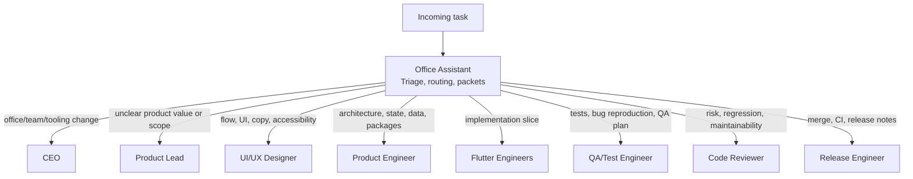

# Task Triage

When you know the task but do not know which role to call, call the Office
Assistant.

The Office Assistant is the front desk of the AI Flutter office. It listens to
the task, chooses the right role or role sequence, prepares the packets, and
keeps the work moving without pretending to be the CEO.

## When To Call The Office Assistant

Use the Office Assistant for:

- "I have an idea, but I do not know where to start."
- "Which role should handle this?"
- "Turn this task into packets for the team."
- "Start the right agents in the right order."
- "This bug/design/request feels cross-functional."
- "Summarize where the office is and what should happen next."

## What The Office Assistant Owns

- Triage.
- Role routing.
- Packet creation.
- Status updates.
- Handoff collection.
- Dependency ordering.
- Escalation to CEO when the task changes the office or product direction.

## What The Office Assistant Does Not Own

- Final product direction.
- Company-structure decisions.
- Deep architecture decisions.
- Final design approval.
- Merging to `main`.

Those belong to CEO, Product Lead, Product Engineer, UI/UX Designer, and Release
Engineer.

## Triage Map



## Routing Rules

- New product idea: CEO, then Product Lead.
- Feature request: Product Lead, UI/UX Designer, Product Engineer.
- Visual or usability issue: UI/UX Designer, then Flutter Engineer.
- Architecture or dependency question: Product Engineer.
- Flutter implementation task: Senior Flutter Engineer for patterns, Junior
  Flutter Developer for narrow slices.
- Bug report: QA/Test Engineer first if reproduction is unclear, Flutter
  Engineer first if the fix is obvious.
- Test gap: QA/Test Engineer.
- Review request: Code Reviewer.
- Release or branch readiness: Release Engineer.
- Office/process/tooling change: CEO through `org/<initiative>`.

## Default Assistant Output

The Office Assistant should produce:

```text
Recommended owner:
Supporting roles:
Branch:
Feature folder:
Packets to create:
First three actions:
Risks or unknowns:
Escalations:
```

If the work is ready to execute, the Office Assistant creates or updates the
agent session packets in:

```text
docs/features/<feature-slug>/async/packets/
```

If the work is not ready, it asks the minimum useful clarification or routes to
Product Lead.

## One-Line Activation

Use this when you are unsure:

```text
Office Assistant: triage this task and route it to the right role sequence:
<task>
```

In a brand-new chat or tool session, the user may simply say:

```text
Office Assistant: <task>
```

The Office Assistant is responsible for reading the repo docs, checking branch
state, and choosing the workflow. See `user-activation.md`.

