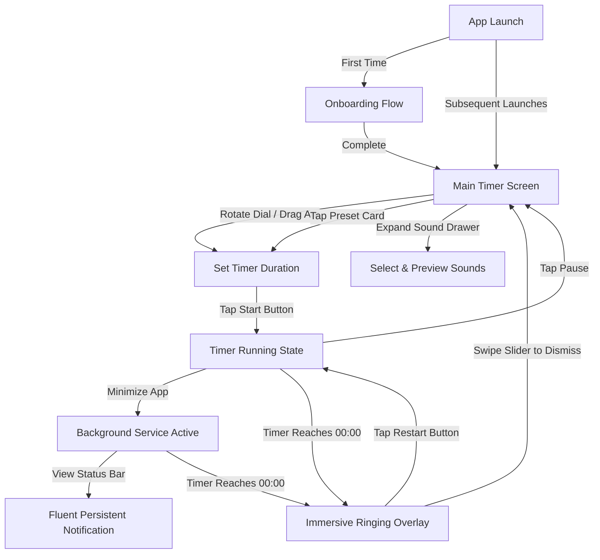

# Feature Brief: Fluent Minimal Redesign (Electric Mint Edition)

## Problem

The current user interface of the Minimal Timer app relies on standard Material 3 design elements, which—while functional and clean—lack a premium, highly tactile, and visually cohesive identity. In a crowded marketplace of utility apps, users are drawn to apps that offer an emotional, engaging, and polished interactive experience. 

Specifically, the current design has:
1. A standard light/dark behavior that doesn't enforce a premium, focused atmosphere.
2. Rigid and basic circular progress indicators without physics or tactile response.
3. Standard Material components (standard buttons, choice chips) that lack the high-end, bespoke feel of specialized focus tools.
4. Rigid transitions between settings, overlays, and main timer screens.

## Target User

- **Design-Conscious Professionals & Creatives**: Developers, designers, writers, and students who curate their workspace aesthetic and want a focus tool that feels like a premium utility rather than a basic system widget.
- **Minimalists**: Users who value low cognitive load, clutter-free interfaces, and single-purpose tools with high-fidelity interactions.
- **Tactile/Sensory-Driven Users**: Individuals who feel more connected to digital tools when they provide physical micro-feedback (haptic ticks, springy bounces, realistic inertia).

## Goal

Transform the Minimal Timer into an ultra-premium, tactile, and visually stunning productivity tool. The redesigned app will enforce a singular, beautiful **Enforced Dark Mode only** theme utilizing a deep carbon backdrop, offset by a vibrant **Electric Mint** accent. Every interaction—dragging the dial, selecting a preset, opening sound settings, and receiving a timer alarm—will feel rich, fluid, and physically modeled, establishing a brand-new standard for minimalist utility apps.

---

## Theme & Visual Style Specifications

To maintain absolute visual consistency and deliver a highly focused experience, the app will completely transition to an **Enforced Dark Mode**. The design uses high-contrast typography, deep surface layering, and vibrant neon accents to guide the user's attention.

| Design Attribute | Value / Specification | Hex Code / Asset |
| :--- | :--- | :--- |
| **Primary Backdrop** | Deep Obsidian / Carbon (Darkest background layer) | `0xFF0B0F19` |
| **Card / Surface BG** | Obsidian Grey (Raised surfaces, preset cards, expanded panels) | `0xFF161B26` |
| **Primary Accent** | Electric Mint (Progress arc, primary icons, active states) | `0xFF00F5D4` |
| **Secondary Accent** | Soft Teal (Subtle active states, glowing highlights) | `0xFF00B4D8` |
| **Text Primary** | Absolute White (Timer readout, primary headers) | `0xFFFFFFFF` |
| **Text Secondary** | Muted Slate Grey (Labels, body text, inactive indicators) | `0xFF94A3B8` |
| **Borders & Dividers** | Slate Obsidian (Subtle structural borders) | `0xFF242F41` |
| **Visual Style** | Fluent Minimalist: Translucent materials, sharp borders, deep drop shadows, high-contrast typography. | — |

### Motion & Haptics Principles

- **Spring-Physics Model**: Ditch linear or standard cubic curves. All key movement (dial rotation, panel expansion, ringing buttons) must utilize physics-based springs (e.g., damping ratio `0.7` for zero overshoot but snappy response, or custom `SpringSimulation` for micro-bounce on landing).
- **Tactile Haptic Feedback**: 
  - **Scroll/Tick Ticks**: High-frequency, ultra-light haptic ticks (`HapticFeedback.lightImpact()`) as the user drags the timer dial through minute increments.
  - **State Changes**: Solid haptic bump (`HapticFeedback.mediumImpact()`) on timer Start/Pause/Reset.
  - **Ringing Alarm**: Repeating gentle vibration sequences synced with the visual pulsing of the screen.
- **Smooth Glows & Shadows**: Utilize high-performance, hardware-accelerated shaders or soft canvas drawing to render custom shadows and glow effects on the primary dial and action buttons.

---

## Feature Scope & Specifications

### 1. Onboarding Flow
A short, beautifully animated, multi-step sequence designed to introduce the app's tactile control paradigm while requesting necessary system permissions.
- **Visuals**: Enforced Dark Mode starting screen featuring a minimalist glowing icon pulsating in Electric Mint.
- **Step 1: Tactile Dial Intro**: Interactive micro-dial teaching the user how to swipe/drag or tap to set focus times.
- **Step 2: Sound & Atmosphere Preview**: Short demonstration of the Zen Bowl Chime sound options, prompting users to allow audio.
- **Step 3: Background & Notification Permissions**: Seamless, conversational request for background execution permissions and alarm notification access.
- **Physics**: Swiping between onboarding pages utilizes page-view spring resistance and inertia.

### 2. Main Timer Dial
The center of the application—rearchitected from a standard indicator to an active, physics-driven dial controller.
- **Visual Design**: 
  - A clean, continuous glowing ring in muted Obsidian Grey (`0xFF242F41`) when empty, filling with an Electric Mint (`0xFF00F5D4`) arc as the timer runs.
  - Tabular figure text for the countdown display to prevent "shaking" text during updates.
- **Interactions**:
  - **Drag-to-Adjust**: Users can drag their finger along the dial perimeter to increase/decrease timer duration (1-minute steps).
  - **Rotary Scroll Physics**: Dragging behaves like a physical wheel with inertia. Flicking the wheel spins the time values, snapping to the nearest minute with a delightful spring-bounce and haptic tick on every unit crossed.
  - **Double-Tap Quick Edit**: Double-tapping the central time readout reveals a minimal direct-input grid for fast manual typing.

### 3. Presets Grid
Quick-action buttons for common focus blocks, presented in an elegant, minimal grid.
- **Defaults**: `1 min` (for testing/quick pauses), `5 min` (short break), `10 min` (classic rest), and `25 min` (Pomodoro block).
- **Visual Style**: Translucent carbon card shapes (`0xFF161B26`) with thin slate outlines. When selected, the card morphs, expanding slightly with a spring-physics pop and glowing with an Electric Mint border.
- **Custom Presets**: Users can long-press a preset card to edit and save their own custom duration, updating the preset badge dynamically.

### 4. Sound & Atmosphere Settings
An expandable premium panel that manages alerts and ambient audio.
- **Visual Design**: An elegant, slide-up bottom drawer with glassmorphic (frosted obsidian) blur effects.
- **Controls**:
  - **Mute Toggle**: Minimalist volume icon changing state with an Electric Mint active indicator.
  - **Sound Picker**: Horizontal sliding chips for sound selections:
    1. **Zen Bowl Chime (Default)**: Deep, resonant organic chime fading out gently.
    2. **Classic Bell Echo**: Repeating, bright brass ring.
    3. **Digital Beep**: A clean, contemporary synth beep.
- **Micro-Interactions**: Selecting a sound triggers a brief preview fade-in/fade-out, accompanied by a light haptic ripple.

### 5. Immersive Ringing Overlay
A beautiful full-screen overlay that activates when the timer finishes, transforming the device into a tranquil but impossible-to-ignore alarm state.
- **Visual Design**: 
  - Entire screen bathes in a deep obsidian dark gradient, pulsing slowly with an outward radial glow in Electric Mint.
  - Massive glowing countdown reading `00:00` or a zen-like "Complete" text.
- **Controls**:
  - **Swipe-to-Dismiss**: A physical slider at the bottom of the screen requiring a continuous rightward swipe to turn off the alarm. The slider handle has spring tension and snaps back if released early.
  - **Tap-to-Restart**: A secondary, springy bouncing button to immediately repeat the previous focus duration.
- **Haptics**: Synchronized pulsing vibrations mirroring the radial glow.

### 6. Robust Background Timer & Persistence
Ensures focus is never lost due to operating system constraints or user multitasking.
- **Notification Persistence**: A clean foreground notification using the custom Fluent style, showing the live countdown directly in the status bar/lock screen notification area.
- **OS Tolerance**: Flawless background execution via a robust isolate model that prevents the OS from suspending the timer when the app is minimized.
- **Alarm Integration**: Even in deep device sleep, locked screen, or muted system volume, the chosen sound (Zen Bowl, Classic Bell) must fire at full fidelity.

---

## Non-Goals

- **Social Focus Features**: No multiplayer pomodoro rooms, social status shares, or leaderboards.
- **Detailed Analytics & Graphs**: No heavy charting library integrations or historical progress exports in this release. Keep the focus entirely on real-time task focus.
- **Multi-Device Syncing**: No database accounts (Google/Apple login) or cloud synchronization. The app is completely private, local-first, and lightweight.

---

## User Flow

---

## Acceptance Criteria

### Onboarding Flow
- [ ] Swiping between pages has custom physics-based scroll tension.
- [ ] Onboarding state is saved in local storage, successfully skipping onboarding on subsequent launches.
- [ ] User is prompted for background activity and notifications with beautiful context-appropriate explanations before system prompts appear.

### Main Timer Dial
- [ ] Central countdown text uses a monospace/tabular figures font style to eliminate text shaking.
- [ ] Rotating the dial by dragging changes time in exact 1-minute steps, firing light haptics on every tick.
- [ ] Releasing the dial utilizes spring physics to snap to the nearest minute increment.
- [ ] The progress indicator fills smoothly and updates cleanly every fraction of a second.

### Presets
- [ ] Tapping a preset updates the dial duration immediately with a spring-bounce scaling animation.
- [ ] Long-pressing a preset opens an inline duration wheel to customize that card's default block.

### Sound & Settings
- [ ] Drawer slides up with a physics-based spring animation.
- [ ] Selecting a sound chip triggers a fading preview play-through.
- [ ] Mute state is persisted and respected across timer completions.

### Ringing Overlay
- [ ] Renders immersive pulsing animation with smooth frame rates.
- [ ] Swipe-to-dismiss slider has realistic physical resistance and returns to start position via a snappy spring if released early.
- [ ] Repeats sound alarm continuously in a loop until explicitly dismissed.

### Background & Persistence
- [ ] Custom foreground service works reliably on target mobile platforms.
- [ ] Persistent lock-screen notification displays live, accurate remaining seconds (no stuck timers).
- [ ] Timer completion plays sound and triggers ringing overlay even when the device is locked/asleep.

---

## High-Level Product Constraints

- **Performance Targets**: 
  - Stable **60/120 FPS** animations for all dial transitions, glowing outlines, and ringing pulses on modern devices.
  - Zero memory leaks during background service starts, pauses, or runs.
- **Accessibility Requirements**:
  - Full screen reader / screen overlay support (Semantics labels active on dial value, preset cards, mute toggles, and swipe controllers).
  - High-contrast visual structure ensuring all text and indicators are readable in various ambient lights (supported by high contrast of Obsidian Background vs Electric Mint text).
  - Configurable haptic intensity for users with sensory preferences.
- **Support Matrix**:
  - **Flutter SDK**: 3.22.x or later.
  - **Mobile Platform Support**: Android 8.0+ (API 26+) and iOS 15+.
- **State Persistence Model**:
  - Live timer states (paused duration, running start time, active duration) saved instantly in persistent storage (e.g., `SharedPreferences`) to allow seamless recovery in case of system app kills.

---

## Risks & Mitigations

| Risk | Impact | Mitigations |
| :--- | :--- | :--- |
| **Technical Risk**: OS aggressively killing background services and ignoring foreground timers. | **High** | Implement a highly reliable foreground service isolate system using local system alarm triggers alongside active execution protocols. |
| **Design Risk**: Intense neon glowing shadows causing severe frame drops on mid-to-low range devices. | **Medium** | Employ highly optimized canvas painter shaders or static blurred asset backdrops instead of rendering expensive real-time CSS-style box-shadow paths. |
| **QA Risk**: Testing background executions, notification states, and ring triggers on various OS device flavors. | **High** | Build a dedicated preview/testing mode within the app's settings that allows developers and QA engineers to trigger short durations and fake OS sleep states easily. |
