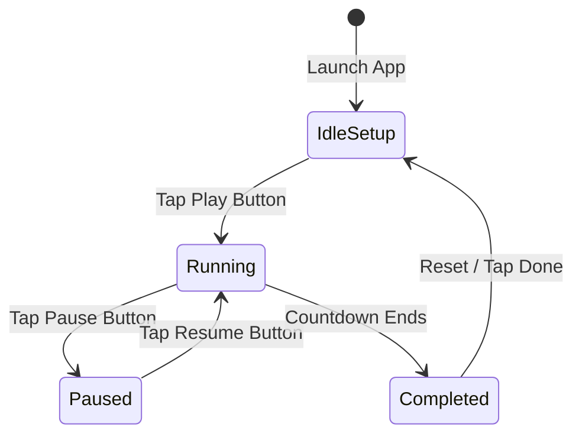

# Obsidian-Mint Dark Redesign: Design Contract
**System Theme: Dark Mode Only | Design System: Fluent Minimalist**

---

## 1. Visual Language & Color Tokens

This design is restricted strictly to an **Enforced Dark Mode only**. It leverages an ultra-deep obsidian/slate base, layered containers with varying transparencies, and high-energy electric mint accents to create focus and depth.

```
+-----------------------------------------------------------------+
|                                                                 |
|   Obsidian Base (0xFF0B0F19)                                    |
|   +---------------------------------------------------------+   |
|   | Slate Container (0xFF1E2530)                            |   |
|   | Acrylic Border (0xFF2A3342 @ 40%)                       |   |
|   |                                                         |   |
|   |         +-------------------------------------+         |   |
|   |         |  Mint Glow (0xFF00F5D4)             |         |   |
|   |         |  Blur: BackdropFilter (15.0 px)     |         |   |
|   |         +-------------------------------------+         |   |
|   +---------------------------------------------------------+   |
+-----------------------------------------------------------------+
```

### Color Palette Spec (ARGB & HEX)

| Token Name | HEX Code | ARGB Color (Flutter) | Purpose / Semantic Mapping |
| :--- | :--- | :--- | :--- |
| `obsidianBase` | `#0B0F19` | `Color(0xFF0B0F19)` | Core system scaffold background. Deepest obsidian depth. |
| `slateContainer`| `#1E2530` | `Color(0xFF1E2530)` | Primary surfaces, cards, control panels, modal sheets. |
| `slateMuted` | `#2A3342` | `Color(0xFF2A3342)` | Borders, divider lines, secondary container fill. |
| `electricMint` | `#00F5D4` | `Color(0xFF00F5D4)` | Brand primary accent. Active states, countdown glow, play indicators. |
| `mintGlow` | `#00F5D4` | `Color(0x1F00F5D4)` | Ambient background glow (12% opacity) behind active dials. |
| `textPrimary` | `#F8FAFC` | `Color(0xFFF8FAFC)` | Primary text, titles, prominent timers, high-contrast states. |
| `textSecondary`| `#94A3B8` | `Color(0xFF94A3B8)` | Subtitles, labels, inactive values, measurement ticks. |
| `glassBorder` | `#FFFFFF` | `Color(0x0DFFFFFF)` | Fluent overlay highlight: 5% transparent white edge reflection. |

---

## 2. Acrylic Surface & Glassmorphism Spec

To achieve the modern "Fluent Minimalist" depth, container surfaces must use physical layering with `BackdropFilter` and semi-transparent outlines.

```
+-----------------------------------------------------------+  <-- Outline (0x0DFFFFFF / 5% white)
|  BackdropFilter (sigmaX: 15.0, sigmaY: 15.0)              |
|  Container Fill: slateContainer @ 70% opacity             |
|  Border Radius: 24dp                                      |
|                                                           |
|  Shadow: BoxShadow(color: 0x1A000000, blur: 20, spread: 2)|
+-----------------------------------------------------------+
```

### Acrylic/Glass Container Blueprint (Flutter Construction)

```dart
Widget buildGlassCard({required Widget child}) {
  return ClipRRect(
    borderRadius: BorderRadius.circular(24.0),
    child: BackdropFilter(
      filter: ImageFilter.blur(sigmaX: 15.0, sigmaY: 15.0),
      child: Container(
        decoration: BoxDecoration(
          color: const Color(0xFF1E2530).withOpacity(0.7),
          borderRadius: BorderRadius.circular(24.0),
          border: Border.all(
            color: const Color(0x0DFFFFFF), // 5% White Glass Edge
            width: 1.2,
          ),
          boxShadow: [
            BoxShadow(
              color: Colors.black.withOpacity(0.15),
              blurRadius: 20.0,
              spreadRadius: 2.0,
              offset: const Offset(0, 8),
            ),
          ],
        ),
        child: child,
      ),
    ),
  );
}
```

---

## 3. Typography (Outfit & Plus Jakarta Sans)

Timer applications live and die by numerical scannability. Numbers must use clean, monospace-adjacent shapes to prevent horizontal text shifting during countdowns. We mandate **Outfit** for display metrics/timers and **Plus Jakarta Sans** for interface controls and labels.

```
Outfit (Bold/Medium)            -->   42:08
Plus Jakarta Sans (Semi-Bold)  -->   FOCUS SESSION
```

### Font Configurations

| Semantic Role | Font Family | Size (sp/dp) | Weight | Letter Spacing (Tracking) | Line Height |
| :--- | :--- | :--- | :--- | :--- | :--- |
| **Timer Giant Metric** | Outfit | `72.0` | `FontWeight.w600` | `-0.02em (-1.44dp)` | `1.0` |
| **Timer Sub-Metric** | Outfit | `36.0` | `FontWeight.w500` | `-0.01em (-0.36dp)` | `1.1` |
| **Primary Section Head**| Plus Jakarta Sans | `20.0` | `FontWeight.w700` | `0.05em (+1.0dp)` (ALL CAPS) | `1.3` |
| **Control Label** | Plus Jakarta Sans | `14.0` | `FontWeight.w600` | `0.02em (+0.28dp)` | `1.4` |
| **Body Caption** | Plus Jakarta Sans | `12.0` | `FontWeight.w400` | `0.0em` | `1.5` |

> [!TIP]
> Always enable tabular figures (`fontFeatures: [FontFeature.tabularFigures()]`) in `TextStyle` for the **Timer Giant Metric** text so digits don't jump around as they change from 1 to 8.

---

## 4. Layout Architecture & Spatial Grid

We utilize an 8dp grid system (`8dp`, `16dp`, `24dp`, `32dp`, `48dp`) to structure the UI. Screen designs are separated into three primary vertical focus zones.

```
+-------------------------------------------------------+
|  STATUS & NAVIGATION ZONE (Height: 64dp)             |
|  - Micro-Status Bar Indicator                         |
|  - Settings Fluent Button                             |
+-------------------------------------------------------+
|  GIANT INTERACTIVE TIMER ZONE                         |
|  - Circular Acrylic Ring (Diameter: 280dp)           |
|  - Radial Mint Progress Indicator (Stroke Width: 6dp)  |
|  - Centered Giant Outfit Timer Text (72sp)            |
+-------------------------------------------------------+
|  FLUENT CONTROLS ZONE (Height: 160dp)                 |
|  - Interactive Dial Drag Bar                          |
|  - Glassmorphic Play/Pause & Reset Action Rows        |
+-------------------------------------------------------+
```

### Grid Layout Dimensions

- **Circular Progress Ring Diameter**: `280.0 dp`
- **Progress Track Stroke Width**: `6.0 dp` (Radial Ring)
- **Inner Content Safe Area Margin**: `24.0 dp`
- **Control Button Minimum Touch Area**: `56.0 dp` (to exceed strict access standards)
- **Acrylic Card Corner Radius**: `24.0 dp`
- **Control Toggle Height**: `48.0 dp`

---

## 5. Screen & State Transition Specs

The interface morphs fluidly between distinct running modes. There are three core screens/states:



### Interactive States

1. **Idle/Setup State**: 
   - Radial Ring features a glowing, dotted outline of `electricMint` (Opacity: `0.3`).
   - Center numbers can be clicked/dragged to edit timer value.
2. **Active/Running State**:
   - Outer ring shows true `electricMint` filled progress arc.
   - Core background features a pulsing "breathing" mint ambient glow (`mintGlow` behind text).
   - All interactive inputs (except Play/Pause) transition to a translucent, locked state (Opacity: `0.4`).
3. **Paused State**:
   - Radial progress arc shifts to an orange-red accent (or pulses slightly) while progress stops.
   - "Breathing" background animation pauses instantly.
4. **Completed State**:
   - The entire radial circle flashes with an expanding pulse animation of `electricMint`.
   - Continuous visual ripples extend outward from the center text area.

---

## 6. Micro-Animations & Custom Physics

All tactile movements must behave like real physical widgets. Standard cubic-bezier easings are replaced with **spring-physics simulations** to make interactions feel fluid, modern, and elastic.

### Flutter Spring Physics Tuning Constants

```dart
// Core elastic spring for button presses and panel slide-ins
final SpringDescription elasticButtonSpring = SpringDescription(
  mass: 1.0,       // Light and responsive
  stiffness: 210.0, // Snappy snap-back force
  damping: 14.0,   // Low damping for high elasticity
);

// Heavy, smooth spring for scroll/dial adjustments and slide gestures
final SpringDescription dialDraggableSpring = SpringDescription(
  mass: 1.5,       // Solid feeling
  stiffness: 140.0, // Steady, controlled resistance
  damping: 20.0,   // High damping to eliminate wild oscillations
);
```

### Motion Mappings

#### 1. Tap Scale Bounce (Action Buttons)
*When a primary action button (Play/Pause/Reset) is pressed down, it shrinks before expanding.*
- **Scale Shrink**: `0.92` (Scale down)
- **Scale Release**: `1.0` (Triggered via `elasticButtonSpring`)
- **Visual Feedback Duration**: Instant reaction. Complete sequence finishes within `320ms`.

#### 2. Breathing Glow (Running State)
*A slow ambient pulse originating from the core background container to highlight focus.*
- **Scale Range**: `1.0` to `1.05` scale.
- **Opacity Range**: `0.06` (6%) to `0.18` (18%) opacity.
- **Duration**: `4000ms` cycle (2000ms breathing in, 2000ms breathing out), repeating infinitely using a soft `Curves.easeInOutSine` curve.

#### 3. Sliding Panel Transition
*The time selection dial moves into the view from the bottom.*
- **Curve Type**: Custom slide transition driven by `dialDraggableSpring`.
- **Duration**: Dynamic based on drag speed, or fixed at `450ms` when triggered via press.

---

## 7. Interactive Gesture & Haptic Feedback Map

To make the minimalist interface highly tactile, we map specific `HapticFeedback` methods to user actions. System vibrations must be subtle, intentional, and clean.

```
       [ Tap Button ] --------> lightImpact
       [ Dial Scrolled ] ------> selectionClick
       [ Long-Press Reset ] ---> mediumImpact
       [ Alarm Triggered ] ----> heavyImpact (Repeated)
```

### Exact Haptics Assignment Table

| User Gesture / Event | State Change | Flutter Haptic Method | Justification / Description |
| :--- | :--- | :--- | :--- |
| **Dial Adjust Scroll** | Incrementing/Decrementing timer value | `HapticFeedback.selectionClick()` | Emulates a physical clockwork dial tooth clicking past. Extremely lightweight tick. |
| **Play/Pause Tap** | Play state toggle | `HapticFeedback.lightImpact()` | Clean, quick micro-tap confirming active state activation. |
| **Add Time Quick-Tap** | Appends +1:00 to timer | `HapticFeedback.lightImpact()` | Instant action receipt feedback. |
| **Reset Press & Hold** | Holds down to clear timer | `HapticFeedback.mediumImpact()` | Deeper structural action warning haptic. Triggers only once hold completes. |
| **Countdown Finished** | Timer hits zero (00:00) | `HapticFeedback.heavyImpact()` (Pulsed) | Highest emphasis signal. Repeats in sync with the audio alarm (e.g., 3 rapid pulses). |

---

## 8. Accessibility (A11y) & Semantic Specification

A minimal dark interface must ensure complete visibility and operation for everyone. We design for high legibility, screen reader flow, and easy-touch controls.

### Accessibility Protocols

*   **Color Contrast Standards**:
    *   Large text (timer numbers) must maintain a minimum contrast ratio of `4.5:1` against the dark obsidian background.
    *   Small labels (Plus Jakarta Sans) must keep a `7:1` contrast ratio by utilizing `Color(0xFFF8FAFC)` for active states and `#94A3B8` for secondary labels.
*   **Touch Targets**:
    *   No button has an active touch region smaller than `48 x 48 dp`.
    *   The primary play/pause target area extends across `64 x 64 dp`.
*   **Semantic Tree & Screen Readers**:
    *   The entire timer display is wrapped inside a single `Semantics` widget detailing the state and exact value.
    *   *Readout Format*: `"Focus session running. 24 minutes and 42 seconds remaining."` instead of reading individual disconnected numbers.
    *   Add custom semantics actions (`SemanticsAction.increase` and `SemanticsAction.decrease`) to the adjustment dial so screen reader users can swipe up/down to edit duration.
