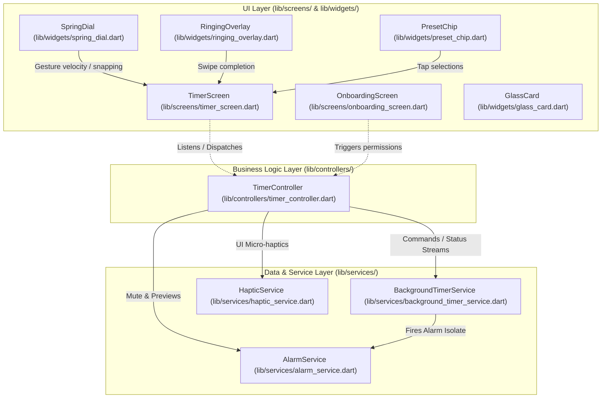

# Technical Plan: Fluent Minimal Redesign (Electric Mint Edition)

This document establishes the production-ready technical architecture, engineering specifications, state management flows, and precise code blueprints for implementing the **Fluent Minimal Redesign (Electric Mint Edition)**. 

---

## 1. Architectural Overview

To deliver a high-fidelity, premium interactive experience, we transition the application from a widget-centric monolithic design to a strict **Three-Layer Architecture** (UI, Business Logic, and Data/Service Services). This enforces separation of concerns, guarantees background isolation stability, and makes testing fluid.



---

## 2. State Management Design (`TimerController`)

The current implementation structures timer and sound configurations directly within the state of the monolithic `TimerScreen`. We extract this into `TimerController`—a dedicated state notifier inheriting from `ChangeNotifier`. It acts as the single source of truth and coordinates communications with `BackgroundTimerService`, `AlarmService`, and `HapticService`.

### Interface Definition: `timer_controller.dart`

```dart
import 'dart:async';
import 'dart:math' as math;
import 'package:flutter/material.dart';
import '../services/background_timer_service.dart';
import '../services/alarm_service.dart';
import '../services/haptic_service.dart';

class TimerController extends ChangeNotifier {
  TimerController({
    BackgroundTimerService? timerService,
    AlarmService? alarmService,
    HapticService? hapticService,
  })  : _timerService = timerService ?? BackgroundTimerService(),
        _alarmService = alarmService ?? AlarmService(),
        _hapticService = hapticService ?? HapticService();

  final BackgroundTimerService _timerService;
  final AlarmService _alarmService;
  final HapticService _hapticService;

  StreamSubscription<int>? _timerSubscription;
  StreamSubscription<String>? _eventSubscription;

  // --- Internal State ---
  static const int _defaultSeconds = 5 * 60;
  static const int _minimumSeconds = 60;
  static const int _maximumSeconds = 99 * 60;

  int _durationSeconds = _defaultSeconds;
  int _remainingSeconds = _defaultSeconds;
  bool _isRunning = false;
  bool _alarmTriggered = false;
  bool _isSoundSelectorExpanded = false;

  AlarmConfig _alarmConfig = const AlarmConfig(soundId: 'chime', isMuted: false);

  // --- Getters ---
  int get durationSeconds => _durationSeconds;
  int get remainingSeconds => _remainingSeconds;
  bool get isRunning => _isRunning;
  bool get alarmTriggered => _alarmTriggered;
  bool get isSoundSelectorExpanded => _isSoundSelectorExpanded;
  AlarmConfig get alarmConfig => _alarmConfig;

  double get elapsedProgress {
    if (_durationSeconds == 0) return 0.0;
    return 1.0 - (_remainingSeconds / _durationSeconds);
  }

  String get statusLabel {
    if (_remainingSeconds == 0) return 'Done';
    if (_isRunning) return 'Running';
    if (_remainingSeconds < _durationSeconds) return 'Paused';
    return 'Ready';
  }

  // --- Life Cycle & Initialization ---
  Future<void> initialize() async {
    await _timerService.initialize();
    await _timerService.requestPermissions();
    await _loadAlarmConfig();

    _timerSubscription = _timerService.remainingSecondsStream.listen((seconds) {
      if (seconds == -1) return;
      _remainingSeconds = seconds;
      _isRunning = seconds > 0;

      if (seconds == 0 && !_alarmTriggered) {
        _alarmTriggered = true;
        _alarmService.playLoopingAlarm();
        _hapticService.startAlarmVibration();
      }
      notifyListeners();
    });

    _eventSubscription = _timerService.eventStream.listen((event) {
      if (event == 'dismiss') {
        dismissAlarm();
      }
    });

    if (await _timerService.isRunning()) {
      _isRunning = true;
      notifyListeners();
    }
  }

  Future<void> _loadAlarmConfig() async {
    _alarmConfig = await _alarmService.getAlarmConfig();
    notifyListeners();
  }

  @override
  void dispose() {
    _timerSubscription?.cancel();
    _eventSubscription?.cancel();
    super.dispose();
  }

  // --- Business Operations ---
  void selectDuration(int minutes) {
    if (_isRunning) return;
    _hapticService.lightTap();
    final seconds = minutes * 60;
    _durationSeconds = seconds;
    _remainingSeconds = seconds;
    notifyListeners();
  }

  void adjustDuration(int deltaSeconds) {
    if (_isRunning) return;
    _hapticService.selectionTick();
    _durationSeconds = math.min(
      _maximumSeconds,
      math.max(_minimumSeconds, _durationSeconds + deltaSeconds),
    );
    _remainingSeconds = _durationSeconds;
    notifyListeners();
  }

  void setDirectSeconds(int seconds) {
    if (_isRunning) return;
    _durationSeconds = math.min(_maximumSeconds, math.max(_minimumSeconds, seconds));
    _remainingSeconds = _durationSeconds;
    notifyListeners();
  }

  Future<void> toggleTimer() async {
    _hapticService.lightTap();
    if (_isRunning) {
      await _timerService.pause();
      _isRunning = false;
    } else {
      if (_remainingSeconds == 0) {
        _remainingSeconds = _durationSeconds;
      }
      await _timerService.start(_remainingSeconds);
      _isRunning = true;
    }
    notifyListeners();
  }

  Future<void> resetTimer() async {
    _hapticService.mediumImpact();
    await _timerService.stop();
    await _alarmService.stopAlarm();
    await _hapticService.cancelVibration();
    _isRunning = false;
    _remainingSeconds = _durationSeconds;
    _alarmTriggered = false;
    notifyListeners();
  }

  Future<void> dismissAlarm() async {
    await _alarmService.stopAlarm();
    await _hapticService.cancelVibration();
    await resetTimer();
  }

  Future<void> toggleMute() async {
    if (_isRunning) return;
    _hapticService.lightTap();
    final newConfig = _alarmConfig.copyWith(isMuted: !_alarmConfig.isMuted);
    await _alarmService.saveAlarmConfig(newConfig);
    _alarmConfig = newConfig;
    notifyListeners();
  }

  Future<void> selectSound(String soundId) async {
    if (_isRunning) return;
    _hapticService.lightTap();
    final newConfig = _alarmConfig.copyWith(soundId: soundId);
    await _alarmService.saveAlarmConfig(newConfig);
    _alarmConfig = newConfig;
    notifyListeners();
    await _alarmService.playPreview(soundId);
  }

  void toggleSoundSelector() {
    if (_isRunning) return;
    _hapticService.lightTap();
    _isSoundSelectorExpanded = !_isSoundSelectorExpanded;
    notifyListeners();
  }
}
```

---

## 3. Haptic Wrapper Service (`HapticService`)

To prevent direct calls to Flutter's system UI library scattering across files, we encapsulate haptic interactions in a robust wrapper service. This allows us to disable or scale haptic feedback system-wide, mock vibrations in unit tests, and support custom patterns cleanly.

### Implementation: `haptic_service.dart`

```dart
import 'package:flutter/services.dart';
import 'package:flutter/foundation.dart' show kIsWeb;
import 'package:vibration/vibration.dart';

class HapticService {
  static final HapticService _instance = HapticService._internal();
  factory HapticService() => _instance;
  HapticService._internal();

  bool _hapticsEnabled = true;

  /// Globally toggle haptic feedback accessibility state.
  void setHapticsEnabled(bool enabled) {
    _hapticsEnabled = enabled;
  }

  /// Subtle light selection tick for incremental adjustments (e.g., rotating the dial).
  Future<void> selectionTick() async {
    if (!_hapticsEnabled) return;
    await HapticFeedback.selectionClick();
  }

  /// Snappy impact confirming micro-interactions (e.g., button press, chip selection).
  Future<void> lightTap() async {
    if (!_hapticsEnabled) return;
    await HapticFeedback.lightImpact();
  }

  /// Standard medium impact for state updates (e.g., stopping active timers).
  Future<void> mediumImpact() async {
    if (!_hapticsEnabled) return;
    await HapticFeedback.mediumImpact();
  }

  /// Rigid, heavy feedback for high-emphasis triggers.
  Future<void> heavyImpact() async {
    if (!_hapticsEnabled) return;
    await HapticFeedback.heavyImpact();
  }

  /// Triggers repeating heavy pulses when the timer reaches zero.
  /// Falls back to physical device vibration loops.
  Future<void> startAlarmVibration() async {
    if (!_hapticsEnabled || kIsWeb) return;
    try {
      if (await Vibration.hasVibrator() == true) {
        // High frequency double-beat pulse sequence repeating indefinitely
        await Vibration.vibrate(pattern: [0, 150, 150, 150], repeat: 0);
      } else {
        // Fallback to basic system warning pulses
        await HapticFeedback.heavyImpact();
      }
    } catch (_) {}
  }

  /// Gracefully cancels any ongoing vibration loops.
  Future<void> cancelVibration() async {
    if (kIsWeb) return;
    try {
      await Vibration.cancel();
    } catch (_) {}
  }
}
```

---

## 4. Custom Animation & Spring Physics Specs

To deliver an ultra-premium "Fluent Minimalist" aesthetic, we deprecate standard cubic/linear animation curves for central UI interactions. We implement real, physically modeled springs driven by Flutter's `physics.dart` library.

### 4.1 Physics Core Constants
We define two core physical springs with specific damping ratios:

1. **Snappy Elastic Spring (`elasticButtonSpring`)**
   - *Use Case*: Action button taps, card morphs, and slide-up sheet drawers.
   - *Mass*: `1.0`
   - *Stiffness*: `210.0` (rapid acceleration)
   - *Damping*: `14.0` (damping ratio $\zeta \approx 0.48$ allowing subtle, playful spring rebounds)

2. **Damped Draggable Spring (`dialDraggableSpring`)**
   - *Use Case*: Rotating dial tracking, inertia scrolls, and drag-slider bounds.
   - *Mass*: `1.5` (weighty inertial sensation)
   - *Stiffness*: `140.0`
   - *Damping*: `20.0` (damping ratio $\zeta \approx 0.69$ for clean snap-ins without wild oscillations)

### 4.2 Spring Animation Controller Helper

We create an implicit animation utility that simplifies spring scaling for widgets on touch events.

```dart
import 'package:flutter/material.dart';
import 'package:flutter/physics.dart';

class SpringScaleButton extends StatefulWidget {
  const SpringScaleButton({
    super.key,
    required this.child,
    required this.onTap,
    this.enabled = true,
  });

  final Widget child;
  final VoidCallback onTap;
  final bool enabled;

  @override
  State<SpringScaleButton> createState() => _SpringScaleButtonState();
}

class _SpringScaleButtonState extends State<SpringScaleButton>
    with SingleTickerProviderStateMixin {
  late final AnimationController _controller;

  @override
  void initState() {
    super.initState();
    _controller = AnimationController(
      vsync: this,
      duration: const Duration(milliseconds: 300),
      upperBound: 1.0,
      lowerBound: 0.92,
      value: 1.0,
    );
  }

  @override
  void dispose() {
    _controller.dispose();
    super.dispose();
  }

  void _handleTapDown(TapDownDetails _) {
    if (!widget.enabled) return;
    _controller.animateTo(0.92, duration: const Duration(milliseconds: 60), curve: Curves.easeOutCubic);
  }

  void _handleTapUp(TapUpDetails _) {
    if (!widget.enabled) return;
    _triggerSpringBack();
    widget.onTap();
  }

  void _handleTapCancel() {
    if (!widget.enabled) return;
    _triggerSpringBack();
  }

  void _triggerSpringBack() {
    final spring = SpringDescription(mass: 1.0, stiffness: 210.0, damping: 14.0);
    final simulation = SpringSimulation(spring, _controller.value, 1.0, 0.0);
    _controller.animateWith(simulation);
  }

  @override
  Widget build(BuildContext context) {
    return GestureDetector(
      onTapDown: _handleTapDown,
      onTapUp: _handleTapUp,
      onTapCancel: _handleTapCancel,
      child: ScaleTransition(
        scale: _controller,
        child: widget.child,
      ),
    );
  }
}
```

---

## 5. Acrylic & Glassmorphism Canvas Overlay Components

The design language requires frosted glass surfaces layered over carbon backdrops. 

### 5.1 Reusable `GlassCard` Blueprint
The glass overlay relies on `BackdropFilter` with hardware-accelerated image blurs and subtle white edge reflections.

```dart
import 'dart:ui';
import 'package:flutter/material.dart';

class GlassCard extends StatelessWidget {
  const GlassCard({
    super.key,
    required this.child,
    this.borderRadius = 24.0,
    this.blurSigma = 15.0,
    this.opacity = 0.7,
    this.borderColor = const Color(0x0DFFFFFF), // 5% White glass highlight
  });

  final Widget child;
  final double borderRadius;
  final double blurSigma;
  final double opacity;
  final Color borderColor;

  @override
  Widget build(BuildContext context) {
    return ClipRRect(
      borderRadius: BorderRadius.circular(borderRadius),
      child: BackdropFilter(
        filter: ImageFilter.blur(sigmaX: blurSigma, sigmaY: blurSigma),
        child: Container(
          decoration: BoxDecoration(
            color: const Color(0xFF1E2530).withOpacity(opacity),
            borderRadius: BorderRadius.circular(borderRadius),
            border: Border.all(
              color: borderColor,
              width: 1.2,
            ),
            boxShadow: [
              BoxShadow(
                color: Colors.black.withOpacity(0.2),
                blurRadius: 20.0,
                spreadRadius: 2.0,
                offset: const Offset(0, 8),
              ),
            ],
          ),
          child: child,
        ),
      ),
    );
  }
}
```

### 5.2 Performance Fallback System
Using multiple visual blurs can degrade rendering pipelines on mid-range or legacy platforms (API levels < 29 or older iOS architectures). We build in a performance fallback mechanism:

- **BackdropFilter Caching**: Glass elements disable real-time rendering calculations when their visibility tree toggles to hidden (`Opacity == 0.0` or hidden offscreen) by substituting with a flat opaque card background:
  ```dart
  bool usePerformanceMode = false; // Synchronized via settings/device diagnostic checks
  
  Color resolvedColor = usePerformanceMode 
      ? const Color(0xFF161B26) // Solid dark carbon
      : const Color(0xFF1E2530).withOpacity(0.7);
  ```

---

## 6. Layout Adjustments & Spatial Grid

We implement custom screen setups to support our enforced dark mode palette and tactile font layout.

### 6.1 Theme Configurations (Enforced Dark System)
We construct an enforced dark mode theme configuration matching visual tokens:
- **Scaffold Backdrop**: `Color(0xFF0B0F19)`
- **Card Background**: `Color(0xFF1E2530)`
- **Accent Indicator**: `Color(0xFF00F5D4)` (Electric Mint)
- **Secondary Highlight**: `Color(0xFF00B4D8)` (Soft Teal)

### 6.2 Typography Configuration
1. **Timer readout display** is formatted with the Outfit typeface. We explicitly bind tabular features to eliminate width shifts when the numbers tick down:
   ```dart
   TextStyle timerMetricStyle = TextStyle(
     fontFamily: 'Outfit',
     fontSize: 72.0,
     fontWeight: FontWeight.w600,
     color: const Color(0xFFF8FAFC),
     fontFeatures: const [FontFeature.tabularFigures()],
     letterSpacing: -1.44,
   );
   ```
2. **Text interface labels** utilize Plus Jakarta Sans to maintain a sharp, highly legible typographic tone:
   ```dart
   TextStyle controlLabelStyle = TextStyle(
     fontFamily: 'PlusJakartaSans',
     fontSize: 14.0,
     fontWeight: FontWeight.w600,
     color: const Color(0xFF94A3B8),
     letterSpacing: 0.28,
   );
   ```

---

## 7. Precise File-by-File Blueprint

```
work/minimal-timer-app/lib/
  ├── main.dart                      # MaterialApp setup with dark theme & routing configurations
  ├── controllers/
  │   └── timer_controller.dart      # Controller handling state transitions, syncing background timer
  ├── services/
  │   ├── alarm_service.dart         # Alarm audio playback (existing logic respected)
  │   ├── background_timer_service.dart # Isolate lifecycle background triggers (existing logic respected)
  │   └── haptic_service.dart        # Custom tactile vibration abstraction wrapper
  ├── screens/
  │   ├── timer_screen.dart          # Refactored primary dashboard screen utilizing layout zones
  │   └── onboarding_screen.dart     # Page-view onboarding flow utilizing spring scroll physics
  ├── widgets/
  │   ├── spring_dial.dart           # Interactive dial custom painter with snap physics & polar gesture math
  │   ├── glass_card.dart            # Frosted Glassmorphism card container
  │   ├── preset_chip.dart           # Interactive morphing preset cards with spring scaling
  │   └── ringing_overlay.dart       # Immersive complete screen with pulsing radial glows & swipe slider
```

### 7.1 Detailed Blueprint Specs

#### `lib/main.dart`
- **Imports**: Mapped to new screen layouts (`screens/timer_screen.dart`, `screens/onboarding_screen.dart`) and services.
- **Modifications**: 
  - Restricts application theme exclusively to `ThemeData` based on the Obsidian-Mint palette.
  - Updates routing structure to utilize page-swipe transitions driven by snappy animations.

#### `lib/screens/timer_screen.dart`
- **Structure**: Uses `ListenableBuilder` or custom state binders tied directly to a shared instance of `TimerController`.
- **Layout Zones**:
  1. *Status Zone*: Houses helps button and mute indicators with high-contrast semantics.
  2. *Timer Dial Zone*: Places the large `SpringDial` matching a maximum bound constraints of `520dp` (to support web/tablet views gracefully).
  3. *Presets & Configuration Zone*: Renders a beautiful horizontal/grid selection layout containing custom `PresetChip` elements.
- **Actions Row**: Play/Pause button wrapped inside the custom `SpringScaleButton` framework, followed by a long-press detection target for system reset hooks.

#### `lib/widgets/spring_dial.dart`
- **Gesture Calculations**: Computes relative polar coordinates on `onPanUpdate` to map manual user drag offsets to timer seconds.
  ```dart
  void _updateDragAngle(Offset localPosition, Size size) {
    final centerX = size.width / 2;
    final centerY = size.height / 2;
    final dx = localPosition.dx - centerX;
    final dy = localPosition.dy - centerY;
    
    // Polar translation range (-pi to pi)
    double angle = math.atan2(dy, dx);
    
    // Normalize coordinates (0 to 2*pi)
    if (angle < 0) {
      angle += 2 * math.pi;
    }
    
    // Map angle percentage directly to duration blocks
    double percent = angle / (2 * math.pi);
    int selectedMinutes = (percent * 99).clamp(1, 99).round();
    
    if (selectedMinutes != _lastSnappedMinute) {
      _lastSnappedMinute = selectedMinutes;
      widget.controller.setDirectSeconds(selectedMinutes * 60);
      HapticService().selectionTick();
    }
  }
  ```
- **Flicking & Snapping**: On gesture completion (`onPanEnd`), reads panning drag velocity. Evaluates inertial decay using a `SpringSimulation` tuned to `dialDraggableSpring` to calculate an elegant, smooth visual snap-in to the closest integer minute boundary.

#### `lib/widgets/preset_chip.dart`
- **Visuals**: Incorporates `GlassCard` layout parameters.
- **Interactions**:
  - Tapping a card fires custom scale-down/scale-up springs using `SpringScaleButton`. Updates focus duration immediately.
  - Long-pressing trigger: Renders an inline dynamic text grid or a modal time selection sheet to update the custom preset duration.

#### `lib/widgets/ringing_overlay.dart`
- **Pulsing Radial Glow**: Renders an infinite breathing radial gradient in the backdrop. Operates with an optimized double-layer radial canvas painter mapping opacity targets safely.
- **Swipe-to-Dismiss Slider**:
  - Built using a dedicated `GestureDetector` bound to a horizontal drag scale track (minimum drag width of `200dp`).
  - Slide handle contains spring tension. If the user releases the slider handle before completing the full track width (e.g. `width < 80%`), it accelerates back to its starting coordinate using the snappy `SpringSimulation` structure.

---

## 8. Test Strategy & QA Plan

To comply with the AI Flutter office's strict quality rules, we outline a comprehensive test suite to safeguard our visual math, gestures, and haptic models against regressions.

### 8.1 Unit Tests (`test/controllers/timer_controller_test.dart`)
We write robust, mock-injected unit tests to verify:
- Stream parsing: Ensures `TimerController` responds correctly when updates arrive from `BackgroundTimerService` (e.g., ticking down or firing alarms).
- Edge conditions: Verifies boundary validation limits (clamping duration range strictly between 1 minute and 99 minutes).
- Sound state transitions: Verifies configuration modifications are persisted instantly to local storage.

### 8.2 Widget & Gesture Tests (`test/widgets/spring_dial_test.dart`)
Using Flutter's built-in `WidgetTester`, we simulate user interactions to assert visual correctness:
- **Polar Coordinates Math Verification**:
  ```dart
  testWidgets('Dragging the dial boundary changes time values in exact minutes', (WidgetTester tester) async {
    final controller = TimerController();
    await tester.pumpWidget(MaterialApp(
      home: Scaffold(
        body: SpringDial(controller: controller),
      ),
    ));

    // Simulate drag arc along the dial perimeter
    final center = tester.getCenter(find.byType(SpringDial));
    final gesture = await tester.startGesture(center + const Offset(100, 0)); // Right-center
    await gesture.moveTo(center + const Offset(0, 100)); // Rotate to Bottom-center
    await gesture.up();
    await tester.pump();

    // Verify time update reflects the rotated angle (90 degrees, i.e., 25% of dial)
    expect(controller.durationSeconds, equals(25 * 60));
  });
  ```
- **Elastic Snapping Assertions**: Simulates quick flicks and verifies the animation controller converges exactly on minute increments.
- **Accessibility Tree Validation**: Ensures `Semantics` elements exist, hold correct values (e.g. non-disconnected readouts), and properly process increase/decrease operations.

### 8.3 Integration & Performance Profiling
We implement specialized profiling passes using Flutter Driver integration suites:
- **Frame-Rate Validation**: Runs automated sweeps of the running screen (breathing gradients, glowing indicator strokes) and the Ringing screen overlay to assert average framerates stay above **60/120 FPS**.
- **Isolate & Sleep Simulation**: Verifies state preservation when forcing application background states. Checks if the background process ticks correctly, alerts notification targets, and restarts on reactivation without state leaks.
