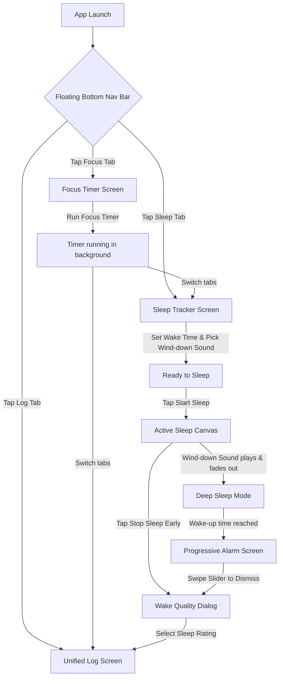

# Feature Brief: Sleep Tracker & Bottom Navigation Redesign

## Problem
Currently, the Minimal Timer app is a single-screen Focus Timer app. While highly optimized for active focus periods, human productivity relies equally on recovery and rest. High-performing individuals require quality sleep to perform during focus blocks, but currently must resort to bloated, ad-supported sleep-tracking apps that disrupt their digital wellness.

Additionally, as the application's feature set expands (adding sleep tracking, alarms, and history log), the single-screen paradigm is no longer sustainable. We need a modern, high-fidelity navigation system that separates these utility domains while ensuring:
1. Active focus sessions are preserved when navigating away.
2. The premium, dark-mode visual theme (deep obsidian backdrop with Electric Mint accents) remains cohesive across all screens.
3. Tab transitions are responsive, fluid, and tactile.

## Target User
- **Design-Conscious Professionals & Creatives**: Developers, designers, and writers who curate their digital space and require high-fidelity, distraction-free productivity and wellness utilities.
- **Sensory-Driven Minimalists**: Individuals who rely on tactile haptic feedback, fluid animations, and progressive notifications to ease transition states (from focus to break, and sleep to waking).
- **Wellness-Focused Performance Seekers**: Users who manage their daily performance by tracking both focus and recovery metrics.

## Goals
- **Bottom Navigation Redesign**: Implement a floating, glassmorphic bottom navigation bar with fluid active-state morphs and light haptic feedback.
- **Tab Separation Architecture**: Separate the app into three distinct views (Focus, Sleep, and Log) using a state-preserving architecture (e.g. `IndexedStack` or kept-alive pages) that prevents active focus timers from resetting when navigating tabs.
- **Sleep Tracker**: Create an immersive, local-first sleep utility including:
  - **Calming Sleep Canvas**: A dedicated, low-light screen with soft visualizers (breathing crescent moon) to minimize display emissions.
  - **Wind-down Audio**: Loopable, high-quality audio options (Zen Rain, Ocean Breath, Cosmic Drone) with an adjustable fade-out sleep timer (15, 30, 45 minutes).
  - **Progressive Sleep Alarm**: A gentle wake-up alarm with a volume crescendo (10% to 100% over 60 seconds) and rhythmic heartbeat haptics.
  - **Wake Quality Check-in**: A minimal, 1-step tactile rating pop-up upon waking.
- **Unified Log (History)**: Design a unified timeline view showing both completed focus blocks and sleep durations with simple, high-contrast slate statistics.

## Non-Goals
- **No Wearable/Sensor Integration**: No Apple Watch, Garmin, or Oura Ring integrations in this release. Sleep tracking is purely software/intent-based.
- **No Automatic Sleep Detection**: No microphone or accelerometer sleep tracking; the user manually starts Sleep Mode.
- **No Advanced Sleep Staging**: We do not calculate REM, Light, or Deep sleep phases. We log total sleep duration and subjective user wake ratings.
- **No Cloud Synchronization**: No backend logins, Google/Apple auth, or cloud DBs. All sleep logs and focus history are stored 100% locally and privately.

## Theme & Visual Style Specifications

We extend the Enforced Dark Mode (Obsidian / Electric Mint) theme with a dedicated Sleep theme palette:

| Visual Attribute | Value / Specification | Hex Code / Asset |
| :--- | :--- | :--- |
| **Sleep Backdrop** | Midnight Sapphire (Deepest navy gradient) | `0xFF060913` |
| **Active Sleep Highlight** | Soft Teal (Calming ambient elements) | `0xFF00B4D8` |
| **Sleep Nav Icon** | Crescent Moon (Active/Inactive states) | `Icons.bedtime` |
| **Glassmorphic Navigation Bar** | Frosted Obsidian (Floating, high blur) | `0xFF161B26` with `0.70` opacity |
| **Backdrop Blur** | Hardware-accelerated blur on bottom nav | `ImageFilter.blur(sigmaX: 20, sigmaY: 20)` |

### Tab Bar Micro-Interactions
- **Sliding Spring Indicator**: The bottom navigation bar has a background pill that slides horizontally to sit behind the active tab icon. This transition uses a spring-physics animation (damping `0.85`, response `0.3s`).
- **Tactile Tap**: Selecting any tab triggers `HapticFeedback.lightImpact()`.

---

## User Flow



---

## Feature Scope & Specifications

### 1. Bottom Navigation Bar Redesign
The app's top-level layout transitions from a single-screen scaffolding to a floating bottom navigation shell.
- **Structure**: Floating bar anchored at the bottom center of the device screen, featuring a border radius of 24, a slim slate obsidian outline, and a high-performance frosted glassmorphic backdrop.
- **Items**:
  1. **Focus**: `Icons.timer_outlined` (inactive) / `Icons.timer` (active)
  2. **Sleep**: `Icons.bedtime_outlined` (inactive) / `Icons.bedtime` (active)
  3. **Log**: `Icons.insert_chart_outlined` (inactive) / `Icons.insert_chart` (active)
- **Transition**: Tab switching triggers a smooth fade animation on the active screen content, with a sliding pill highlighting the active tab index.

### 2. Tab Separation Architecture
- **Timer Isolation**: The `TimerController` state (running countdown, active duration, audio selection) must reside in a persistent state shell. Switching tabs must not disrupt, pause, or trigger re-builds on the active focus timer.
- **Background KeepAlive**: We enforce tab keeping-alive via `AutomaticKeepAliveClientMixin` or persistent routes so that the Focus Timer UI remains at its exact scroll/drag position when returning from other tabs.

### 3. Sleep Tracker Mode
A beautiful recovery utility housed entirely within the second tab.
- **Main Setup Screen**:
  - **Wake-up Picker**: A clean, radial time-picker dial or minimalist spin wheel displaying the target wake-up time.
  - **Wind-down Sounds Drawer**: Inline slider chips allowing selection of loopable ambient sounds:
    1. **Zen Rain** (Soft, organic rain pitter-patter).
    2. **Ocean Breath** (Rhythmic crashing waves).
    3. **Cosmic Drone** (Deep warm synthesizer texture).
  - **Sleep Timer**: A picker to select wind-down duration (Off, 15, 30, 45 minutes) to auto-stop ambient audio.
  - **Start Action**: Large, springy "Enter Sleep Mode" button in Soft Teal.
- **Active Sleep Canvas**:
  - Replaces the screen with a deep midnight sapphire gradient.
  - A central, faint breathing crescent moon icon pulsating slowly.
  - Disables screen sleep timeout (wakelock) while active to maintain visual cues, but shifts pixels to dark obsidian levels to prevent OLED burn-in.
  - Plays the chosen wind-down audio, fading its volume exponentially to `0.0` over the selected duration.
- **Progressive Wake-up Alarm**:
  - When the target wake-up time is reached, the device wakes into the full-screen alarm overlay.
  - Plays a gentle Morning Chime sound, starting at `0.1` volume and ramping up linearly to `1.0` over exactly 60 seconds.
  - Rhythmic heartbeat haptics trigger concurrently (`lightImpact` -> `mediumImpact` as volume increases).
  - Dismissal requires sliding a springy "Swipe to Wake" controller from left to right.
- **Wake Quality Check-in**:
  - Once dismissed, a modal overlays the screen: "Good morning. How do you feel?"
  - Offers three tactile rating emojis: 😔 (Restless), 😐 (Neutral), 🟢 (Restored).
  - Tapping saves the entry: `{ timestamp, durationMinutes, rating, wakeUpTime }` to local storage.

### 4. Unified Log & History
A clean, minimalist history dashboard in the third tab.
- **Header**: Aggregated focus and sleep statistics: "Focus Time Today: XX min", "Sleep Last Night: X.X hrs".
- **Timeline**: A unified vertical list of focus blocks (Mint icons) and sleep blocks (Teal icons) arranged chronologically.
- **Interactions**: Swiping left on any log item reveals a springy delete button.

---

## Acceptance Criteria

### Bottom Navigation & Tab Separation
- [ ] **Tab Navigation Bar Rendering**: The bottom navigation bar renders as a floating glassmorphic container with correct icons, matching the Obsidian Grey/Electric Mint theme.
- [ ] **Light Tab Haptics**: Tapping any tab in the bottom bar must trigger a single, light haptic feedback tick (`HapticFeedback.lightImpact()`).
- [ ] **Sliding Active Indicator**: Tapping a tab must animate the background pill indicator smoothly behind the active tab with spring-based motion physics (zero linear sliding).
- [ ] **Focus Timer State Preservation**: A running focus timer must continue to countdown accurately in the background when switching to the Sleep or Log tabs, and the exact timer UI state (remaining seconds, current dial rotation) must be preserved without resets upon returning.
- [ ] **Active Sound Persistence**: If a Focus sound is playing or an alarm completes while on another tab, the alarm overlay must trigger immediately and display over the active tab view.

### Sleep Tracker Config & Canvas
- [ ] **Wake-up Picker Input**: The wake-up time picker allows scheduling any target time (HH:MM) and displays the calculated sleep duration based on the current system time.
- [ ] **Wind-down Sound Selection**: Tapping a wind-down sound chip selects the sound, persists the selection, and plays a brief 3-second preview.
- [ ] **Wind-down Sleep Timer**: The selected wind-down timer (e.g. 15 mins) must fade out the playing ambient audio volume exponentially to zero within a margin of ±5 seconds of the target duration.
- [ ] **Active Canvas Wakelock**: Entering Sleep Mode must enable a screen wakelock to prevent the screen from turning off, and dim the display components to primary dark levels (`0xFF060913`).
- [ ] **Safe Exit**: The user can exit active Sleep Mode manually before the alarm fires by pressing and holding a "Cancel Sleep" button for 2 consecutive seconds.

### Progressive Sleep Alarm
- [ ] **On-Time Triggering**: The sleep alarm must trigger within ±2 seconds of the scheduled wake-up time.
- [ ] **Volume Crescendo**: The alarm sound volume must start at `0.1` and scale smoothly to `1.0` over exactly 60 seconds (no sudden volume spikes).
- [ ] **Heartbeat Haptics**: Vibration patterns must match the crescendo, scaling from soft, sparse pulses to faster, firm heartbeat pulses as volume increases.
- [ ] **Swipe-to-Wake Dismissal**: The swipe slider handle must have spring tension, snapping back to `0.0` if released before reaching the end of the track. Dragging to `1.0` must immediately silence the audio, disable haptics, and show the Wake Quality modal.
- [ ] **Lock Screen Wake-up**: The alarm must wake up the screen, play audio, and trigger the dismiss overlay even if the device is in a locked or background sleep state.

### Wake Quality Check-in & Unified Log
- [ ] **Rating Modal Interaction**: The wake quality modal must display the 3 emoji selections, trigger a medium haptic impact upon selection, and write the sleep log to persistent storage.
- [ ] **Log Persistence**: Both Focus and Sleep logs must be saved instantly to a local database (e.g., SQLite or SharedPreferences) and reload successfully upon app launch.
- [ ] **Unified Timeline Display**: The Log screen renders all local focus and sleep records sorted chronologically, displaying correct icons, timestamps, and durations.
- [ ] **Swipe-to-Delete Action**: Swiping a log item left reveals a delete action. Tapping delete removes the item permanently from local storage and updates the view with a spring-collapse list animation.

---

## Data And Integrations

### 1. Storage Schema
- **Focus Log Item**:
  ```json
  {
    "id": "uuid_string",
    "type": "focus",
    "timestamp": 17823429302,
    "duration_seconds": 1500
  }
  ```
- **Sleep Log Item**:
  ```json
  {
    "id": "uuid_string",
    "type": "sleep",
    "timestamp": 17823429302,
    "duration_seconds": 28800,
    "rating": "restored"
  }
  ```
- **User Preferences**:
  - `sleep_alarm_time`: Time string (`"07:30"`)
  - `selected_sleep_sound_id`: `"rain"`
  - `wind_down_duration`: `1800` (seconds)

### 2. Permissions & Hardware Interfaces
- **Audio Service**: Background isolate audio playback for wind-down loops and progressive alarms.
- **Haptic Feedback**: Standard vibration and custom pattern-based haptics via hardware controllers.
- **Wakelock**: Screen wakelock permission to prevent screen sleep while active sleep canvas is engaged.
- **Local Alarms / Android Foreground Service**: Integrating with high-precision system alarms (e.g., `AlarmManager` on Android, `UNUserNotificationCenter` on iOS) to ensure wake-up fires reliably at the microsecond.

---

## Risks

| Category | Risk Description | Impact | Mitigation Strategy |
| :--- | :--- | :--- | :--- |
| **Product Risk** | Users setting a sleep alarm might sleep through it if the progressive crescendo starts too gently. | **High** | Provide a setting to adjust the crescendo duration (e.g. 10s vs 60s) or immediately jump to full volume if double-tapped. |
| **Technical Risk** | The mobile operating system (especially Android 13+ and iOS 16+) aggressively sleeping background isolates, preventing the sleep alarm from firing at the exact time. | **Critical** | Integrate natively with system-level exact alarm APIs and request the "Schedule Exact Alarm" permission explicitly. |
| **Design Risk** | The persistent glassmorphic bottom navigation causing rendering/scrolling stutter on entry-level Android devices. | **Medium** | Provide a performance fallback in settings that replaces the frosted blur filter with a solid obsidian container on low-end hardware. |
| **QA Risk** | Testing exact alarm firing times and progressive volume in automated tests is notoriously flakey. | **High** | Implement a time-acceleration wrapper in the test helper allowing the QA suite to mock the clock passing 8 hours of sleep in 500ms. |
