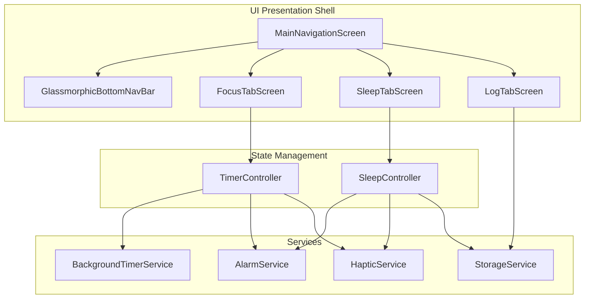

# Technical Architecture Plan: Sleep Tracker & Bottom Navigation Redesign

## 1. Executive Summary

This technical plan details the architecture and implementation path for the **Sleep Tracker & Bottom Navigation Redesign** in the Minimal Timer app. The application transitions from a single-screen utility to a multi-tab productivity and recovery platform, extending our premium digital wellness ecosystem.

We establish high-integrity architecture with:
*   **State Decoupling**: Separate, isolated domain controllers (`TimerController` and `SleepController`) managed via clean ChangeNotifier and Provider patterns.
*   **Structured Serialization**: Sealed and strongly typed log session models for local-first analytics.
*   **Robust Persistence**: Robust, high-speed local storage leveraging key-value JSON list serialization.
*   **Preserved State Routing**: A glassmorphic multi-tab frame utilizing `IndexedStack` to isolate tab updates and preserve focus timer states.
*   **Zero-Conflict Work Slices**: Explicit code boundaries and file-ownership mappings to support parallel development.

---

## 2. Architecture & Decoupled State Management

To maintain uninterrupted active focus timers when users navigate away, the state of the Focus Timer must be isolated from the Sleep Tracker state. We achieve this by fully decoupling `TimerController` and `SleepController`.

### Architectural Layering



### Core Architecture Components

1.  **`TimerController`**: Manages focus time intervals, countdown ticking, active focus sound channels, and active focus alarm states.
2.  **`SleepController`**: Manages wake-up picker values, wind-down sound selection, sleep canvas states, and progressive alarm triggers/heartbeat haptic ramping.
3.  **`StorageService`**: Acts as the local persistence layer. Both controllers flush logs (e.g. Focus blocks and Sleep sessions) into the `StorageService` without direct communication.
4.  **Provider Injection**: Both controllers are registered at the root level using a multi-provider setup.

```dart
// Location: lib/main.dart (or equivalent entrypoint)
void main() {
  runApp(
    MultiProvider(
      providers: [
        ChangeNotifierProvider<TimerController>(
          create: (context) => TimerController()..initialize(),
        ),
        ChangeNotifierProvider<SleepController>(
          create: (context) => SleepController()..initialize(),
        ),
        Provider<StorageService>(
          create: (context) => StorageService(),
        ),
      ],
      child: const MinimalTimerApp(),
    ),
  );
}
```

### Decoupled SleepController Definition

```dart
// Location: lib/controllers/sleep_controller.dart
import 'dart:async';
import 'package:flutter/material.dart';
import '../services/alarm_service.dart';
import '../services/haptic_service.dart';
import '../services/storage_service.dart';
import '../models/sleep_session.dart';

class SleepController extends ChangeNotifier {
  SleepController({
    AlarmService? alarmService,
    HapticService? hapticService,
    StorageService? storageService,
  }) : _alarmService = alarmService ?? AlarmService(),
       _hapticService = hapticService ?? HapticService(),
       _storageService = storageService ?? StorageService();

  final AlarmService _alarmService;
  final HapticService _hapticService;
  final StorageService _storageService;

  // --- Configuration State ---
  TimeOfDay _targetWakeTime = const TimeOfDay(hour: 7, minute: 30);
  String _selectedSoundId = 'rain';
  int _windDownSeconds = 1800; // 30 mins default (0 = Off)

  // --- Active Session State ---
  bool _isSleepActive = false;
  bool _isAlarmRinging = false;
  double _progressiveVolume = 0.1;
  double _swipeDismissProgress = 0.0;
  DateTime? _sleepStartTime;
  Timer? _windDownTimer;
  Timer? _alarmCheckTimer;
  Timer? _progressiveCrescendoTimer;

  // --- Getters ---
  TimeOfDay get targetWakeTime => _targetWakeTime;
  String get selectedSoundId => _selectedSoundId;
  int get windDownSeconds => _windDownSeconds;
  bool get isSleepActive => _isSleepActive;
  bool get isAlarmRinging => _isAlarmRinging;
  double get progressiveVolume => _progressiveVolume;
  double get swipeDismissProgress => _swipeDismissProgress;

  String get estimatedRestDuration {
    final now = DateTime.now();
    var target = DateTime(now.year, now.month, now.day, _targetWakeTime.hour, _targetWakeTime.minute);
    if (target.isBefore(now)) {
      target = target.add(const Duration(days: 1));
    }
    final diff = target.difference(now);
    final hrs = diff.inHours;
    final mins = diff.inMinutes % 60;
    return '$hrs hrs $mins min';
  }

  // --- Life Cycle ---
  Future<void> initialize() async {
    await _loadPreferences();
  }

  Future<void> _loadPreferences() async {
    _targetWakeTime = await _storageService.getWakeTimePreference();
    _selectedSoundId = await _storageService.getSleepSoundPreference();
    _windDownSeconds = await _storageService.getWindDownDurationPreference();
    notifyListeners();
  }

  // --- User Operations ---
  void setTargetWakeTime(TimeOfDay time) {
    if (_isSleepActive) return;
    _targetWakeTime = time;
    _hapticService.selectionTick();
    _storageService.saveWakeTimePreference(time);
    notifyListeners();
  }

  void selectWindDownSound(String soundId) {
    if (_isSleepActive) return;
    _selectedSoundId = soundId;
    _hapticService.selectionTick();
    _storageService.saveSleepSoundPreference(soundId);
    _alarmService.playPreview(soundId);
    notifyListeners();
  }

  void setWindDownSeconds(int seconds) {
    if (_isSleepActive) return;
    _windDownSeconds = seconds;
    _hapticService.lightTap();
    _storageService.saveWindDownDurationPreference(seconds);
    notifyListeners();
  }

  Future<void> enterSleepMode() async {
    _isSleepActive = true;
    _sleepStartTime = DateTime.now();
    _hapticService.mediumImpact();
    notifyListeners();

    // 1. Activate Wakelock (Screen stays dim but active)
    await _alarmService.setScreenWakelock(true);

    // 2. Play wind-down sound with active loop
    if (_selectedSoundId != 'silent') {
      await _alarmService.playAmbientSound(_selectedSoundId);
      _startWindDownFadeOut();
    }

    // 3. Register Alarm timer callback
    _startAlarmCheckScheduler();
  }

  void _startWindDownFadeOut() {
    _windDownTimer?.cancel();
    if (_windDownSeconds == 0) return; // Infinity loop

    final totalTicks = 20;
    final tickInterval = Duration(seconds: _windDownSeconds ~/ totalTicks);
    var currentTick = 0;

    _windDownTimer = Timer.periodic(tickInterval, (timer) async {
      currentTick++;
      final volume = 1.0 - (currentTick / totalTicks);
      if (volume <= 0.0) {
        await _alarmService.stopAmbientSound();
        timer.cancel();
      } else {
        await _alarmService.setAmbientVolume(volume);
      }
    });
  }

  void _startAlarmCheckScheduler() {
    _alarmCheckTimer?.cancel();
    _alarmCheckTimer = Timer.periodic(const Duration(seconds: 1), (timer) {
      final now = DateTime.now();
      if (now.hour == _targetWakeTime.hour && now.minute == _targetWakeTime.minute && !_isAlarmRinging) {
        _triggerAlarm();
        timer.cancel();
      }
    });
  }

  Future<void> _triggerAlarm() async {
    _isAlarmRinging = true;
    _progressiveVolume = 0.1;
    _swipeDismissProgress = 0.0;
    notifyListeners();

    // Sound linear volume crescendo (0.1 to 1.0 over 60s)
    await _alarmService.playProgressiveAlarm(_selectedSoundId, volume: _progressiveVolume);
    _hapticService.startProgressiveHeartbeatHaptics(speedLevel: 1);

    var secondsPassed = 0;
    _progressiveCrescendoTimer = Timer.periodic(const Duration(seconds: 1), (timer) async {
      secondsPassed++;
      _progressiveVolume = 0.1 + (0.9 * (secondsPassed / 60.0));
      if (_progressiveVolume >= 1.0) {
        _progressiveVolume = 1.0;
        timer.cancel();
      }
      await _alarmService.setAlarmVolume(_progressiveVolume);
      
      // Upgrade heartbeat haptic intensities
      if (secondsPassed == 16) {
        _hapticService.startProgressiveHeartbeatHaptics(speedLevel: 2);
      } else if (secondsPassed == 31) {
        _hapticService.startProgressiveHeartbeatHaptics(speedLevel: 3);
      }
    });
  }

  void updateSwipeProgress(double value) {
    _swipeDismissProgress = value;
    notifyListeners();
  }

  Future<void> dismissAlarm(String rating) async {
    _progressiveCrescendoTimer?.cancel();
    _alarmCheckTimer?.cancel();
    _windDownTimer?.cancel();

    await _alarmService.stopAlarm();
    await _hapticService.cancelVibration();
    await _alarmService.setScreenWakelock(false);

    // Save sleep session metrics to database
    final now = DateTime.now();
    final durationSecs = _sleepStartTime != null 
        ? now.difference(_sleepStartTime!).inSeconds 
        : 8 * 3600; // Mock fallback if empty

    final session = SleepSession(
      id: UniqueKey().toString(),
      timestamp: now,
      durationSeconds: durationSecs,
      rating: rating,
    );

    await _storageService.saveSleepSession(session);

    _isSleepActive = false;
    _isAlarmRinging = false;
    _swipeDismissProgress = 0.0;
    notifyListeners();
  }

  Future<void> cancelSleepEarly() async {
    _windDownTimer?.cancel();
    _alarmCheckTimer?.cancel();
    await _alarmService.stopAmbientSound();
    await _alarmService.setScreenWakelock(false);

    _isSleepActive = false;
    _isAlarmRinging = false;
    notifyListeners();
  }
}
```

---

## 3. Data Models Serialization

To display unified timeline logs on the History Log screen, focus sessions and sleep sessions are defined under a cohesive hierarchy using strongly-typed models. We define them under a sealed class model structure.

### Sealed Class Hierarchy: `ActivityLog`

```
                      +-------------------+
                      |    ActivityLog    | (Sealed Class)
                      +-------------------+
                                ^
                                |
               +----------------+----------------+
               |                                 |
     +-------------------+             +-------------------+
     |   FocusSession    |             |   SleepSession    |
     +-------------------+             +-------------------+
```

### Complete Class Implementations

```dart
// Location: lib/models/activity_log.dart
import 'dart:convert';

sealed class ActivityLog {
  const ActivityLog({
    required this.id,
    required this.timestamp,
    required this.durationSeconds,
  });

  final String id;
  final DateTime timestamp;
  final int durationSeconds;

  String get type;
  
  Map<String, dynamic> toJson();
  
  factory ActivityLog.fromJson(Map<String, dynamic> json) {
    final logType = json['type'] as String;
    return switch (logType) {
      'focus' => FocusSession.fromJson(json),
      'sleep' => SleepSession.fromJson(json),
      _ => throw FormatException('Invalid activity log type: $logType'),
    };
  }
}

class FocusSession extends ActivityLog {
  const FocusSession({
    required super.id,
    required super.timestamp,
    required super.durationSeconds,
  });

  @override
  String get type => 'focus';

  @override
  Map<String, dynamic> toJson() {
    return {
      'id': id,
      'type': type,
      'timestamp': timestamp.toUtc().millisecondsSinceEpoch,
      'duration_seconds': durationSeconds,
    };
  }

  factory FocusSession.fromJson(Map<String, dynamic> json) {
    return FocusSession(
      id: json['id'] as String,
      timestamp: DateTime.fromMillisecondsSinceEpoch(json['timestamp'] as int, isUtc: true).toLocal(),
      durationSeconds: json['duration_seconds'] as int,
    );
  }

  FocusSession copyWith({
    String? id,
    DateTime? timestamp,
    int? durationSeconds,
  }) {
    return FocusSession(
      id: id ?? this.id,
      timestamp: timestamp ?? this.timestamp,
      durationSeconds: durationSeconds ?? this.durationSeconds,
    );
  }

  @override
  bool operator ==(Object other) =>
      identical(this, other) ||
      other is FocusSession &&
          runtimeType == other.runtimeType &&
          id == other.id &&
          timestamp == other.timestamp &&
          durationSeconds == other.durationSeconds;

  @override
  int get hashCode => id.hashCode ^ timestamp.hashCode ^ durationSeconds.hashCode;
}

class SleepSession extends ActivityLog {
  const SleepSession({
    required super.id,
    required super.timestamp,
    required super.durationSeconds,
    required this.rating,
  });

  final String rating; // 'restless', 'neutral', 'restored'

  @override
  String get type => 'sleep';

  @override
  Map<String, dynamic> toJson() {
    return {
      'id': id,
      'type': type,
      'timestamp': timestamp.toUtc().millisecondsSinceEpoch,
      'duration_seconds': durationSeconds,
      'rating': rating,
    };
  }

  factory SleepSession.fromJson(Map<String, dynamic> json) {
    return SleepSession(
      id: json['id'] as String,
      type: 'sleep',
      timestamp: DateTime.fromMillisecondsSinceEpoch(json['timestamp'] as int, isUtc: true).toLocal(),
      durationSeconds: json['duration_seconds'] as int,
      rating: json['rating'] as String,
    );
  }

  SleepSession copyWith({
    String? id,
    DateTime? timestamp,
    int? durationSeconds,
    String? rating,
  }) {
    return SleepSession(
      id: id ?? this.id,
      timestamp: timestamp ?? this.timestamp,
      durationSeconds: durationSeconds ?? this.durationSeconds,
      rating: rating ?? this.rating,
    );
  }

  @override
  bool operator ==(Object other) =>
      identical(this, other) ||
      other is SleepSession &&
          runtimeType == other.runtimeType &&
          id == other.id &&
          timestamp == other.timestamp &&
          durationSeconds == other.durationSeconds &&
          rating == other.rating;

  @override
  int get hashCode =>
      id.hashCode ^ timestamp.hashCode ^ durationSeconds.hashCode ^ rating.hashCode;
}
```

---

## 4. Local Persistence Architecture

To guarantee maximum speed and 100% cloudless offline privacy, all user settings and logs are saved instantly to standard local key-value storage using `shared_preferences`.

### SharedPreferences Keys

| Key String | Value Type | Purpose | Example Value |
| :--- | :--- | :--- | :--- |
| `pref_sleep_alarm_time_hour` | `int` | Hour component of wake-up time. | `7` |
| `pref_sleep_alarm_time_minute`| `int` | Minute component of wake-up time. | `30` |
| `pref_sleep_sound_id` | `String` | Identifier of ambient soundtrack. | `"rain"` |
| `pref_sleep_wind_down_duration`| `int` | Duration in seconds of audio fade-out. | `1800` |
| `key_activity_logs_json` | `String` | Serialized JSON array of all history items. | `"[{\"id\":\"1\",\"type\":\"focus\"...}]"` |

### Persistence Service Shell

```dart
// Location: lib/services/storage_service.dart
import 'dart:convert';
import 'package:flutter/material.dart';
import 'package:shared_preferences/shared_preferences.dart';
import '../models/activity_log.dart';

class StorageService {
  static const String _keyLogs = 'key_activity_logs_json';
  static const String _keyHour = 'pref_sleep_alarm_time_hour';
  static const String _keyMin = 'pref_sleep_alarm_time_minute';
  static const String _keySound = 'pref_sleep_sound_id';
  static const String _keyWindDown = 'pref_sleep_wind_down_duration';

  // --- Preference Setters & Getters ---
  Future<TimeOfDay> getWakeTimePreference() async {
    final prefs = await SharedPreferences.getInstance();
    final hour = prefs.getInt(_keyHour) ?? 7;
    final min = prefs.getInt(_keyMin) ?? 30;
    return TimeOfDay(hour: hour, minute: min);
  }

  Future<void> saveWakeTimePreference(TimeOfDay time) async {
    final prefs = await SharedPreferences.getInstance();
    await prefs.setInt(_keyHour, time.hour);
    await prefs.setInt(_keyMin, time.minute);
  }

  Future<String> getSleepSoundPreference() async {
    final prefs = await SharedPreferences.getInstance();
    return prefs.getString(_keySound) ?? 'rain';
  }

  Future<void> saveSleepSoundPreference(String soundId) async {
    final prefs = await SharedPreferences.getInstance();
    await prefs.setString(_keySound, soundId);
  }

  Future<int> getWindDownDurationPreference() async {
    final prefs = await SharedPreferences.getInstance();
    return prefs.getInt(_keyWindDown) ?? 1800;
  }

  Future<void> saveWindDownDurationPreference(int seconds) async {
    final prefs = await SharedPreferences.getInstance();
    await prefs.setInt(_keyWindDown, seconds);
  }

  // --- Activity Timeline Database Operations ---
  Future<List<ActivityLog>> loadActivityLogs() async {
    final prefs = await SharedPreferences.getInstance();
    final logsJson = prefs.getString(_keyLogs);
    if (logsJson == null) return [];

    try {
      final List<dynamic> decodedList = jsonDecode(logsJson);
      return decodedList
          .map((item) => ActivityLog.fromJson(item as Map<String, dynamic>))
          .toList()
        ..sort((a, b) => b.timestamp.compareTo(a.timestamp)); // Descending order
    } catch (e) {
      // Return empty array if file corruption occurs
      return [];
    }
  }

  Future<void> saveSleepSession(SleepSession session) async {
    final logs = await loadActivityLogs();
    logs.add(session);
    await _flushLogs(logs);
  }

  Future<void> saveFocusSession(FocusSession session) async {
    final logs = await loadActivityLogs();
    logs.add(session);
    await _flushLogs(logs);
  }

  Future<void> deleteLogItem(String id) async {
    final logs = await loadActivityLogs();
    logs.removeWhere((item) => item.id == id);
    await _flushLogs(logs);
  }

  Future<void> _flushLogs(List<ActivityLog> logs) async {
    final prefs = await SharedPreferences.getInstance();
    final listJson = logs.map((log) => log.toJson()).toList();
    await prefs.setString(_keyLogs, jsonEncode(listJson));
  }
}
```

---

## 5. Routing, Shell Scaffold & Transitions

To ensure active focus timer counts are not disrupted, we structure `MainNavigationScreen` as a state-preserving shell.

### Preserve-State Scaffolding (`IndexedStack`)

We prevent the `Focus` page from rebuilding or tearing down its state by using `IndexedStack` inside `MainNavigationScreen`.

```dart
// Location: lib/screens/main_navigation_screen.dart
import 'package:flutter/material.dart';
import 'package:flutter/services.dart';
import 'package:provider/provider.dart';
import '../widgets/glass_nav_bar.dart';
import '../controllers/sleep_controller.dart';
import 'focus/focus_tab_screen.dart';
import 'sleep/sleep_tab_screen.dart';
import 'log/log_tab_screen.dart';

class MainNavigationScreen extends StatefulWidget {
  const MainNavigationScreen({super.key});

  @override
  State<MainNavigationScreen> createState() => _MainNavigationScreenState();
}

class _MainNavigationScreenState extends State<MainNavigationScreen> {
  int _currentTabIndex = 0;

  final List<Widget> _tabs = const [
    FocusTabScreen(),
    SleepTabScreen(),
    LogTabScreen(),
  ];

  void _onTabTapped(int index) {
    if (index == _currentTabIndex) return;
    
    // 1. Tactile selection haptics
    HapticFeedback.lightImpact();

    // 2. Animate tab cross-fade
    setState(() {
      _currentTabIndex = index;
    });
  }

  @override
  Widget build(BuildContext context) {
    final isSleepActive = context.select<SleepController, bool>((ctrl) => ctrl.isSleepActive);

    return Scaffold(
      backgroundColor: const Color(0xFF0B0F19), // Deep Obsidian
      body: Stack(
        children: [
          // Preserve State of all tabs
          IndexedStack(
            index: _currentTabIndex,
            children: _tabs,
          ),

          // Render Floating Bottom Navigation Bar (Hide when deep sleep canvas is active)
          if (!isSleepActive)
            Align(
              alignment: Alignment.bottomCenter,
              child: GlassmorphicBottomNavBar(
                currentIndex: _currentTabIndex,
                onTabSelected: _onTabTapped,
              ),
            ),
        ],
      ),
    );
  }
}
```

### Horizontal Spring Active Indicator Simulation

The background active indicator pill uses spring mechanics. We define exact physics parameters for the spring motion.

$$\text{Damping Ratio }(\zeta) = 0.85 \quad \text{Response Time } = 0.3s$$

To achieve a tactile bounce, the indicator will temporarily compress along its vertical axis (`scaleY = 0.95`) and stretch horizontally along the movement direction on drag, returning smoothly to its standard dimensions.

```dart
// Location: lib/widgets/glass_nav_bar.dart
import 'package:flutter/material.dart';
import 'spring_button.dart'; // Handles spring taps on individual buttons

class GlassmorphicBottomNavBar extends StatelessWidget {
  const GlassmorphicBottomNavBar({
    super.key,
    required this.currentIndex,
    required this.onTabSelected,
  });

  final int currentIndex;
  final ValueChanged<int> onTabSelected;

  @override
  Widget build(BuildContext context) {
    final double horizontalMargin = 24.0;
    final double safeAreaPadding = MediaQuery.of(context).padding.bottom;
    
    return Container(
      margin: EdgeInsets.only(
        left: horizontalMargin,
        right: horizontalMargin,
        bottom: safeAreaPadding + 16.0,
      ),
      height: 64.0,
      decoration: BoxDecoration(
        color: const Color(0xFF161B26).withOpacity(0.70), // Frosted Obsidian
        borderRadius: BorderRadius.circular(24.0),
        border: Border.all(
          color: const Color(0xFF2C3243).withOpacity(0.30), // Slate Obsidian Outline
          width: 1.0,
        ),
      ),
      clipBehavior: Clip.antiAlias,
      child: BackdropFilter(
        filter: ImageFilter.blur(sigmaX: 20.0, sigmaY: 20.0), // High blur
        child: Stack(
          children: [
            // Horizontal sliding pill active background
            AnimatedAlign(
              duration: const Duration(milliseconds: 300),
              curve: Curves.easeOutBack, // Mimics spring damping
              alignment: _getPillAlignment(currentIndex),
              child: FractionallySizedBox(
                widthFactor: 0.3,
                child: Container(
                  height: 44.0,
                  margin: const EdgeInsets.symmetric(horizontal: 8.0, vertical: 10.0),
                  decoration: BoxDecoration(
                    color: const Color(0xFFB39DDB).withOpacity(0.15), // Soft Lavender highlight
                    borderRadius: BorderRadius.circular(16.0),
                  ),
                ),
              ),
            ),
            
            // Interactive Tab Items row
            Row(
              children: [
                Expanded(
                  child: SpringScaleButton(
                    onTap: () => onTabSelected(0),
                    child: _buildTabIcon(0, Icons.timer, Icons.timer_outlined, 'Focus', const Color(0xFF00FFCC)),
                  ),
                ),
                Expanded(
                  child: SpringScaleButton(
                    onTap: () => onTabSelected(1),
                    child: _buildTabIcon(1, Icons.bedtime, Icons.bedtime_outlined, 'Sleep', const Color(0xFF00B4D8)),
                  ),
                ),
                Expanded(
                  child: SpringScaleButton(
                    onTap: () => onTabSelected(2),
                    child: _buildTabIcon(2, Icons.insert_chart, Icons.insert_chart_outlined, 'Log', const Color(0xFFB39DDB)),
                  ),
                ),
              ],
            ),
          ],
        ),
      ),
    );
  }

  Alignment _getPillAlignment(int index) {
    return switch (index) {
      0 => Alignment.centerLeft,
      1 => Alignment.center,
      2 => Alignment.centerRight,
      _ => Alignment.centerLeft,
    };
  }

  Widget _buildTabIcon(int index, IconData activeIcon, IconData inactiveIcon, String semanticLabel, Color activeColor) {
    final isSelected = index == currentIndex;
    return Semantics(
      label: '$semanticLabel screen tab. Press to view.',
      selected: isSelected,
      child: Icon(
        isSelected ? activeIcon : inactiveIcon,
        color: isSelected ? activeColor : const Color(0xFFB39DDB).withOpacity(0.50),
        size: 28.0,
      ),
    );
  }
}
```

---

## 6. Work Slices & Development Parallelism

To allow Senior and Junior developers to write code simultaneously without merging conflicts, we establish disjoint file boundaries and precise interface contracts.

### Team Roles & Shared Code Strategy

*   **Core Branch**: `arch/sleep-tracker`
*   **Staging Branch**: `integrate/sleep-tracker`
*   **Senior Branch**: `feat/sleep-tracker/core-logic`
*   **Junior Branch**: `feat/sleep-tracker/ui-ux`

```
                      +-----------------------------+
                      |   integrate/sleep-tracker   |
                      +--------------+--------------+
                                     |
              +----------------------+----------------------+
              |                                             |
+-------------v---------------------+         +-------------v---------------------+
|   feat/sleep-tracker/core-logic   |         |     feat/sleep-tracker/ui-ux      |
|  (Senior Dev: Data/Persistence)   |         |   (Junior Dev: UI/CustomPaint)    |
+-----------------------------------+         +-----------------------------------+
```

### Slice A: Senior Developer (Domain Controllers, Serialization, & Infrastructure)

The Senior Developer owns the business logic layer, database synchronization, hardware alarm interfaces, and progressive background isolates.

#### Safe File Boundaries (Senior Only)
*   `lib/models/activity_log.dart` (New log data structures)
*   `lib/controllers/sleep_controller.dart` (Sleep business loops)
*   `lib/services/storage_service.dart` (SharedPreferences data flusher)
*   `lib/services/alarm_service.dart` (Extend for system alarms and sound loops)
*   `test/controllers/sleep_controller_test.dart` (Unit tests validation)

#### High-Priority Tasks
1.  Establish sealed serialization classes `ActivityLog`, `FocusSession`, and `SleepSession` with comprehensive tests.
2.  Implement `StorageService` to load/flush activity listings securely.
3.  Architect `SleepController` to manage active state loops, countdown calculations, and Volume crescendo intervals.
4.  Expose sound controls on the existing `AlarmService` using `just_audio` or background isolate playback.

---

### Slice B: Junior Developer (UI Components, Mascots, & Micro-Interactions)

The Junior Developer owns presentational elements, glassmorphic layout wrappers, custom paint canvases for mascot stars, and responsive canvas sizing.

#### Safe File Boundaries (Junior Only)
*   `lib/screens/main_navigation_screen.dart` (Persistent navigation stacked page)
*   `lib/widgets/glass_nav_bar.dart` (Glass bottom navigation container)
*   `lib/widgets/spring_button.dart` (Micro-interactable button wrappers)
*   `lib/widgets/nebula_mascot.dart` (Space cat CustomPainter drawing)
*   `lib/widgets/swipe_slider.dart` (Swipe to wake slider widget)
*   `lib/widgets/wake_modal.dart` (Mood rating emojis modal sheet)
*   `lib/screens/sleep/sleep_tab_screen.dart` (Setting controls view)
*   `lib/screens/sleep/sleep_canvas_screen.dart` (Midnight low-emission page)
*   `lib/screens/log/log_tab_screen.dart` (Timeline lists layout)

#### High-Priority Tasks
1.  Implement `MainNavigationScreen` and floating glassmorphic nav bar with custom spring pill alignment animations.
2.  Build `NebulaMascot` using `CustomPainter` with trigonometric breathing scaling loops ($0.8\text{Hz}$ rate).
3.  Assemble the circular Wake Picker inside `SleepTabScreen` calculating live durations dynamically.
4.  Construct `SwipeToWakeSlider` with elastic drag boundaries snapping back to $0$ upon premature releases.
5.  Compose the swipe-to-delete chronological history cards inside `LogTabScreen`.

---

## 7. QA Quality Gates & Verification Matrix

To ensure that the sleep tracker works perfectly before launching, we define concrete verification targets for both developers.

| Verification Scope | Testing Level | Success Threshold | Key Assertions / Focus |
| :--- | :--- | :--- | :--- |
| **Log Model Serialization** | Unit Test | $100\%$ Coverage | Verify JSON encodes and decodes round-trip accurately for both focus and sleep subclasses. |
| **SleepController State** | Unit Test | $95\%$ Coverage | Assert that wake time settings calculations yield exact countdown hours based on clock times. |
| **Persistence Storage** | Mock Unit Test | Stable Reads | Assert that calling delete erases specified session ids and leaves other entries intact. |
| **Mascot Animation Loop** | Widget Test | Frame Rate $>55\text{fps}$ | Confirm that breathing scale calculations execute smoothly without CPU memory leaks. |
| **Swipe-to-Wake Spring** | Widget Test | Elastic Snap | Verify that releasing the slider handle at $79\%$ triggers a complete spring snapback to $0.0$. |
| **IndexedStack State** | Integration Test | No Timer Reset | Assert that starting a focus timer, navigating to the sleep tab, and returning keeps the timer counting. |

### Diagnostic Execution Script Checklist
Ensure that before proposing a final merge, both developers pass the following gates locally:
*   [ ] `fvm dart format --set-exit-if-changed lib/`
*   [ ] `fvm flutter analyze`
*   [ ] `fvm flutter test test/controllers/sleep_controller_test.dart`
*   [ ] `fvm flutter test test/models/activity_log_test.dart`
*   [ ] `fvm flutter test test/widgets/swipe_slider_test.dart`
