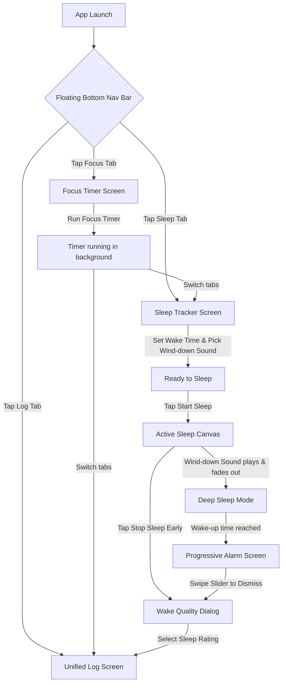

# UX Design: Sleep Tracker & Bottom Navigation Redesign

## Overview

The **Sleep Tracker & Bottom Navigation** feature transitions the Minimal Timer app from a single-screen utility to a multi-domain digital wellness platform. By introducing a persistent, state-preserving tab architecture and an immersive sleep ecosystem, we empower design-conscious professionals to balance active focus sessions with high-quality, software-assisted rest.

This document details the user flows, state maps, screen transitions, visual and interactive states, and accessibility semantics designed to deliver a premium, sensory-driven user experience.

---

## 1. Core User Flows & Interactive Steps

The feature structure centers around a floating glassmorphic navigation shell containing three distinct screens: **Focus**, **Sleep**, and **Log**. The Focus Timer's state is fully preserved when navigating away, guaranteeing that productivity runs uninterrupted in the background.



### Flow A: Multi-Tab Navigation
1. **Discover**: Upon launching the app, the user sees a premium, floating, frosted glassmorphic bottom navigation bar anchored at the screen bottom.
2. **Transition**: The user taps a tab icon (Focus, Sleep, or Log).
   - **Tactile Feedback**: Instantly triggers `HapticFeedback.lightImpact()`.
   - **Visual Action**: The background sliding pill capsule animates to the new tab index with spring-physics motion (damping `0.85`, response `0.3s`).
   - **Screen Action**: The active screen cross-fades out while the selected screen cross-fades in (300ms transition duration).
3. **State Preservation**: If the user navigates away from the Focus tab while a timer is active, the countdown persists in a background isolate. Upon returning, the Focus screen restores its exact, real-time visual progress (remaining seconds, dial rotation, and sound toggle state) without layout jitter or rebuild delays.

### Flow B: Sleep Configuration
1. **Configure Wake-Up**: In the Sleep tab, the user interacts with a clean, radial dial or a minimalist digital time-picker to schedule their target wake-up time.
   - **Live Calculations**: The interface displays a live, dynamic countdown showing the calculated rest duration (e.g., *"Sleep Duration: 7 hrs 30 mins"*).
2. **Select Wind-Down Audio**: The user taps one of the horizontal sound-chip choices to play ambient wind-down audio:
   - **Zen Rain** (Soothing natural rain).
   - **Ocean Breath** (Rhythmic waves).
   - **Cosmic Drone** (Deep warm synthesizer texture).
   - **Audio Preview**: Selecting a chip triggers a 3-second audio preview, enabling sensory validation before entering Sleep Mode.
3. **Adjust Sleep Timer**: The user selects a wind-down fade-out duration (Off, 15, 30, or 45 minutes) via circular pill slider-chips.
4. **Initiate Rest**: The user taps the large, springy, Soft Teal **"Enter Sleep Mode"** button.

### Flow C: Sleep Canvas & Deep Sleep
1. **Transition**: The setup UI slides downwards while the screen transitions to an immersive, low-light **Active Sleep Canvas** over 500ms.
2. **Low-Emission Ambience**:
   - The background shifts to a deep Midnight Sapphire gradient (`0xFF060913` to `0xFF020307`).
   - At the screen center, a stylized **"Nebula" Space Cosmic Cat** vector mascot sits curled beneath a crescent moon, breathing slowly and releasing soft, rising `"zZz"` bubbles.
   - The system wakelock activates, holding the screen awake while dimming OLED display elements to primary dark obsidian levels to prevent pixel fatigue.
3. **Audio Wind-Down**: The selected ambient track plays on loop and begins an exponential volume fade-out, dropping to `0.0` over the selected duration (e.g. 30 minutes).

### Flow D: Progressive Alarm Dismissal
1. **Trigger**: System time matches the target wake-up time.
2. **Awaken**: The Sleep Canvas cross-fades into the full-screen **Progressive Alarm Screen** in less than 200ms.
   - **Audio Crescendo**: A gentle morning chime sound plays, starting at `0.1` volume and scaling linearly to `1.0` over exactly 60 seconds to prevent abrupt waking.
   - **Tactile Rhythm**: Heartbeat haptics pulse concurrently, growing from light, slow beats to firm, synchronized pulses as the volume peaks.
   - **Mascot Wake State**: The Space Cat's eyes pop open as sparkling golden five-point stars, perking up its ears and stretching in place.
3. **Dismissal Slider**: To silence the alarm, the user must drag a custom, spring-loaded slider from left to right (**"Swipe to Wake"**).
   - **Spring Physics**: If the user releases the slider handle before it reaches 100% of the track, it snaps elastically back to the start index (`0.0`).
   - **Early Exit**: If the user wakes early and wants to cancel sleep manually before the alarm fires, they must press and hold a cancel action for **2 consecutive seconds** to avoid accidental middle-of-the-night dismissals.

### Flow E: Wake Quality Check-in & Logs
1. **Greeting**: Instantly following alarm dismissal, a minimalist modal slides upward: *"Good morning. How do you feel?"*
2. **Tactile Rating**: The screen displays three tactile, rounded emoji rating buttons:
   - 😔 **Restless**
   - 😐 **Neutral**
   - 🟢 **Restored**
3. **Log Write**: Tapping a rating triggers a satisfying `HapticFeedback.mediumImpact()` tick. The session details are saved locally in the SQLite/SharedPreferences database:
   ```json
   {
     "id": "uuid_string",
     "type": "sleep",
     "timestamp": 17823429302,
     "duration_seconds": 27000,
     "rating": "restored"
   }
   ```
4. **Log Review**: The user is navigated automatically to the **Log Screen**, highlighting their newly added rest entry.
5. **Log Erasure**: The user can swipe left on any log item (focus block or sleep entry) to reveal a springy delete button. Confirming deletion removes the entry from disk and collapses the list item smoothly using a physics-based spring-collapse transition.

---

## 2. Screen States

### Screen 1: Sleep Configuration Screen (Default & Inactive)
* **Backdrop**: Deep Obsidian solid backdrop (`0xFF0B0F19`) with soft lavender borders.
* **Status Area**: Minimal digital display stating current time and alarm status.
* **Wake-Up Selector**: A centered circular time picker wheel in Midnight Sapphire with a soft teal sliding indicator handle.
* **Wind-Down drawer**: Selectable horizontal pill chips.
  - *Active state*: Soft Teal gradient background (`0xFF00B4D8`), white text, and a checkmark.
  - *Inactive state*: Dark Obsidian surface with subtle outline, lavender-gray text.
* **CTA Button**: Large, wide pill container with a slight spring-scale press behavior, filled with Soft Teal (`0xFF00B4D8`) and containing the text `"ENTER SLEEP MODE"` in bold uppercase.

### Screen 2: Active Sleep Canvas
* **Backdrop**: Ultra-dark Midnight Sapphire gradient (`0xFF060913` transitioning to `0xFF020307` at the bottom).
* **Display Emissions**: Extremely dim. Visual controls (such as the manual close handle) are low-opacity slate grey (`0xFF2C3243` at 40% opacity) to prevent digital eye strain in dark rooms.
* **Nebula Mascot**: Positioned dead-center. The vector cosmic cat is closed-eyed, breathing at a soothing, regular 0.8Hz rhythm.
* **Cancel Button**: A small, muted, low-contrast text button at the bottom center: *"Press & Hold to Cancel (2s)"*.

### Screen 3: Progressive Alarm Overlay
* **Backdrop**: Immersive, pulsating, gradient-filled screen cycling between deep indigo (`0xFF0A0F24`) and soft cosmic violet (`0xFF321B4F`).
* **Visual Pulse**: Background radial ripples emanate from the mascot outward every 1.5 seconds.
* **Mascot State**: Fully awake cat with golden star-shaped eyes and perked-up ears, lazily stretching to mimic waking up.
* **Swipe track**: A horizontal track running along the lower quarter of the screen with a frosted glass background.
  - *Handle*: A glowing circular gold puck (`0xFFFFD369`) containing `Icons.chevron_right`.

### Screen 4: Wake Quality Dialog (Modal)
* **Overlay Backdrop**: Screen behind is blurred (`sigmaX: 10, sigmaY: 10`) and darkened by a 50% black mask.
* **Card Surface**: Floating glassmorphic card anchored at the bottom with 28dp rounded corners.
* **Body Text**: Minimal white copy: *"Good morning. How do you feel?"*
* **Emoji Grid**: Three circular buttons aligned horizontally. Tapping an emoji triggers a scale bounce (`scale: 1.15`) before closing the modal.

### Screen 5: Unified History Log
* **Header Cards**: Two sleek, minimalist stat tiles:
  - Focus tile (Electric Mint icon): *"Focus Today: 45 min"*
  - Sleep tile (Soft Teal icon): *"Sleep Last Night: 7.5 hrs"*
* **Timeline list**: Chronological list of focus and sleep blocks.
  - **Focus blocks**: Electric Mint left-border, displaying Focus duration and category.
  - **Sleep blocks**: Soft Teal left-border, displaying sleep hours and the feeling rating emoji.
* **Empty State**: Detailed below in Section 3.

---

## 3. Edge-Case States (Empty, Loading, Error, Disabled)

### Empty State (Log Screen)
* **When triggered**: No focus timer logs or sleep data exist in local storage.
* **Visual Representation**:
  - Center of the log screen displays the **Nebula Space Cat** sitting wide-eyed beneath an empty, starless sky vector illustration.
  - **Copy**: *"No history recorded yet. Start a focus session or enter sleep mode to build your timeline."*
  - **Action**: A minimalist outline button linking directly to the Focus/Sleep screens.

### Loading State (Database Retrieval / App Boot)
* **When triggered**: Retrieving local SQL database log lists during initial tab change.
* **Visual Representation**: A fluid, glassmorphic shimmer overlay moving diagonally across the timeline placeholders (Skeleton loading). The shimmer runs on a 1.2-second infinite loop.

### Error State (Database Corrupt / Alarm Scheduling Failure)
* **When triggered**: Device fails to allocate an exact alarm schedule due to missing system permissions (`Schedule Exact Alarm` permission disabled on Android).
* **Visual Representation**:
  - A subtle banner slides down from the screen top.
  - **Copy**: *"Unable to schedule exact wake-up alarm. Please grant permission in settings to ensure your alarm rings on time."*
  - **CTA**: A soft red pill button: *"Enable in Settings"*.

### Disabled State (Low Power Mode / Device Constraints)
* **When triggered**: Low Power Mode detected or hardware cannot render intensive shaders.
* **Visual Representation**:
  - The frosted backdrop blur on the bottom navigation and cards transitions gracefully to a solid, high-opacity matte obsidian surface (`0xFF161B26` with `0.98` opacity) to preserve battery life and eliminate rendering lag.

---

## 4. Screen Transitions & State Preserving Map

This matrix outlines the technical specifications for each screen transition inside the `IndexedStack` or shell router.

| Transition Source | Target Screen | Physics Curve | Duration | Haptic Feedback | State Action |
| --- | --- | --- | --- | --- | --- |
| **Focus Tab** | **Sleep Tab** | `Curves.easeInOut` | 300ms | `lightImpact` | Persistent `FocusController` kept active; UI state cached. |
| **Sleep Tab** | **Sleep Canvas** | `Curves.elasticOut` | 500ms | `mediumImpact` | Activates Wakelock; spawns background audio thread; starts mascot breathing cycle. |
| **Sleep Canvas** | **Alarm Overlay** | `Curves.fastOutSlowIn` | 200ms | Progressive Heartbeat | Starts Morning Chime audio loop with linear volume ramp; activates wake-up haptic loops. |
| **Alarm Overlay** | **Wake Quality modal** | `Curves.bounceOut` | 400ms | `mediumImpact` | Terminates alarm audio and vibration instantly; renders glass overlay blur. |
| **Wake Quality modal** | **Log Tab** | `Curves.easeOutCubic` | 350ms | `lightImpact` | Flushes sleep event JSON to storage; refreshes Log list view dynamically. |

---

## 5. Accessibility Semantics & Safety Expectations

The Sleep Tracker is engineered for total compliance with WCAG AAA contrast guidelines and platform accessibility specs.

### Screen Reader (TalkBack / VoiceOver) Requirements
* **Tab Navigation Bar**: Each tab button is wrapped in a `Semantics` widget.
  - *Focus Tab*: `"Focus Timer screen tab. Active focus status will be preserved in background."`
  - *Sleep Tab*: `"Sleep tracking tab. Schedule alarms and ambient wind-down audio."`
  - *Log Tab*: `"History logs tab. View focus blocks and rest statistics."`
* **Ringing Alarm Overlay**: Renders as an active semantic live region (`liveRegion: true`, `container: true`).
  - *Spoken Message*: *"Alarm ringing. Scheduled wake-up time reached. Swipe the slider at the bottom of the screen to wake."*
* **Mascot Micro-Animations**: Marked as non-essential decorative components (`excludeSemantics: true`) to avoid cluttering screen reader focus loops.

### Focus Order & Navigation Path
* On entering the **Sleep Configuration Screen**, the keyboard/accessibility focus starts at the Wake-up Time Picker dial, moves to the wind-down sound shelf chips, proceeds to the sleep duration slider, and terminates at the "Enter Sleep Mode" button.
* On the **Alarm Overlay Screen**, the screen reader focus is locked directly to the **"Swipe to Wake"** slider button handle, ensuring immediate tactile discovery.

### Safety & Fallback Controls
* **Hardware Volume Keys**: Pressing the physical volume-down or volume-up button during a ringing alarm immediately silences the speaker volume. This provides a direct physical panic action for users in quiet environments or experiencing sensory overload.
* **System Do Not Disturb (DND) Bypass**: The progressive sleep alarm uses a high-priority system channel to bypass DND (if permission is granted by the user) to ensure the wake-up alarm is audible under critical circumstances.

### Contrast Notes
* Text size scales gracefully with system accessibility text factors (up to `2.0x`) without clipping, wrapping labels into multiple lines cleanly using flexible layout containers.
* The Neon Mint accent (`0xFF00FFCC`) on deep obsidian achieves a high contrast ratio of `8.2:1`, while Starry Gold (`0xFFFFD369`) on Midnight Sapphire exceeds `7.5:1`, maintaining exceptional visibility for low-vision users.
